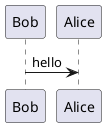
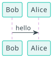

# data-station-specification

Specification of composable data stations

## Contributing

### Getting started

Install these prerequisites if you haven't already done so:
- [`just`](https://just.systems/man/en/)
- [uv](https://docs.astral.sh/uv/getting-started/installation/)

Then, you can clone the repository and run `uv sync` to setup the virtual environment.

The specification is authored with [mkdocs.org](https://www.mkdocs.org). You can start the live-reloading docs server with `just serve`.

You can edit the markdown pages with your editor of choice. The project layout is as follows:

```         
    mkdocs.yml        # The configuration file.
    pyproject.toml    # Python project file
    uv.lock           # uv lockfile
    docs/
        index.md      # The documentation homepage.
        ...           # Other markdown pages, images and other files.
    overrides         # theme customization
    references        # external documents relevant to the specification
```

The website is build automatically with GitHub actions on every commit on main.

### PlantUML

We use the [mkdocs-puml](https://mikhailkravets.github.io/mkdocs_puml/) plugin to author UMLs diagrams. For example, this fence code:

~~~

~~~

will render as a SVG diagram



### Citations and references

`data-station-specification.bib` contains references in Bibtex format. Note that `mkdocs-bibtex` can't handle Better Bibtext format, so make sure the bibliography is in plain Bibtex.

