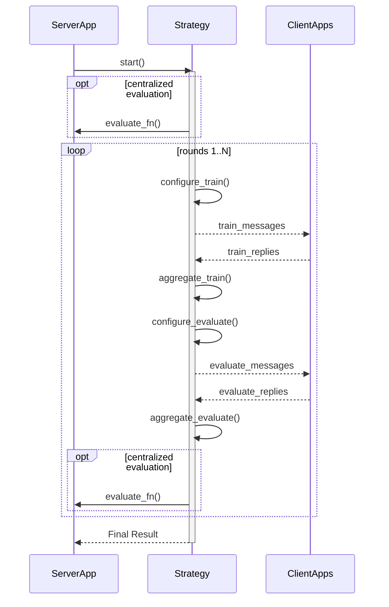

# 4.6. Federated learning

Federated learning is a machine learning technique in which a model is trained on multiple decentralised servers, known as _nodes_ or _clients_, that do not share their local data. Instead of centralising data, federated learning brings the model to the data. The process is led by a central server that manages the global model, but this server never has direct access to the local data. Training takes place on the local clients, and only the model updates are sent back to the server.

There are many different implementations of federated learning. The [Flower framework](https://flower.ai/docs/framework/index.html) is one of the most widely used. It is an open source library maintained by Flower Labs GmbH and is now used in various sectors. We consider Flower to be a reference implementation of federated learning. The following description of federated learning as an application component is based on the documentation of the [Flower framework](https://flower.ai/docs/framework/index.html).

 
## 4.6.1. Use case of federated learning

The federated learning process can be divided into a number of generic, repeating steps. A complete cycle of these steps is called a 'round'.

1.  **Training configuration**: The central server selects a subset of clients and sends them the current version of the global model and the training instructions.
2.  **Local training**: Each selected client trains the received model on its own local data.
3.  **Aggregating the results**: The clients send their updated model parameters (not their data) back to the central server. The server aggregates these updates (for example by taking a weighted average) to create a new, improved global model.
4.  **Evaluation configuration**: The server sends the new global model to a (different) set of clients with the instruction to evaluate the model.
5.  **Aggregating the evaluation**: The clients evaluate the model's performance on their local test data and send the results (for example accuracy or loss) back to the server. The server collects and aggregates these evaluation statistics.
6.  **Generating the output**: After a predetermined number of rounds, or when the model has sufficiently converged, the trained model is ready for use. The aggregated evaluation statistics provide insight into the performance of the final model.

This process is repeated until the model achieves the desired performance. The sequence diagram of federated learning is as follows:

!!! abstract "Sequence diagram federated learning"

    === "Components"

        *   **ServerApp**: The application that coordinates the entire federated learning process.
        *   **Strategy**: The logic that implements the federated learning algorithm. This determines how clients are selected, how training and evaluation are configured, and how the results are aggregated.
        *   **ClientApps**: The applications at the decentralised locations that perform the local training and evaluation on their own data.

        The **ServerApp** is what in this document is called the Processing Hub. The **Strategy** component is in practice executed by one of the data stations. This process is described in more detail in the PLUGIN implementation ([PLUGIN process](../implementaties/PLUGIN/proces.en.md)).

    === "Process"

        1.  The `ServerApp` starts the process by invoking the `Strategy`.
        2.  The `Strategy` begins the first round.
        3.  **Training phase**:
            *   `configure_train()`: The `Strategy` selects clients and prepares the training instructions (`train_messages`).
            *   The server sends these instructions, including the model parameters, to the selected `ClientApps`.
            *   The clients train the model locally and send their updates (`train_replies`) back.
            *   `aggregate_train()`: The `Strategy` collects the updates and aggregates them into a new global model.
        4.  **Evaluation phase**:
            *   `configure_evaluate()`: The `Strategy` selects clients for evaluation and prepares the evaluation instructions (`evaluate_messages`).
            *   The server sends these instructions to the `ClientApps`.
            *   The clients evaluate the model and send the results (`evaluate_replies`) back.
            *   `aggregate_evaluate()`: The `Strategy` collects and aggregates the evaluation results.
        5.  This process of training and evaluation repeats for a certain number of rounds.
        6.  At the end, the `Strategy` returns the final model and the collected statistics to the `ServerApp`.

        The sequence diagram below illustrates the interaction between the central server (`ServerApp`), the federated learning strategy (`Strategy`) running on the server, and the decentralised clients (`ClientApps`).

## 4.6.2. Recent developments and challenges for federated learning in healthcare

A systematic review of 89 scientific articles (published between 2015 and 2023) in the field of federated learning in healthcare provides a good overview of recent developments and the challenges for large-scale implementation.[@zhang2024recent]

First, it is useful to distinguish different types of federated learning:

* **Horizontal FL (HFL):** Most common; different locations have the same type of data (features) about different patients.
* **Vertical FL (VFL):** Different locations have different data about the same patients (e.g. a hospital with scans and a genetics lab with DNA data).
* **Federated Transfer Learning:** Used when locations have both different patients and different types of data.

Methodological progress has been made particularly along the following five components:

1. **Local data processing:** Focus on addressing **class imbalance** (e.g. rare diseases) through the use of synthetic data generation.
2. **Local optimisation:** Development of various models, from simple regression to complex neural networks such as **CNNs** (widely used for medical imaging) and **RNNs**.
3. **Communication:** Improvements in encryption methods (such as **Homomorphic Encryption**) and techniques to reduce the amount of data to be transmitted to save bandwidth.
4. **Aggregation:** Combining local updates into a global model. **FedAvg** remains the standard, but there is increasing experimentation with weighted averages based on data quality or performance.
5. **Redistribution:** Personalising the global model before it is sent back to the hospitals, so that it better fits the local patient population.

At the same time, there are still considerable challenges for large-scale implementation.

!!! info "Challenges"

    === "Technology and infrastructure"

        * **Hardware:** Most FL models require powerful **GPUs**, which are currently not standard at the location where the data is stored in many hospitals.
        * **Data heterogeneity:** Differences in patient populations and clinical protocols lead to variation in data, which can undermine the accuracy of the central model.

    === "Privacy and security"

        * **Metadata leaks:** Although patient data remains local, attackers can sometimes still derive sensitive information from model parameters or metadata (such as the number of patients per location).
        * **Encryption costs:** Strong encryption (Homomorphic Encryption) currently still requires too much computing power for large-scale use with complex models.

    === "Standardisation"

        * **Custom implementations:** Most researchers build their own FL software rather than using existing frameworks (such as Flower or NVIDIA FLARE), increasing the risk of errors.
        * **Poor documentation:** Details about data pre-processing, missing values and model initialisation are often lacking, making results difficult to verify.

    === "Legal and operational"
    
        * **Regulation:** FL networks must comply with strict privacy legislation such as the **GDPR** and HIPAA.
        * **Lack of practical examples:** None of the 89 articles reviewed provided evidence of actual, long-term deployment in a real clinical environment.

Although federated learning therefore has much to offer, considerable work will still need to be done to use it routinely on a large scale. Where the standardisation of the data station is already fairly advanced, this is much less the case for the federated learning component. In the further elaboration and development, the outcome of the [Health-AI programme](https://www.clinicaldatascience.nl/health-ai) will therefore need to be taken into account, for example.
