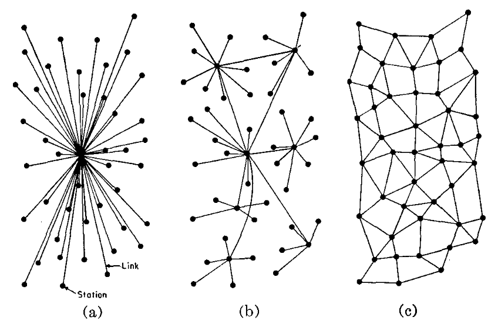
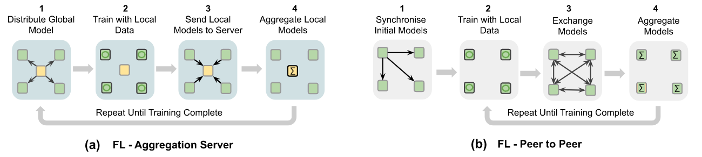

# Perspectief: applicatie
## Applicatiecomponenten voor gegevenswerking in een gelaagd, decentraal netwerk

Dit document richt zich op de uitwerking van een hybride BVO dat uitgaat van de principes van _data visiting_ in een gelaagde, decentraal netwerk van datastation. Deze aanpak heeft veel overeenkomsten met wat in TEHDAS2 een federatieve BVO wordt genoemd (_federated SPE_). De EHDS is in essentie federatief ontworpen: we willen uiteindelijk gezondheidsgegevens uit heel Europa kunnen aanwenden voor secundair gebruik. Tegelijkertijd willen we dat gezondheidsgegevens zo min mogelijk worden gekopieerd omdat daarmee controle op en veiligheid van de data in gevaar komt. Het kunnen uitvoeren van berekeningen bij de data is daarom een belangrijke funtionele vereiste. Om dit mogelijk te maken is **ten minste een architectuur nodig voor decentrale gegevensverwerking tussen landen**. Hierin is voorzien dat landelijke knooppunten gezamenlijk analyses kunnen uitvoeren, onder regie van een centraal knooppunt op Europees niveau. Deze aanpak is uitgewerkt in [TEHDAS2 M7.4](../appendix/tehdas2-spe.md) hoofdstuk 5 (_SPE federation_ p. 42) en hoofdstuk 6 (_Implementing federated computing_ p. 50). In dit document passen wij dezelfde ontwerpprincipes toe om **binnen een land een netwerk van datastations voor decentrale informatieverwerking** mogelijk te maken.

Decentrale gegevensverwerking gaat uit van een netwerk van datastations die met elkaar verbonden zijn. De manier waarop deze datastations zijn verbonden (de zogenaamde netwerk topologie) is bepalend voor de architectuur van de hybride BVO. We kennen grofweg drie netwerk topologieën[@baran1964distributed]: centraal, decentraal en gedistribueerd.

///caption
Soorten netwerken: a) centraal, b) decentraal, c) distribueerd.
///

Federatieve BVOs kennen twee archetypes:[@rieke2020future]

1. Datastations zijn verbonden met één centrale server, met andere woorden een federatie BVO met een centraal netwerk (ook wel bekend als een _hub-and-spoke_ netwerk).
2. Datastations zijn met elkaar verbonden door middel van een een distribueerd netwerk (ook wel _peer-to-peer_ genoemd).

///caption
Gefedereerde gegevensverwerking met een a) centrale aggregatie server, en b) _peer-to-peer_ netwerk.
///

De meest gebruikte vorm van gefedereerde gegevensverwerking gaat uit van een centrale server die de datastations aanstuurt. Het concept van een _Federated Database System (FDBS)_ is in 1985 beschreven en wordt al jaren gebruikt voor het uitvoeren van gefedereerde analyse (_queries_) over meerdere databases.[@heimbigner1985federated] Het concept van gefedereerd leren zoals in 2017 door Google is geintroduceerd[@mcmahan2017communication] maakt ook gebruik van een centrale server.

In de beschrijving van datastations gaan we dus uit van een processing hub, waarop de datagebruiker inlogt om toegang om berekeningen te kunnen initieren in het netwerk van datastations. Federated computing met een _peer-to-peer_ netwerk zijn expliciet niet in scope van de architectuur zoals hier beschreven is.

Daarnaast moet het in de context van de EHDS mogelijk zijn om te werken met _federations of federations_. De hybride BVO die we voor ogen hebben kent een gelaagdheid van knooppunten. Denk bijvoorbeeld aan een zorginstelling die participeert in een regionale federatieve BVO, waarbij vervolgens verschillende regionale knooppunten opgaan in een landelijk netwerk. Daarbovenop kunnen landelijke knooppunten onderdeel uitmaken van een Europese federatie. In de uitwerking van de architectuur gaan we daarom uit van een _decentraal netwerk_ dat een gelaagdheid kent van meerdere netwerken van BVOs (netwerk type b in bovenstaande illustratie).

## De componenten van een decentraal netwerk van BVOs

In de uitwerking van de architectuur voor een decentraal netwerk van BVOs staan **het datastation** en de **processing hub** centraal. Deze twee applicatie componenten realiseren gezamenlijk de functionaliteit die nodig is in een decentrale BVO. In relatie tot het [FAIR zandloper model](../data-stations-als-hoeksteen.md), is het datastation onderdeel van laag 3, terwijl de processing hub onderdeel is van laag 4. Conceptueel plaatsen we de verschillende vormen van gefedereerde gegevensbewerking in laag 5. Voortbouwend op TEHDAS2 maken we onderscheid tussen drie (arche)typen:

1. **Gefedereerde analyse**: statistieken worden lokaal berekend in een netwerk van datastations. Alleen geaggregeerde resultaten of samenvattende statistieken worden uit de datastations geëxporteerd, met bijbehorende waarborgen dat geen persoonsgegevens worden onttrokken. Gefedereerde analyse is in principe hetzelfde als een _Federated Database System_. Gefedereerde analyse is bij uitstek geschikt om gegevensverzoeken in de zin van [EHDS artikel 69](https://eur-lex.europa.eu/legal-content/NL/TXT/HTML/?uri=OJ:L_202500327&qid=1764922416982#art_69) uit te voeren. [KIK-V](../implementaties/KIK-V/index.md) zien wij als een referentie implementatie voor gefedereerde analyse.
2. **Gefedereerd leren**: modellen worden getraind en gevalideerd op de datastations zonder dat de ruwe data wordt gedeeld tussen de datastations. In plaats daarvan worden alleen de model updates gedeeld met de processing hub om daarmee betere dataprivacy en beveiliging te bereiken. [PLUGIN](../implementaties/PLUGIN/index.md) zien wij als een referentie implementatie voor gefedereerd leren.
3. **Data pooling**: de datastations kunnen worden gebruikt om data (tijdelijk) naar een andere BVO of daartoe bevoegd systeem te sturen, wat ook wel gegevensuitwisseling wordt genoemd. De [EOSC-ENTRUST Blueprint](https://zenodo.org/records/14362388) geeft een gedetaileerde architectuctuur weer hoe datastations kunnen integreren met dergelijke _Trusted Research Environment_. Het mechanisme van data pooling kan ook gebruikt worden om data aan te leveren naar kwaliteitsregistraties. Strikt genomen is data pooling geen vorm van federated processing, maar meer een hybride BVO. Omdat er zoveel raakvlakken zijn en mogelijke toepassingen zijn is het in de scope van dit document meegenomen. Dit is een van de redenenen dat we de term hybride BVO gebruiken.

In dit hoofdstuk beschrijven we de applicatie componenten van een hybride BVO, zijnde de drie soorten toepassingen in laag 5, de Processing Hub en het datastation. Daarbij gaan we ook expliciet in op de verschillende [TEHDAS2 vereisten](../appendix/tehdas2-requirements.md) die zijn geformuleerd. Voor de andere, meer generieke componenten, gaan we uit van de beschrijving in TEHDAS2 en voeren we een kortere _fit-gap_ analyse uit in hoeverre deze componenten passen in een hybride BVO. Onderstaand tabel geeft een overzicht van de belangrijkste applicatie componenten binnen het FAIR zandloper vijf-lagen model.

| Laag | Systemen |
|:----:|:---------|
| **5** | **> [Gefedereerde analyse](./federatieve-analyse.md)** **> [Gefedereerd leren](./federatief-leren.md)** **> [Data pooling](./data-pooling.md)** |
| **4** | > [Data Access Application Mgnt System](./daams.md) > [Catalogus gezondheidsgegevens](./catalogus.md) **> [Processing hub](./processing-hub.md)** |
| **3** | **> [Datastation](./data-station.md)** |
| **2** | > Data ontsluitingssysteem |
| **1** | > bronsystemen |

///caption
Overzicht van kerncomponenten in de architectuur van een federatieve BVO. De componenten die in deze architectuur centraal staan zijn vetgedrukt.
///

