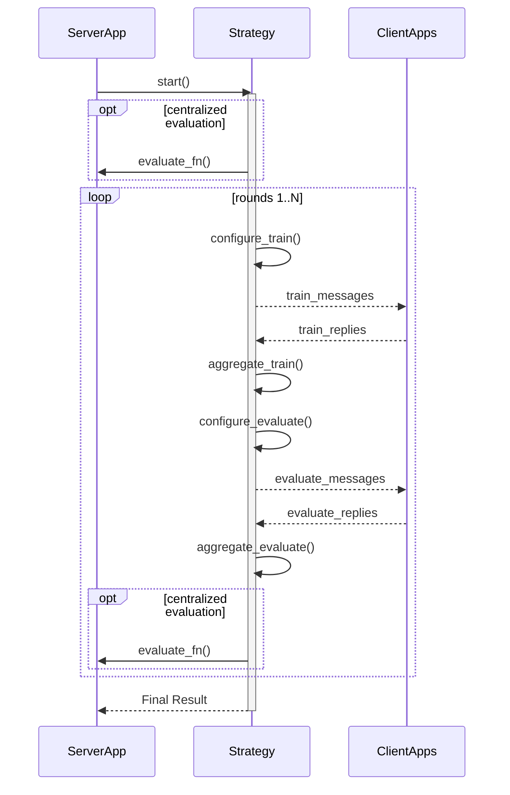

# 4.5. Federatief Leren

Federatief leren is een machine learning-techniek waarbij een model wordt getraind op meerdere decentrale servers, zogenaamde _nodes_ of _clients_, die hun lokale data niet delen. In plaats van data te centraliseren, brengt federatief leren het model naar de data. Het proces wordt geleid door een centrale server die het globale model beheert, maar deze server heeft nooit direct toegang tot de lokale data. De training vindt plaats op de lokale clients, en alleen de updates van het model worden teruggestuurd naar de server.

Er zijn veel verschillende implementaties van federatief leren. Het [Flower framework](https://flower.ai/docs/framework/index.html) is daarvan een de meest gebruikte. Het is een open source library dat wordt beheerd door Flower Labs GmbH en wordt inmiddels in verschillende sectoren gebruikt. We beschouwen Flower als een referentie implementatie van federated learning. Onderstaande beschrijving van federatief leren als applicatiecomponent is gebaseerd op de documentatie van het [Flower framework](https://flower.ai/docs/framework/index.html). 

 
## 4.5.1. Usecase van federatief leren

Het proces van federatief leren kan worden opgedeeld in een aantal generieke, herhalende stappen. Een volledige cyclus van deze stappen wordt een 'ronde' genoemd.

1.  **Configuratie van de training**: De centrale server selecteert een subset van clients en stuurt hen de huidige versie van het globale model en de instructies voor de training.
2.  **Lokale training**: Elke geselecteerde client traint het ontvangen model op zijn eigen lokale data.
3.  **Aggregeren van de resultaten**: De clients sturen hun bijgewerkte modelparameters (niet hun data) terug naar de centrale server. De server aggregeert deze updates (bijvoorbeeld door een gewogen gemiddelde te nemen) om een nieuw, verbeterd globaal model te creëren.
4.  **Configuratie van de evaluatie**: De server stuurt het nieuwe globale model naar een (andere) set clients met de instructie om het model te evalueren.
5.  **Aggregeren van de evaluatie**: De clients evalueren de prestaties van het model op hun lokale testdata en sturen de resultaten (bijvoorbeeld de nauwkeurigheid of het verlies) terug naar de server. De server verzamelt en aggregeert deze evaluatiestatistieken.
6.  **Genereren van de output**: Na een vooraf bepaald aantal rondes, of wanneer het model voldoende is geconvergeerd, is het getrainde model klaar voor gebruik. De geaggregeerde evaluatiestatistieken geven inzicht in de prestaties van het uiteindelijke model.

Dit proces wordt herhaald totdat het model de gewenste prestaties bereikt. De sequence diagram van federatief leren ziet er als volgt uit:

!!! abstract "Sequence diagram federatief leren"

    === "Componenten"

        *   **ServerApp**: De applicatie die het gehele federated learning-proces coördineert.
        *   **Strategy**: De logica die het federated learning-algoritme implementeert. Deze bepaalt hoe clients worden geselecteerd, hoe de training en evaluatie worden geconfigureerd, en hoe de resultaten worden geaggregeerd.
        *   **ClientApps**: De applicaties op de decentrale locaties die de lokale training en evaluatie uitvoeren op hun eigen data.

        De **ServerApp** is wat in dit document de Processing Hub wordt genoemd. De **Strategy** component wordt in de praktijk uitgevoerd door een van de datastations. Dit proces wordt bij de implementatie van PLUGIN in meer detail beschreven ([PLUGIN proces](../../implementaties/PLUGIN/proces.md)).

    === "Proces"

        1.  De `ServerApp` start het proces door de `Strategy` aan te roepen.
        2.  De `Strategy` begint de eerste ronde.
        3.  **Trainingsfase**:
            *   `configure_train()`: De `Strategy` selecteert clients en bereidt de trainingsinstructies (`train_messages`) voor.
            *   De server stuurt deze instructies, inclusief de modelparameters, naar de geselecteerde `ClientApps`.
            *   De clients trainen het model lokaal en sturen hun updates (`train_replies`) terug.
            *   `aggregate_train()`: De `Strategy` verzamelt de updates en aggregeert ze tot een nieuw globaal model.
        4.  **Evaluatiefase**:
            *   `configure_evaluate()`: De `Strategy` selecteert clients voor evaluatie en bereidt de evaluatie-instructies (`evaluate_messages`) voor.
            *   De server stuurt deze instructies naar de `ClientApps`.
            *   De clients evalueren het model en sturen de resultaten (`evaluate_replies`) terug.
            *   `aggregate_evaluate()`: De `Strategy` verzamelt en aggregeert de evaluatieresultaten.
        5.  Dit proces van training en evaluatie herhaalt zich voor een bepaald aantal rondes.
        6.  Aan het einde retourneert de `Strategy` het finale model en de verzamelde statistieken aan de `ServerApp`.

        Het is goed om teHet onderstaande sequence diagram illustreert de interactie tussen de centrale server (`ServerApp`), de federated learning strategie (`Strategy`) die op de server draait, en de decentrale clients (`ClientApps`).

## 4.5.2. Recente ontwikkelingen en uitdagingen voor federatief leren in de zorg

Een systematische review van 89 wetenschappelijke artikelen (gepubliceerd tussen 2015 en 2023) op het gebied van federatief leren in de zorg geeft een goed overzicht van recente ontwilleingen en de uitdagingen voor grootschalige implementatie.[@zhang2024recent]

Allereerst is het goed om verschillende soorten van federatief leren te onderscheiden:

* **Horizontal FL (HFL):** Meest voorkomend; verschillende locaties hebben dezelfde soort gegevens (features) over verschillende patiënten.
* **Vertical FL (VFL):** Verschillende locaties hebben verschillende gegevens over dezelfde patiënten (bijv. een ziekenhuis met scans en een genetica-lab met DNA-data).
* **Federated Transfer Learning:** Gebruikt wanneer locaties zowel verschillende patiënten als verschillende gegevenssoorten hebben.

Daarbij is met name langs de volgende vijf componenten methodologische vooruitgang geboekt:

1. **Lokale Dataverwerking:** Focus op het aanpakken van **klasse-onbalans** (bijv. zeldzame ziektes) door gebruik van synthetische data-generatie.
2. **Lokale Optimalisatie:** Ontwikkeling van diverse modellen, van eenvoudige regressie tot complexe neurale netwerken zoals **CNN's** (veelgebruikt voor medische beeldvorming) en **RNN's**.
3. **Communicatie:** Verbeteringen in encryptiemethoden (zoals **Homomorphic Encryption**) en technieken om de hoeveelheid te verzenden data te beperken om bandbreedte te besparen.
4. **Aggregatie:** Het combineren van lokale updates tot een globaal model. **FedAvg** blijft de standaard, maar er wordt steeds meer geëxperimenteerd met gewogen gemiddelden op basis van datakwaliteit of prestaties.
5. **Redistributie:** Het personaliseren van het globale model voordat het wordt teruggestuurd naar de ziekenhuizen, zodat het beter aansluit bij de lokale patiëntenpopulatie.

Tegelijkertijd zijn er nog de nodige uitdagingen voor grootschalige implementatie.

!!! info "Uitdagingen"

    === "Techniek en infrastructuur"

    * **Hardware:** De meeste FL-modellen vereisen krachtige **GPU's**, die momenteel in veel ziekenhuizen niet standaard beschikbaar zijn op de plek waar de data staat.
    * **Data-heterogeniteit:** Verschillen in patiëntenpopulaties en klinische protocollen leiden tot variatie in data, wat de nauwkeurigheid van het centrale model kan ondermijnen.

    === "Privacy en veiligheid"

    * **Metadata-lekken:** Hoewel patiëntdata lokaal blijft, kunnen aanvallers via modelparameters of metadata (zoals het aantal patiënten per locatie) soms toch gevoelige informatie herleiden.
    * **Encryptiekosten:** Sterke encryptie (Homomorphic Encryption) vraagt momenteel nog te veel rekenkracht voor grootschalig gebruik bij complexe modellen.

    === "Standaardisatie"

    * **Eigen implementaties:** De meeste onderzoekers bouwen hun eigen FL-software in plaats van bestaande raamwerken (zoals Flower of NVIDIA FLARE) te gebruiken, wat de kans op fouten vergroot.
    * **Slechte documentatie:** Details over data-voorbehandeling, missing values en model-initialisatie ontbreken vaak, waardoor resultaten lastig te verifiëren zijn.

    === "Juridisch en operationeel"
    

    * **Regelgeving:** FL-netwerken moeten voldoen aan strenge privacywetgeving zoals de **AVG (GDPR)** en HIPAA.
    * **Gebrek aan praktijkvoorbeelden:** Geen van de 89 onderzochte artikelen leverde bewijs voor een daadwerkelijke, langdurige inzet in een echte klinische omgeving.

Alhoewel federatief leren dus veel kan brengen, zals er nog het nodige moeten gebeuren om in op grote schaal routinematig te gebruiken. Daar waar de standaardisatie van het datastation al redelijk ver is, is dat voor het component federatief leren veel minder het geval. In de verdere uitwerking en ontwikkeling zal dus bijvoorbeeld de uitkomst van het [Health-AI programma](https://www.clinicaldatascience.nl/health-ai) meegenomen moeten worden.

