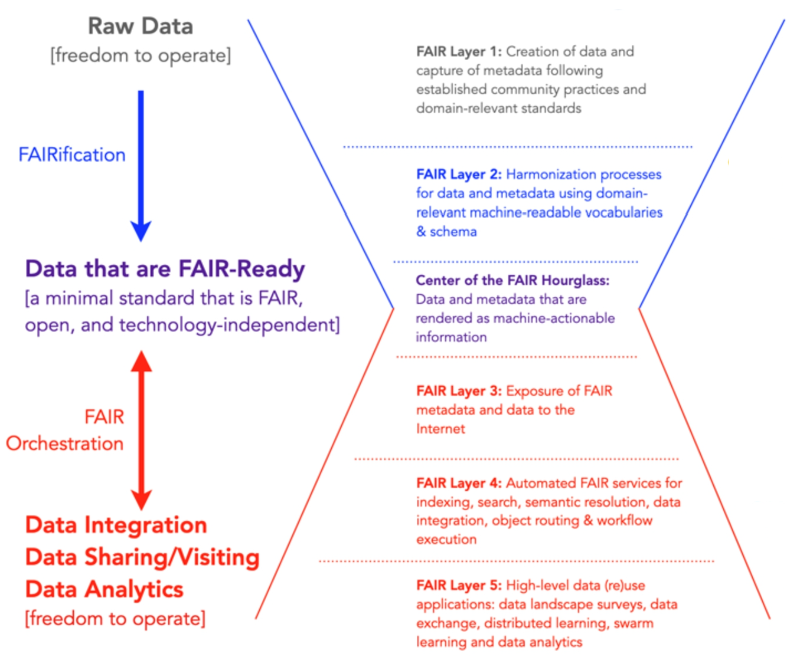

# Data stations as a foundational building block for secondary health data sharing

## What's in a name: data visiting, compute to the data, personal health train, federated analytics and PETs

The ambition for a seamlessly connected digital healthcare ecosystem, capable of leveraging vast quantities of patient data for research and innovation remains illusive. Designing and implementing health data platforms is notoriously difficult, given the heterogeneity and complexity of such systems. Inspired by previous calls to action to move towards open architectures for health data systems [@estrin2010health; @mehl2023fullstac], convergence of health information standards[@tsafnat2024converge] and the notion of the hourglass model[@estrin2010health; @beck2019hourglass; @schultes2023fair], we hypothesize that the concept of a 'data station' can be used as a foundational building block for national-wide health data sharing ecosystems.

A data station is envisaged as the site where data visiting can take place in a secure and privacy-enhancing manner by enabling the use of the data where they are.[@weise2022ossdip; @gonzalez-garcia2024phiri; @bacco2024federated] Data visiting is also known as _compute to the data_ or the _personal health train_ (PHT).[@beyan2020distributed; @choudhury2020personal; @boninodasilvasantos2022personal; @zhang2023secure; @choudhury2025advancing] The concept of federated analytics[@elkordy2023federated;wang2025survey] encompasses data visiting, within which federated learning (FL) is a specialization of this concept where machine learning models are trained collaboratively through sharing of model parameters.[@wang2025survey; @rieke2020future; @teo2024federated] All these techniques and methods are also often refered to as privacy-enhancing technologies (PETs), which are now sufficiently mature to be used on an industrial scale, enabling computations to be done under encryption (in-the-blind) thereby significantly improving security across a network of participants.[@un2023pet-guide; @royalsociety2023privacy]

The _sine qua non_ of this plethora of distributed technologies is the existence of a data station.

## Why a specification for data stations _now_?

Recent technological advances in the data engineering community offer important new enablers to implement data stations. The composable data stack as a solution design allows for unbundling of hitherto monolithic data platforms into loosely coupled components.[@pedreira2023composable; @composable] Key components in this stack, most notably [DuckDB](https://duckdb.org) and [polars](https://pola.rs), have significantly increased the single-node computing capabilities, whereby it is now possible to process up to 1 TB of tabular data on a single machine node, that is, on a single data station.[@raasveldt2019duckdb; @nahrstedt2024empirical]

This specification of data stations in not only motivated by technological enablers, but also by other developments:

- data stations extends the notion of the FAIR Hourglass which aims to establish the use of widely agreed-upon open, minimal standards for machine-actionable data sharing.[@boninodasilvasantos2022fair;@schultes2023fair]
- data stations are essential in implementing contemporary data governance frameworks, including the Data Governance Act (DGA), the European Health Data Space (EHDS) and the concept of data solidarity.[@prainsack2023beyond]
- data stations can also contribute in the shift towards a more equitable, open digital infrastructure.[@krewer2024digital]

