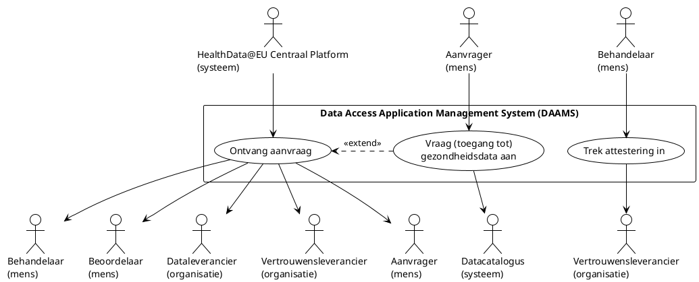

# Data aanvragen (data access)

Het aanvraagproces begint zodra een aanvrager de benodigde gezondheidsgegevens heeft gevonden in de Europese of nationale gezondheidsdatacatalogus. Daarna kan de aanvrager een aanvraag indienen via het centrale platform van HealthData@EU of via het eigen aanvraagsysteem van de nationale instantie voor toegang tot gezondheidsgegevens (HDAB). In het diagram hieronder is dat terug te zien in de use cases “Ontvang aanvraag” (aanvragen via HealthData@EU) en “Vraag toegang tot gezondheidsdata aan” (aanvragen via het nationale systeem).

Het maakt daarbij niet uit via welk systeem de aanvraag wordt ingediend: in alle gevallen wordt de aanvraag behandeld en beoordeeld door de HDAB van de lidstaat waar de gegevens worden beheerd. Alleen wanneer een aanvraag betrekking heeft op gezondheidsgegevens uit een andere lidstaat dan Nederland, moet deze verplicht via het centrale platform van HealthData@EU worden ingediend. Dit geldt ook als het om één aanvraag gaat voor gegevens uit meerdere lidstaten.

In de EHDS wordt onderscheid gemaakt tussen twee soorten aanvragen:

- Aanvragen voor toegang tot gezondheidsgegevens (artikel 67), en
- Verzoeken om gezondheidsgegevens (artikel 69).

Op basis van een aanvraag kan een HDAB een gegevensvergunning afgeven, en op basis van een verzoek kan een besluit worden genomen. Zowel de gegevensvergunning als het besluit wordt vervolgens uitgegeven als een elektronische attestering van attributen, in lijn met het Europese kader voor digitale identiteit[^1] en de voorstellen voor Europese zakelijke wallets[^2].

In de onderstaande paragrafen worden de usecases uit het diagram verder toegelicht.

## Vraag (toegang tot) gezondheidsdata aan

Een aanvrager kan de mogelijkheid krijgen om een aanvraag rechtstreeks in te voeren en in te dienen bij de nationale instantie voor toegang tot gezondheidsgegevens (HDAB). Het invullen en indienen van een aanvraag wordt op basis van dezelfde sjablonnen en formulierstructuren uitgevoerd als via het centrale platform van HealthData@EU.

## Ontvang aanvraag

In deze usecase wordt uitgegaan van zowel de ontvangst van een aanvraag via het centrale platform van HealthData@EU als van een aanvraag die in het eigen systeem is ingediend. Een onderzoeker of onderzoeksinstituut wil bijvoorbeeld toegang krijgen tot bepaalde gezondheidsgegevens voor een onderzoeksproject. Zij loggen in met een Europees erkend inlogmiddel (in Nederland een middel onder de Wet digitale overheid (Wdo)) en dienen een aanvraag in.

Het proces verloopt vervolgens in hoofdlijnen als volgt.

### De aanvraag komt binnen

Een aanvraag die in het eigen systeem van de HDAB is ingediend, wordt direct ontvangen. Een aanvraag vanuit HealthData@EU wordt via het nationale contactpunt aangeleverd. Het systeem registreert datum en tijd en controleert of de aanvraag bij de juiste HDAB is terechtgekomen. Ook wordt de identiteit van de aanvrager geverifieerd.

De HDAB moet elke aanvraag publiceren (indien nodig in geanonimiseerde vorm), ook als deze nog niet compleet is. Wijzigingen moeten steeds als update worden toegevoegd. Wanneer de aanvraag gevoelig is, hoeft de inhoud niet te worden weergegeven.

### Controleren of de aanvraag compleet is

Een behandelaar controleert of de aanvraag volledig is. Het systeem kan hierbij ondersteunen door alvast een aantal controles uit te voeren: is de informatie logisch? Is er eerder een vergelijkbare aanvraag gedaan? Ontbreekt er informatie? De behandelaar beoordeelt deze bevindingen en vult aan waar nodig. Zodra de aanvraag volledig is, wordt deze formeel als compleet verklaard en doorgestuurd naar de volgende fase. De aanvrager ontvangt hiervan een bericht.

Wanneer informatie ontbreekt, krijgt de aanvrager de mogelijkheid de aanvraag aan te vullen. Gebeurt dit niet tijdig, dan kan de aanvraag worden afgewezen.

### De inhoudelijke beoordeling

Vervolgens beoordeelt een beoordelaar of de aanvraag inhoudelijk voldoet aan de gestelde eisen. Ook wordt de technische haalbaarheid onderzocht. Hiervoor wordt de aanvraag doorgestuurd naar de betrokken gegevenshouder. De gegevenshouder beoordeelt of het technisch mogelijk is om de gevraagde gegevens te leveren en geeft een kosteninschatting voor bewerking en levering.

Wanneer de aanvraag haalbaar blijkt, gaat deze door naar de volgende stap. Soms wordt een aanvraag gedeeltelijk goedgekeurd of omgezet naar een eenvoudiger gegevensverzoek, bijvoorbeeld wanneer geanonimiseerde statistische gegevens ook voldoende zijn.

### De financiële fase

Wanneer duidelijk is welke gegevens geleverd kunnen worden, worden de totale kosten berekend. Dit betreft zowel de kosten van de gegevenshouders als de kosten van de HDAB zelf. De aanvrager krijgt deze kosten te zien en moet aangeven of hij hiermee akkoord gaat. Bij akkoord gaat de aanvraag door. Wanneer de aanvrager niet reageert of niet instemt met de kosten, kan de aanvraag worden beëindigd.

### Het verstrekken van het besluit of de gegevensvergunning

Als alles akkoord is, wordt het besluit genomen om gezondheidsgegevens te verstrekken of toegang tot gegevens te verlenen via een gegevensvergunning. Zowel het besluit als de gegevensvergunning moeten op een hoog betrouwbaarheidsniveau[^3] worden uitgegeven. Ze worden via een gekwalificeerde vertrouwensleverancier aan de aanvrager verstrekt en in het systeem geregistreerd.

### Het uitleveren van de gegevens

Wanneer de vergunning is afgegeven, krijgt elke betrokken gegevenshouder het verzoek om de data-extractie uit te voeren. Daarmee eindigt dit deel van het proces. Als het om een gegevensvergunning gaat, worden de gegevens klaargezet voor gebruik in een beveiligde gegevensomgeving (BVO). Dit kan zowel federatief bij de gegevenshouder zelf als centraal in een van de vertrouwde BVO’s.

### Alternatieve situaties

Tijdens de aanvraag kunnen verschillende bijzondere situaties optreden:

1. Versneld proces: wanneer de aanvrager een publieke instantie is.
2. Onvolledige aanvraag: de aanvrager moet ontbrekende informatie aanleveren; gebeurt dit niet, dan volgt afwijzing.
3. Verkeerd geadresseerde aanvraag: de aanvraag is bij de verkeerde instantie ingediend en wordt afgewezen.
4. Identiteit niet te controleren: de aanvraag wordt afgewezen.
5. Kosten worden niet geaccepteerd: de aanvraag wordt beëindigd.
6. Inhoudelijke (gedeeltelijke) weigering: de aanvrager ontvangt een gemotiveerd besluit.

## Referenties

[^1] European Parliament and Council. (2024). Regulation (EU) 2024/1183 of the European Parliament and of the Council of 11 April 2024 amending Regulation (EU) No 910/2014 as regards the establishment of the European framework for digital identity. Official Journal of the European Union. https://eur-lex.europa.eu/eli/reg/2024/1183/oj/eng

[^2] European Commission. (2025, November 19). Proposal for a Regulation on the establishment of European Business Wallets. https://digital-strategy.ec.europa.eu/en/library/proposal-regulation-establishment-european-business-wallets

[^3] European Commission. (2015, September 8). Commission implementing regulation (EU) 2015/1502 of 8 September 2015 on setting out minimum technical specifications and procedures for assurance levels for electronic identification means pursuant to Article 8(3) of Regulation (EU) No 910/2014 of the European Parliament and of the Council on electronic identification and trust services for electronic transactions in the internal market. https://eur-lex.europa.eu/eli/reg_impl/2015/1502/oj/eng
