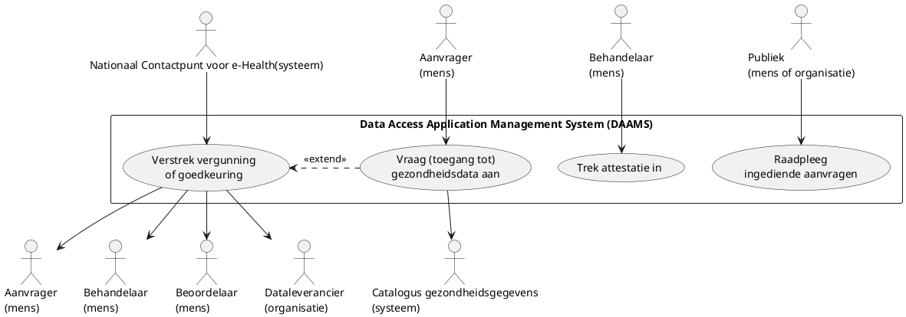
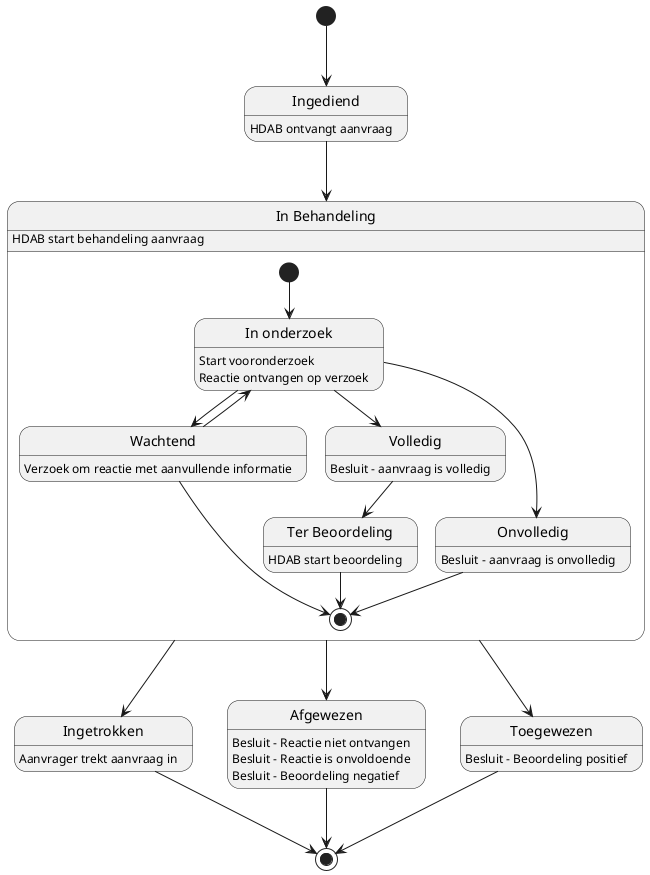

# Data aanvragen (data access)

Het aanvraagproces start op het moment dat de benodigde gezondheidsgegevens gevonden zijn in de Europese of nationale gezondheidsdatacatalogus.

Vervolgens kan een aanvraag ingediend worden via twee kanalen: via het centrale platform van HealthData@EU (kort: centrale platform) of via het eigen systeem van de Nationale instantie voor toegang tot gezondheidsgegevens (HDAB). De keuze voor het centrale platform wordt gemaakt wanneer gegevens uit meerdere lidstaten moeten worden aangevraagd. Aanvragen die direct bij een HDAB worden ingediend, zijn uitsluitend van toepassing op gegevens die zich binnen de eigen lidstaat bevinden.

Alle aanvragen die via het centrale platform worden ingediend, komen altijd eerst binnen bij het Nationale Contactpunt voor e-Health (NCPeH). Het NCPeH fungeert als een verbindingspunt in de infrastructuur, speciaal ontworpen om de veilige uitwisseling van gezondheidsgegevens tussen de verschillende lidstaten van de Europese Unie mogelijk te maken. Het is goed om te weten dat er geen directe communicatie is tussen de HDAB en het centrale platform; alles loopt via dit NCPeH.

In de EHDS[^1] wordt onderscheid gemaakt tussen twee soorten aanvragen:

- Aanvragen voor toegang tot gezondheidsgegevens (artikel 67), en
- Verzoeken om gezondheidsgegevens (artikel 69).

Wanneer een aanvraag positief wordt beoordeeld, leidt dit tot het verstrekken van een datavergunning voor toegang tot de gegevens of een goedkeuring van het verzoek. In het diagram worden deze stappen weergegeven als "Verstrek datavergunning of goedkeuring aan verzoek" en "Vraag toegang tot gezondheidsdata aan."

Op basis van een aanvraag kan een HDAB een gegevensvergunning afgeven, en op basis van een verzoek kan een goedkeuring worden gegegen. Zowel de gegevensvergunning als de goedkeuring is een elektronische attestering van attributen, in lijn met het Europese kader voor digitale identiteit[^2][^3] en de voorstellen voor Europese zakelijke wallets[^4]. Deze attestatie kan op enig moment ook worden ingetrokken als dat noodzakelijk is.

Om transparant (open en duidelijk) te zijn over hoe gezondheidsgegevens worden gebruikt, worden alle aanvragen direct gepubliceerd zodra ze binnenkomen. Dit betekent dat een aanvraag al openbaar wordt gemaakt voordat gecontroleerd is of deze compleet is.

## Overzicht van de usecases

De HDAB gebruikt een systeem voor het ontvangen en verwerken van aanvragen. Binnen het stelsel voor secundair gebruik heet dit systeem het Data Access Application Management System (DAAMS). In het diagram hieronder staan de belangrijkste usecases van dit systeem. De naam van elke usecase geeft aan wat een gebruiker met het systeem kan doen.

In de usecase-methodiek kan een use case worden uitgebreid met een andere use case. In het diagram is dit toegepast om duidelijk te maken dat het verstrekken van een datavergunning of goedkeuring voorafgaat aan het aanvragen van toegang tot gezondheidsgegevens. Dit betekent dat een aanvrager kan beginnen met de usecase voor het aanvragen van data, en dat deze vervolgens automatisch de stappen bevat die nodig zijn voor het verlenen van de vergunning of goedkeuring.

De usecases uit het diagram zijn in de vervolgparagrafen beschreven.

## Vraag (toegang tot) gezondheidsdata aan

Een aanvrager, zoals een onderzoeker of een overheidsorganisatie, kan toegang vragen tot gezondheidsgegevens voor een specifiek doel. Om dit te doen moet de aanvrager eerst inloggen met een inlogmiddel dat in Nederland is erkend onder de Wet digitale overheid (Wdo). Voorbeelden zijn DigiD, de Europese Digital Identity Wallet (vanaf 2027) en eHerkenning voor organisaties.

Na het inloggen kan de aanvrager de aanvraag invullen, tussentijds opslaan en later definitief indienen.

De aanvrager moet tijdens het invullen van de aanvraag aangeven welke datasets nodig zijn. Dat betekent dat de aanvrager kiest tot welke datasets toegang wordt gevraagd, of – in het geval van een dataverzoek – uit welke datasets gegevens moeten worden geleverd. Alle informatie over beschikbare datasets staat in de Nationale catalogus voor gezondheidsgegevens. Deze catalogus kun je zien als een kaartenbak met alle datasets die gebruikt kunnen worden. Met behulp van een soort winkelwagen kan de aanvrager eenvoudig datasets selecteren en toevoegen aan de aanvraag.

## Verstrek vergunning of goedkeuring

De HDAB geeft een vergunning of een goedkeuring op een aanvraag. Welke van de twee het wordt, hangt af van het soort aanvraag dat is ingediend:

- De HDAB verleent een vergunning als de aanvraag gaat over toegang tot gezondheidsgegevens (volgens artikel 67).
- De HDAB geeft een goedkeuring als het een verzoek om gezondheidsgegevens betreft (volgens artikel 69).

In dit deel (de usecase) leggen we uit welke stappen doorlopen moeten worden om tot deze vergunning of goedkeuring te komen.

De usecase start op het moment dat een aanvraag wordt ingediend, hetzij via het centrale platform of via het eigen systeem van de HDAB. Het onderstaande diagram illustreert de verschillende statussen die een aanvraag doorloopt vanaf het indienen tot het definitieve besluit: toewijzing, afwijzing of intrekking door de aanvrager. Elke status vertegenwoordigt een uitgevoerde processtap, welke in deze usecase beknopt wordt beschreven.

### Ontvangen en in behandeling nemen

Zodra een aanvraag is ontvangen, start de behandeling. Aanvragen van overheidsinstanties worden sneller afgehandeld via een versneld proces. Voor alle aanvragen gelden daarnaast wettelijke maximale termijnen, zoals vastgelegd in de artikelen 68 en 69 van de EHDS:

- Een vergunning moet binnen drie maanden worden afgegeven, gerekend vanaf het moment dat de aanvraag volledig is.
- Voor een verzoek om gegevens geldt dezelfde termijn van drie maanden.

Daarom begint de behandeling altijd met een controle of de aanvraag compleet is, voordat de inhoudelijke beoordeling start.

### Onderzoeken

Wanneer een aanvraag in behandeling wordt genomen, wordt deze als eerste gecontroleerd op volledigheid. Als er informatie ontbreekt, krijgt de aanvrager de kans om de aanvraag aan te vullen. Als de aanvrager dit niet op tijd doet, kan de aanvraag worden afgewezen. Zodra de aanvraag compleet is, kan de inhoudelijke beoordeling van start gaan.

### Beoordelen

Tijdens de inhoudelijke beoordeling wordt gekeken of de aanvraag voldoet aan de gestelde eisen. Ook wordt onderzocht of de aanvraag technisch uitvoerbaar is. Hiervoor wordt de aanvraag doorgestuurd naar de dataleveranciers, die beoordelen of de gevraagde gegevens geleverd kunnen worden. De dataleveranciers maken eveneens een kostenraming voor de verwerking en levering.

Als de aanvraag haalbaar is, gaat deze door naar de volgende stap. Soms wordt een aanvraag gedeeltelijk goedgekeurd of aangepast naar een eenvoudiger gegevensverzoek, bijvoorbeeld wanneer anonieme statistische gegevens al voldoende zijn.

### Verstrekken kostenindicatie

Zodra duidelijk is welke gegevens geleverd kunnen worden, worden de totale kosten berekend, inclusief de kosten van de dataleveranciers en die van de HDAB. De aanvrager ontvangt een overzicht van deze kosten en moet aangeven of hij hiermee akkoord gaat. Bij akkoord gaat de aanvraag verder. Als de aanvrager niet reageert of de kosten niet accepteert, kan de aanvraag worden beëindigd.

### Verstrekken attestatie (vergunning of goedkeuring)

Wanneer een aanvrager de kosten accepteert, kan er een vergunning of goedkeuring worden verleend. Het verkrijgen van deze acceptatie vraagt om vertrouwen, dat geborgd wordt door de Europese verordening voor digitale identiteit en vertrouwensdiensten. Deze verordening onderscheidt drie betrouwbaarheidsniveaus[^5]: laag, substantieel en hoog.

Voor bijzondere persoonsgegevens, zoals medische dossiergegevens, is een hoog betrouwbaarheidsniveau vereist om een veilige beschikbaarstelling te garanderen. Daarom moeten zowel de vergunning als de goedkeuring op hoog niveau worden verleend en op een betrouwbare manier worden gepresenteerd aan de partijen die verantwoordelijk zijn voor veilige toegang tot en verwerking van de data, zoals de dataleveranciers en de aanbieders van beveiligde verwerkingsomgevingen.

### Versturen verzoek

Zodra de vergunning of goedkeuring is verleend, wordt een verzoek aan de dataleveranciers gestuurd om de gevraagde gegevens beschikbaar te stellen aan de aanvrager, hetzij binnen een beveiligde verwerkingsomgeving, hetzij door de gegevens zoals gevraagd uit het verzoek te leveren.

## Trek attestatie in

Op basis van artikel 63 van de EHDS moet de HDAB toezicht houden op de naleving van de voorwaarden die aan de vergunning of goedkeuring zijn verbonden. Als tijdens dit toezicht blijkt dat een aanvrager deze voorwaarden niet nakomt, kan de HDAB ingrijpen en de vergunning of goedkeuring intrekken.

## Raadpleeg ingediende aanvragen

De EHDS schrijft voor dat de HDAB een aanvraag direct na ontvangst openbaar moet maken (artikel 57), ook als later blijkt dat de aanvraag niet volledig is en nog aangepast moet worden. Dit betekent dat de openbaarmaking plaatsvindt voordat de aanvraag op volledigheid wordt gecontroleerd. Daarnaast stelt artikel 57 dat de aanvragen elektronisch beschikbaar moeten worden gesteld. Een overzicht op een website volstaat daarmee dus niet.

## Referenties

[^1]: European Parliament and Council. (2025). Regulation (EU) 2025/327 of the European Parliament and of the Council of 11 February 2025 on the European Health Data Space and amending Directive 2011/24/EU and Regulation (EU) 2024/2847. Official Journal of the European Union. https://eur-lex.europa.eu/eli/reg/2025/327/

[^2]: European Parliament and Council. (2014). Regulation (EU) No 910/2014 of the European Parliament and of the Council of 23 July 2014 on electronic identification and trust services for electronic transactions in the internal market and repealing Directive 1999/93/EC. Official Journal of the European Union. https://eur-lex.europa.eu/eli/reg/2014/910

[^3]: European Parliament and Council. (2024). Regulation (EU) 2024/1183 of the European Parliament and of the Council of 11 April 2024 amending Regulation (EU) No 910/2014 as regards the establishment of the European framework for digital identity. Official Journal of the European Union. https://eur-lex.europa.eu/eli/reg/2024/1183/

[^4]: European Commission. (2025, November 19). Proposal for a Regulation on the establishment of European Business Wallets. https://digital-strategy.ec.europa.eu/en/library/proposal-regulation-establishment-european-business-wallets

[^5]: European Commission. (2015, September 8). Commission implementing regulation (EU) 2015/1502 of 8 September 2015 on setting out minimum technical specifications and procedures for assurance levels for electronic identification means pursuant to Article 8(3) of Regulation (EU) No 910/2014 of the European Parliament and of the Council on electronic identification and trust services for electronic transactions in the internal market. https://eur-lex.europa.eu/eli/reg_impl/2015/1502/
