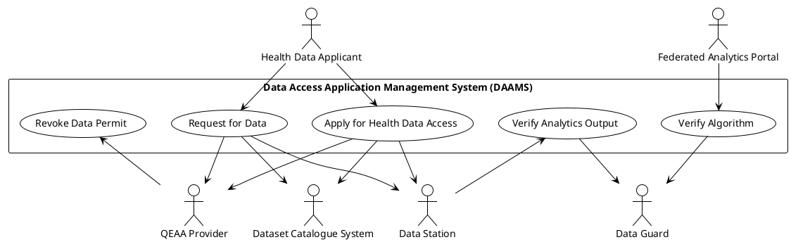

# Data Access Application Management System (DAAMS)

## Beschrijving
Voor het beschikbaar stellen van data is het noodzakelijk dat een potentiële datagebruiker een vergunning aanvraagt voor toegang tot gezondheidsgegevens, of een verzoek tot datatoegang indient. Beide worden verleend door de HDAB. De gezondheidsgegevens zijn opgenomen in een Europese datacatalogus met dataproducten waaruit de aanvrager kan kiezen. Wanneer een vergunning is verleend of een dataverzoek is goedgekeurd, dan wordt een verzoek tot datalevering verzonden naar de datastations van de dataleveranciers van de betreffende dataproducten.

De eisen voor de usecases zijn beschreven in [TEHDAS2 D6.3 Guideline for Health Data Access Bodies on the procedures and formats for data access](https://tehdas.eu/wp-content/uploads/2025/09/draft-guideline-for-health-data-access-bodies-on-the-procedures-and-formats-for-data-access.pdf).

### Apply for Health Data Access

**Goal**: Health Data Applicant vraagt een vergunning aan voor toegang tot gezondheidsgegevens

**Primary Actor**: Health Data Applicant (natuurlijk persoon of rechtspersoon)

**Preconditions**: 

- De primaire actor beschikt over een eIDAS-erkend inlogmiddel
- De dataproducten van iedere dataleverancier zijn opgenomen in een Nationale datacatalogus. 

**Main Success Scenario:**

De eisen voor deze usecase zijn beschreven in [TEHDAS2 D6.3 Guideline for Health Data Access Bodies on the procedures and formats for data access](https://tehdas.eu/wp-content/uploads/2025/09/draft-guideline-for-health-data-access-bodies-on-the-procedures-and-formats-for-data-access.pdf).

**Extension Points:**

De aanvraag kan gericht zijn aan zowel de nationale HDAB als aan een HDAB in een andere lidstaat.

**Post-conditions**

- Een vergunning voor toegang tot gezondheidsgegevens (Data Permit) is toegekend, deels toegekend of afgewezen. De vergunning is een gekwalificeerde verklaring op het hoogste betrouwbaarheidsniveau overeenkomstig de eIdas-verordening. 
- Het verzoek om data van een Health Data Applicant is goedgekeurd 
- Een verzoek om data beschikbaar te stellen is namens de HDAB verzonden naar de datastations van de geselecteerde dataproducten. De vergunning wordt meegezonden.

### Request for Data

**Goal**: Health Data Applicant verzoekt om data van een of meerdere dataleveranciers voor een van de doelen genoemd in artikel 53 van de EHDS

**Primary Actor**: Health Data Applicant (natuurlijk persoon of rechtspersoon)

### Verify Algorithm

**Goal**: Federated Analytics Portal verzoekt om verificatie van het algoritme. De Data Guard onderzoekt het algoritme en verifieert dat het geen privacygevoelige informatie lekt over een persoon dan wel andere informatie lekt die gevoelig is voor een organisatie.

**Primary Actor**: Federated Analytics Portal (systeem)

### Verify Analytics Output

**Goal**: Data Station verzoekt om verificatie van het resultaat. De Data Guard onderzoekt het resultaat en verifieert dat het geen privacygevoelige informatie lekt over een persoon dan wel andere informatie lekt die gevoelig is voor een organisatie.

**Primary Actor**: Data Station (systeem)

De resultaten of outputs van secundair gebruik mogen alleen geanonimiseerde gegevens bevatten (artikel 61 EHDS)

### Revoke Data Permit

**Goal**: QEAA Provider trekt op verzoek van de HDAB een vergunning in.

**Primary Actor**: QEAA provider (rechtspersoon)