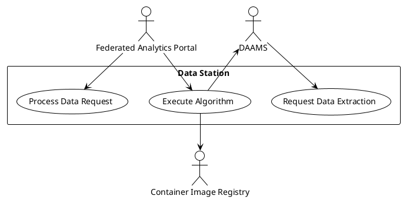

# Data Station

Met een datastation maakt een dataleverancier data toegankelijk voor diverse toepassingen. Secundair gebruik is een van de toepassingen van het datastation. Nadat een vergunning is verleend voor toegang of nadat een verzoek om data is goedgekeurd, verstuurt de HDAB via het analyseportaal een verzoek aan het datastation om een dataproduct beschikbaar te stellen aan een datagebruiker.

Een datagebruiker kan vanuit het analyseportaal een project starten en uitvoeren. De configuratie wordt vanuit het analyseportaal beheerd en verzonden naar het datastation. Wanneer het algoritme moet worden uitgevoerd, stuurt het analyseportaal een bericht naar het datastation met de opdracht tot uitvoering. Het image wordt vervolgens door het datastation gedownload en geplaatst in een beveiligde containeromgeving. De resultaten worden eerst gevalideerd en daarna vrijgegeven aan het analyseportaal.

Op basis van een verzoek om data wordt een vraag naar het datastation verzonden. De vraag wordt verwerkt en het antwoord wordt teruggezonden.

## Request Data Extraction

**Goal**: DAAMS vraagt om de dataproducten te extraheren en beschikbaar te stellen aan een Health Data User.

**Primary Actor**: Data Access Application Management System (DAAMS) (systeem)

## Execute Algorithm

**Goal**: Federated Analytics Portal vraagt om uitvoering van een algoritme en retournering van de resultaten

**Primary Actor**: Federated Analytics Portal (systeem)

## Process Data Request

**Goal**: Federated Analytics Portal verzoekt om data op basis van een vraag.

**Primary Actor**: Federated Analytics Portal (systeem)

**Preconditions**: 

**Main Success Scenario:**

1. Federated Analytics Portal verzendt een bericht met het dataverzoek
2. Het systeem registreert het ontvangen bericht in het logboek
3. Het systeem verifieert en authenticeert de verzender van het bericht
4. Het systeem verifieert het dataverzoek
5. Het systeem voert de technische vraagstelling uit
6. Het systeem stelt een bericht samen met het antwoord op de vraag
7. Het systeem verzendt het bericht naar het Federated Analytics Portal
8. Het systeem registreert het verzonden bericht in het logboek

**Extension Points:**

**Post-conditions**

- De vraag is beantwoord en geretourneerd