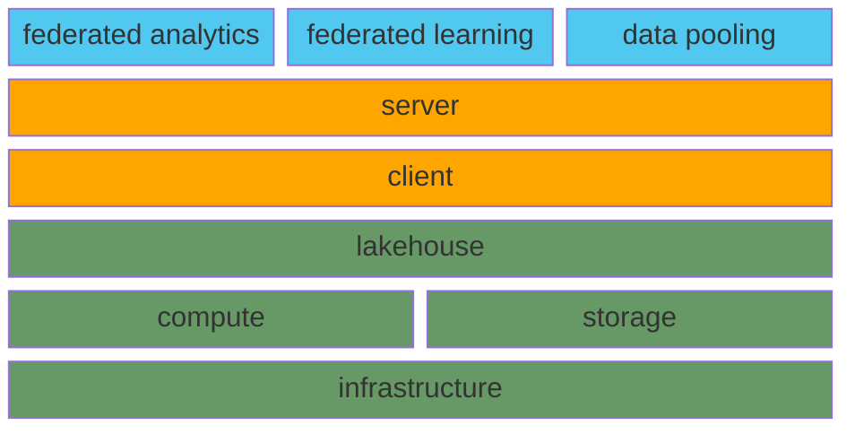

# Datastations als hoeksteen voor het secundair delen van gezondheidsgegevens

Waarom data stations ... 

## Dataproducten

Binnen de European Health dataspace (EHDS) is bepaald welke soorten gegevens als eerste beschikbaar moeten worden gemaakt. Voor het normale gebruik in de zorg (het primaire gebruik) gaat het om zes soorten gegevens:

1. Essentiële patiëntgegevens (zoals allergieën en medische historie
van diagnoses en behandelingen)
2. Elektronische recepten
3. Elektronische verstrekkingen (afgeleverde medicijnen)
4. Medische beeldvorming en bijbehorende verslagen (zoals
röntgenfoto’s met uitleg)
5. Resultaten van medische testen, zoals laboratoriumuitslagen
6. Ontslagverslagen van een ziekenhuisopname

Naast de gegevens voor het primaire gebruik heeft de Europese Commissie ook gegevens voor secundair gebruik opgenomen in de EHDS.

Primair gebruik heeft betrekking op de directe zorgverlening aan een patiënt, terwijl secundair gebruik betrekking heeft op het hergebruik van
gegevens voor onder andere onderzoek, beleid en innovatie.

Bepaalde gegevens voor primair gebruik kunnen worden samengebracht in een dataproduct, zoals de patiëntsamenvatting. Deze bevat onder meer de essentiële patiëntgegevens, recepten en verstrekkingen. Een dataproduct
wordt hierbij gedefinieerd als een concrete dataset die kan worden gedeeldtussen zorgverleners, systemen en instellingen. Ook voor secundair
gebruik kunnen datasets worden samengesteld als dataproduct, bijvoorbeeld in OMOP-formaat.

Elk dataproduct bevat, naast de data zelf, ook metadata. Deze metadata kunnen bijvoorbeeld verwijzen naar de betekenis van de data,
vastgelegd in een ontologie of domeinmodel. Daarnaast legt een dataproduct vast aan welke regels de data moet voldoen: hoe de structuur is opgebouwd, welke inhoudelijke eisen gelden voor de data, hoe het mag worden gebruikt en welke beleidsregels van toepassing zijn voor toegang.

