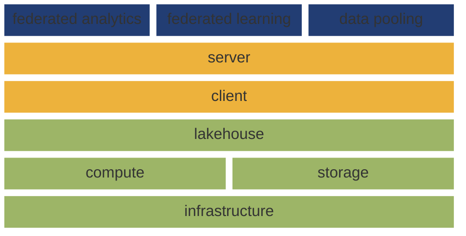

# Datastations als hoeksteen voor het secundair delen van gezondheidsgegevens

Waarom data stations ... 

```mermaid
block-beta
  columns 6
  fa["federated analytics"]:2
  fl["federated learning"]:2
  dp["data pooling"]:2
  server:6
  client:6
  lake["lakehouse"]:6
  compute:3 storage:3
  infra["infrastructure"]:6

  classDef green fill:#9DB567,stroke:#9DB567
  classDef orange fill:#EDB23C,stroke:#EDB23C
  classDef blue fill:#223D73,stroke:#223D73,color:#ffffff
  class lake,compute,storage,infra green
  class server,client orange
  class fa,fl,dp blue
```

