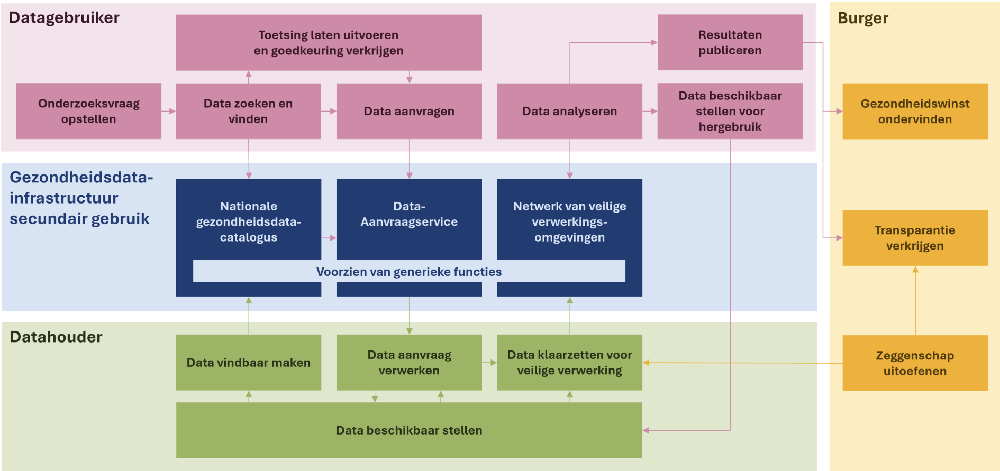

# Scope van de architectuur
## De gezondheidsdata-infrastructuur voor secundair gebruik als _system of interest_
Het _system of interest_ van deze specificatie is de gezondheidsdata-infrastructuur voor secundair gebruik. Een dergelijk systeem bestaat uit verschillende elementen, zoals in figuur 3 is weergegeven.

///caption
**Figuur 3.** Schematisch overzicht van het proces van secundair gebruik van data. Bron: Health-RI.
///

## Het proces van secundair gebruik vanuit het perspectief van de data gebruiker

In de draft documentatie van TEHDAS2 zijn de belangrijkste processtappen voor secundair gebruik benoemd. Deze hebben we gerelateerd aan bovenstaand diagram en zullen we in het als leidraad gebruiken in de uitwerking van de architectuur aan de hand van use-cases.

###  Data zoeken en vinden (_data discovery_)
Voordat de gebruiker de gegevens kan gebruiken, moet worden nagegaan of de benodigde gegevens beschikbaar zijn in het benodigde formaat voor het secundaire gebruiksdoel. Datasets die beschikbaar zijn in de EU zijn te vinden in een metadatacatalogus op https://qa.data.health.europa.eu/. Zodra de data zijn gevonden, kan de data gebruiker beginnen met het aanvragen van de gegevens.

### Data aanvragen (_data access_)
Het aanvragen van toegang tot data is feitelijk een aanvraag tot verwerking door de data gebruiker van gegevens die door een gegevenshouder zijn verstrekt, in overeenstemming met specifieke technische, juridische of organisatorische vereisten, zonder noodzakelijkerwijs de overdracht of het downloaden van dergelijke gegevens te impliceren. (Verordening inzake Gegevensgovernance (DGA), Artikel 2(8), (9) en (13)).

### Data klaarzetten voor verwerking (_data preparation_)
Gedurende deze fase leveren de gegevenshouders de benodigde gegevens aan de HDAB (Gezondheidsgegevens Toegangsorgaan), die de gegevens voorbereidt voor secundair gebruik. Hierbij worden technieken toegepast voor pseudonimisering, anonimisering, generalisatie, onderdrukking en randomisering van persoonsgegevens. Het beginsel van dataminimalisatie (conform de AVG/GDPR) moet worden gerespecteerd om de privacy te waarborgen.

### Data analyseren (_use of data_)
In deze fase voert de gebruiker analyses uit op basis van de ontvangen gegevens voor het doel dat is gedefinieerd in de aanvraagfase. Het analyseren van gegevens op persoonsniveau moet gebeuren in een BVO. De duur van deze fase wordt gespecificeerd in de verordening (Art 68(12)).

### Resultaten publiceren (_finalisation_)
Deze laatste fase van het gebruikerstraject betreft de plichten van de gegevensgebruiker met betrekking tot de analyseresultaten die voortvloeien uit het secundaire gebruik van gegevens. De gegevensgebruiker moet de resultaten van het secundaire gebruik van gezondheidsgegevens publiceren binnen 18 maanden na de voltooiing van de gegevensverwerking in een veilige verwerkingsomgeving of na ontvangst van de gevraagde gezondheidsgegevens. De resultaten moeten in een anoniem formaat worden verstrekt. De gegevensgebruiker moet het gezondheidsgegevens toegangsorgaan op de hoogte stellen van de resultaten. Bovendien moet de gegevensgebruiker in de output vermelden dat de resultaten zijn verkregen door gebruik te maken van gegevens in het kader van de EHDS (Europese Ruimte voor Gezondheidsgegevens).

## Uitwerking in use-cases

In dit hoofdstuk wordt voor ieder systeem het use-case-diagram weergegeven en kort toegelicht. De use-cases worden in het hoofdstuk over het betreffende systeem nader uitgewerkt.

[TO DO: korte toelichting Use-case 3.0 modeling]

