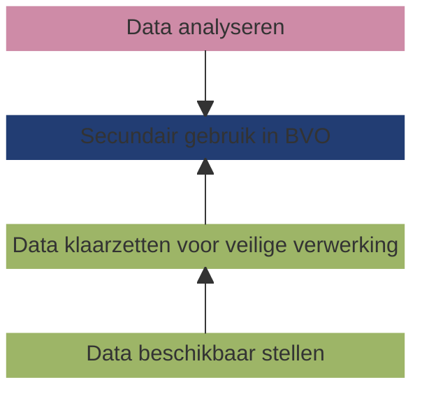

# Principes

Een belangrijk kenmerk van een inrichtingsprincipe is dat het niet onderhandelbaar is. Dit onderscheidt principes van requirements, die wel
ter discussie kunnen staan en aangepast kunnen worden. Inrichtingsprincipes spelen een cruciale rol, omdat zij de onderliggende
argumentatie is voor beslissingen over de inrichting en werking van de dataspace.

!!! abstract "Scope van dit document"
    Een data gebruiker voert een data analyse uit in een gefedereerde beveiligde verwerkingsomgeving, dat is verbonden aan een netwerk van _data stations_ zijnde de systemen waarom de data houder de data beschikbaar heeft gesteld en klaargezet voor gebruik. Dit document geeft een functionele specificatie en voorbeeld implementaties van een data station, zijnde het deel van de gezondheidsdatainfrastructuur dat binnen het domein (verwantwoordelijkheid) van de data houder is gerealiseerd.

