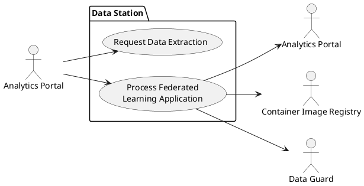
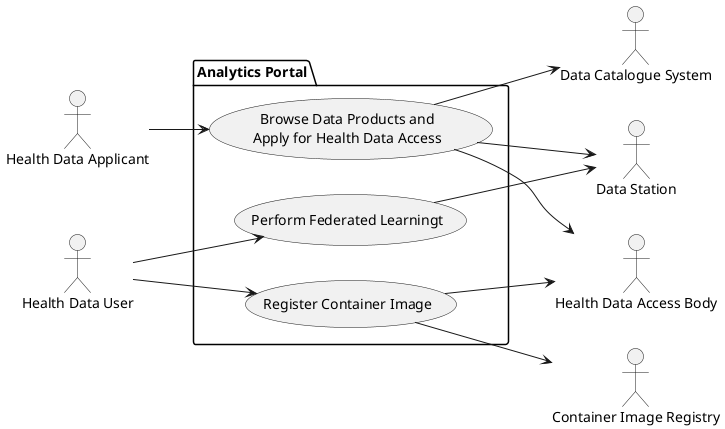

## Analyse Portaal

Uitgangspunt voor het portaal is dat het een datagebruiker toegang verleent tot data en de mogelijkheid biedt om een algoritme op die data uit te voeren. De ontwikkeling van het algoritme vindt buiten het portaal plaats, waarbij de datagebruiker de gelegenheid krijgt om testruns uit te voeren om het algoritme te valideren.

Voor gebruik van het portaal is het noodzakelijk dat een potentiële datagebruiker zich aanmeldt. De datagebruiker selecteert vervolgens de dataproducten die voor het algoritme nodig zijn. Deze dataproducten zijn opgenomen in een Europese datacatalogus waaruit de datagebruiker kan kiezen. Nadat de selectie is gemaakt, vult de datagebruiker het aanvraagformulier verder in en verstuurt de aanvraag. Deze aanvraag kan zowel worden gericht aan de nationale HDAB als aan een HDAB in een andere lidstaat.
De HDAB beoordeelt de aanvraag, voert een review uit op het algoritme en verleent – indien goedgekeurd – toegang tot de data door middel van een vergunning voor de datagebruiker. Deze vergunning is zowel nationaal als internationaal toepasbaar en dus niet beperkt tot gebruik binnen het portaal.

Wanneer het algoritme is geaccepteerd, kan de datagebruiker het image van de container waarin het algoritme is opgenomen registreren. Vervolgens kan de datagebruiker een project starten voor federated learning. Dit project wordt uitgevoerd op de verschillende datastations waar de geselecteerde dataproducten worden beheerd, waarbij het algoritme op elk van deze locaties wordt toegepast.

De volgende paragrafen geven een beknopte beschrijving van de use cases van het analyseportaal.

### Verken dataproducten en vraag toegang aan tot gezondheidsgegevens
Met deze use case kan een aanvrager een verzoek indienen voor een toegangsvergunning tot gezondheidsgegevens bij een dataleverancier. Op basis van deze vergunning verleent de dataleverancier toegang tot een dataproduct binnen een datastation. In de use case kan de aanvrager dataproducten van verschillende dataleveranciers selecteren, deze opnemen in de aanvraag en daarmee een verzoek indienen om toegang te krijgen tot de data in de geselecteerde dataproducten.

De eisen voor deze usecase zijn beschreven in [TEHDAS2 D6.3 Guideline for Health Data Access Bodies on the procedures and formats for data access](https://tehdas.eu/wp-content/uploads/2025/09/draft-guideline-for-health-data-access-bodies-on-the-procedures-and-formats-for-data-access.pdf).

Uitvoering van de usecase levert het volgende op:

- Een verzoek om data beschikbaar te stellen is namens de HDAB verzonden naar de datastations van de geselecteerde dataproducten.
- De aanvraag is ontvangen, beoordeeld en geaccepteerd.
- De aanvrager heeft een vergunning voor gezondheidsgegevens ontvangen (Data Permit). De vergunning is een gekwalificeerde verklaring op het hoogste betrouwbaarheidsniveau overeenkomstig de eIdas-verordening. 

### Registreer Container Image

Door middel van deze usecase kan een datagebruiker een algoritme laten verifieren, een build laten uitvoeren van de container applicatie en de image registeren bij een vertrouwde registratie van images. Voor de container is ene standaardconfiguratie beschikbaar voor het opzetten van de verbinding met het dataproduct.

Uitvoering van de usecase levert het volgende op:

- Het algoritme en de configuratie van de container applicatie is ontvangen, beoordeeld en geaccepteerd.
- De image van de container applicatie is gebuild
- De image van de container applicatie is geregistreerd in een Container Image Registry

### Voer Federated Learning uit

Een datagebruiker kan met deze usecase een project voor Federated Learning starten. Een project kan een of meerdere algoritmes bevatten die uitgevoerd moeten worden op een datastation. In het project komen de resultaten van het leren bij elkaar en kan de datagebruiker een analyse uitvoeren op de resultaten. 

Uitvoering van de usecase levert het volgende op:

- Een opdracht voor het uitvoeren van een container applicatie is verzonden naar een datastation en het resultaat is ontvangen.

## Data Station

Federated Learning is een van de toepassingen van het datastation. Nadat een vergunning is verleend, verstuurt de HDAB via het analyseportaal een verzoek aan verschillende datastations om een dataproduct beschikbaar te stellen voor een toepassing, zoals Federated Learning. Alleen de datastations van dataleveranciers die via de datacatalogus hebben aangegeven dat zij een dataproduct beschikbaar stellen, worden benaderd.

Een datagebruiker kan vanuit het analyseportaal een project starten en uitvoeren. De configuratie wordt vanuit het analyseportaal beheerd en verzonden naar het datastation. Wanneer het algoritme moet worden uitgevoerd, stuurt het analyseportaal een bericht naar het datastation met de opdracht tot uitvoering. Het image wordt vervolgens door het datastation gedownload en geplaatst in een beveiligde containeromgeving. De resultaten worden eerst gevalideerd en daarna vrijgegeven aan het analyseportaal.
