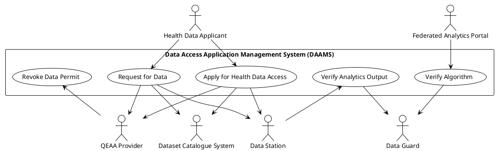
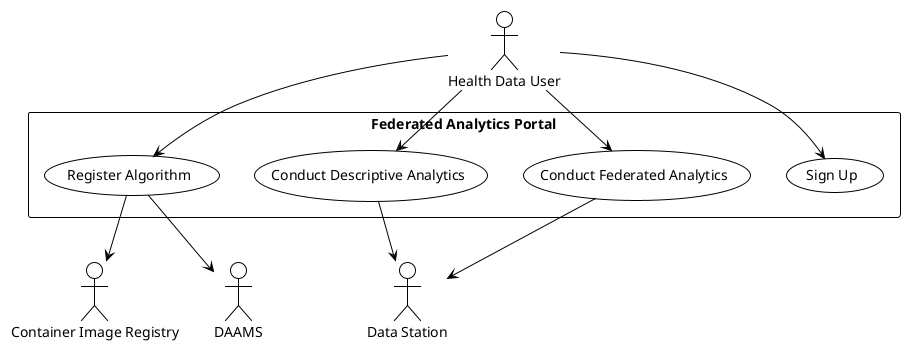
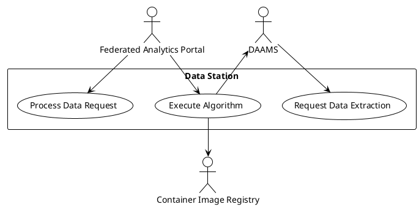

## Use Case Diagrams

In dit hoofdstuk wordt voor ieder systeem het use-case-diagram weergegeven en kort toegelicht. De use-cases worden in het hoofdstuk over het betreffende systeem nader uitgewerkt.

### Data Access Application Management System (DAAMS)

Voor het beschikbaar stellen van data is het noodzakelijk dat een potentiële datagebruiker een vergunning aanvraagt voor toegang tot gezondheidsgegevens, of een verzoek tot datatoegang indient. Beide worden verleend door de HDAB. De gezondheidsgegevens zijn opgenomen in een Europese datacatalogus met dataproducten waaruit de aanvrager kan kiezen. Wanneer een vergunning is verleend of een dataverzoek is goedgekeurd, dan wordt een verzoek tot datalevering verzonden naar de datastations van de dataleveranciers van de betreffende dataproducten.

De eisen voor de usecases zijn beschreven in [TEHDAS2 D6.3 Guideline for Health Data Access Bodies on the procedures and formats for data access](https://tehdas.eu/wp-content/uploads/2025/09/draft-guideline-for-health-data-access-bodies-on-the-procedures-and-formats-for-data-access.pdf).

### Federated Analytics Portal

Het portaal geeft een datagebruiker de mogelijkheid om een algoritme te registreren en te distribueren voor het uitvoeren van een gefedereerde analyse. De ontwikkeling van het algoritme vindt buiten het portaal plaats, waarbij de datagebruiker de gelegenheid heeft om testruns uit te voeren om het algoritme te verifiëren.

Uitgangspunt is een gefedereerde manier van databeschikbaarheid. Dit in tegenstelling tot de beschrijving gegeven in [M6.1 Guideline for health data holders on making personal and non-personal electronic health data available for reuse](https://tehdas.eu/wp-content/uploads/2025/09/draft-guideline-for-health-data-holders-on-making-personal-and-non-personal-electronic-health-data-available-for-reuse.pdf). Het portaal geeft hiermee invulling aan de EHDS overweging 80 dat gezien de gevoeligheid van gezondheidsgegevens waar mogelijk beginselen als “privacy door ontwerp” en “privacy door standaardinstellingen” en het concept “breng de vragen naar de gegevens in plaats van die gegevens te verplaatsen” in acht moeten worden genomen.

### Data Station

Met een datastation maakt een dataleverancier data toegankelijk voor diverse toepassingen. Secundair gebruik is een van de toepassingen van het datastation. Nadat een vergunning is verleend voor toegang of nadat een verzoek om data is goedgekeurd, verstuurt de HDAB via het analyseportaal een verzoek aan het datastation om een dataproduct beschikbaar te stellen aan een datagebruiker.

Een datagebruiker kan vanuit het analyseportaal een project starten en uitvoeren. De configuratie wordt vanuit het analyseportaal beheerd en verzonden naar het datastation. Wanneer het algoritme moet worden uitgevoerd, stuurt het analyseportaal een bericht naar het datastation met de opdracht tot uitvoering. Het image wordt vervolgens door het datastation gedownload en geplaatst in een beveiligde containeromgeving. De resultaten worden eerst gevalideerd en daarna vrijgegeven aan het analyseportaal.

Op basis van een verzoek om data wordt een vraag naar het datastation verzonden. De vraag wordt verwerkt en het antwoord wordt teruggezonden.

