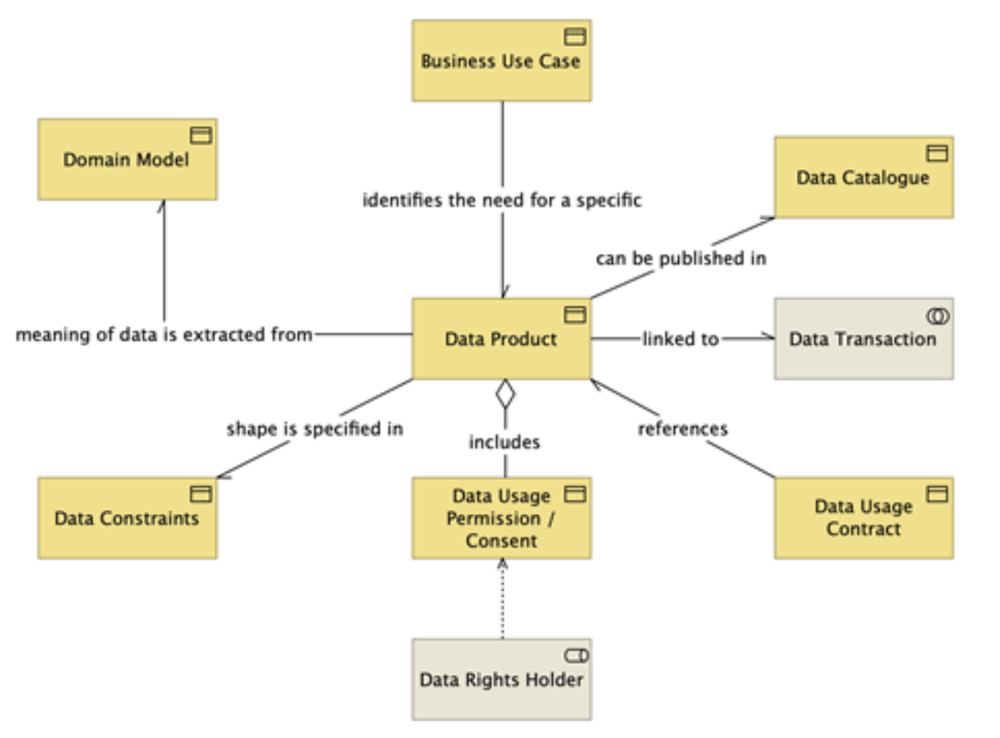

# 1.2. Data stations as a cornerstone for a decentralised, hybrid SPE

## 1.2.1. Data stations and the hourglass model
The concept of **data stations** is one of the two pillars of this document, which describes an architecture for a nationally covering hybrid SPE for secondary use. The concept of data stations takes many different forms today:

- The original PHT concept describes data stations in the context of federated learning[@choudhury2025advancing], which was subsequently generalised to encompass other forms of federated computing[@boninodasilvasantos2022personal].
- The FAIR principles have been elaborated in the concept of a [FAIR data point](https://specs.fairdatapoint.org/fdp-specs-v1.2.html), being a data station populated with FAIR metadata of the data intended as a federated solution for a data catalogue.
- The [KIK-V Programme](https://www.kik-v.nl/starten-met-kik-v) of the Zorginstituut has operationalised the concept of data stations for automated information exchange in the long-term care sector (VVT), which is a form of federated analysis.
- Data stations in the context of primary use are conceptually the same as the [Shared Health Record](https://guides.ohie.org/arch-spec/openhie-component-specifications-1/openhie-shared-health-record-shr) component as specified in the [OpenHIE architecture](https://guides.ohie.org/arch-spec). RSO Zuid-Limburg is working on a primary data station based on openEHR[^1], a solution direction also being pursued in Scandinavia[@pohjonen2022norway] and Slovenia[@bajric2023building]. Although data stations for primary use share many similarities with data stations for secondary use, there are also important differences in the technical characteristics between these systems. These differences relate, for example, to the speed (_latency_) and volume at which data in the station can be accessed: for primary use, individual records must be retrievable quickly, whereas for secondary use, larger datasets can be queried and higher latency is acceptable.

Despite the many different forms, we see more similarities than differences in existing conceptualisations and implementations of data stations. In fact, various studies point to the potential that data stations offer for achieving greater standardisation and interoperability. The success of the internet and other technologies with strong network effects, such as the Linux/Unix operating system, has taught us that standardisation is a great good, but that we must be sparing in imposing standards. This concept has been described using an hourglass as a metaphor[@estrin2010health;@beck2019hourglass] (Figure 2), and is based on the principle of maximum freedom for applications at the top of the hourglass (the domain of the data user) and maximum freedom for the underlying basic infrastructure at the bottom (the domain of the data holder). Despite this freedom, a high degree of interoperability can be achieved by standardising and harmonising the heart of the hourglass (the data station) to a high degree. Schultes (2023)[@schultes2023fair] has combined the principles of the hourglass model with the FAIR principles to arrive at a five-layer model.

/// caption
**Figure 2.** The hourglass model as a conceptual framework for data interoperability. Source: Schultes (2023).[@schultes2023fair]
///

??? abstract "FAIR principles"

    The international FAIR principles are guidelines for the description, storage and publication of data. FAIR is an acronym for:

    - **F**indable
    - **A**ccessible
    - **I**nteroperable
    - **R**eusable

    Although the principles were originally formulated for scientific data, they are also applied for secondary use of data routinely recorded in, for example, the regular care process.

## 1.2.2. The five layers of the hourglass model as a conceptual framework

The hourglass model is based on five layers that guide data from the moment it is first recorded by the data holder (layer 1) through to the ultimate secondary use by the data user (layer 5).

### 1.2.2.1. The FAIRification process in the first two layers

In **layer 1**, the data is created. The person responsible for recording the data has maximum freedom here. The recording of data can be done by a researcher who manually collects, codes and records data as a research dataset, but can also be done in the primary care process, where various healthcare providers record data in different health information systems.

In **layer 2**, the standardisation of the data begins. It is a kind of funnel where, using various data processing tools, the data and metadata are converted into structured formats that are machine-readable and make use of standardised terminology and information schemas.

### 1.2.2.2. The data station at the heart of the hourglass

**Layer 3 is the heart of the hourglass** and acts as a bridge between the two lower and two upper layers. In this layer, the data and metadata are (1) prepared for use and the FAIRification process and (2) connected to the network of secure processing environments. This layer is the most crucial for achieving interoperability. To that end, a set of minimal, open and technology-neutral standards is defined. The idea of a data station aligns with the concept of data products in the DSSC.

??? abstract "Data product"
    Primary use relates to the direct provision of care to a patient, while secondary use relates to the reuse of data for purposes including research, policy and innovation.
    
    Certain data for primary use can be brought together in a data product, such as the patient summary. This includes essential patient data, prescriptions and dispensing records. A data product is defined here as a concrete dataset that can be shared between healthcare providers, systems and institutions. Datasets for secondary use can also be compiled as a data product, for example in OMOP format.
    
    Each data product contains, in addition to the data itself, also metadata. This metadata describes, among other things, the structure of the data, the content requirements that the data must meet, and references to the meaning of the data (recorded in an ontology or domain model). In addition, a data product sets out the rules that the data user must comply with for access to the data: how it may be used and which policies apply to access.

    

### 1.2.2.3. FAIR orchestration

In **layer 4**, the processing hub is positioned, with which every data station can be incorporated into a network for processing and consuming the data. This layer also contains the generic provisions such as a catalogue and search functionality.

In **layer 5**, the data user is given maximum freedom to consume various services and/or perform analyses.

[^1]: See this [webinar](https://www.youtube.com/watch?v=jT5UTLRX5VQ) from 23 January 2025
