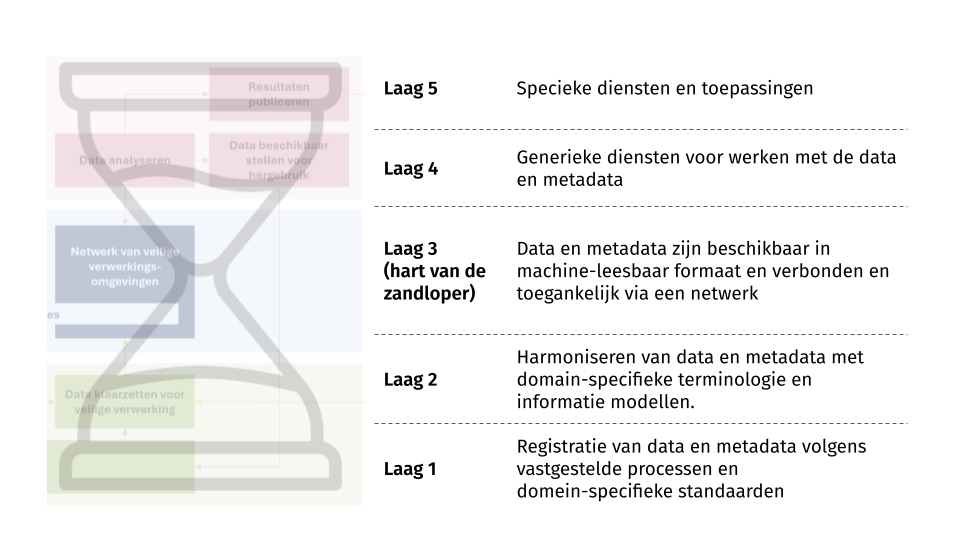
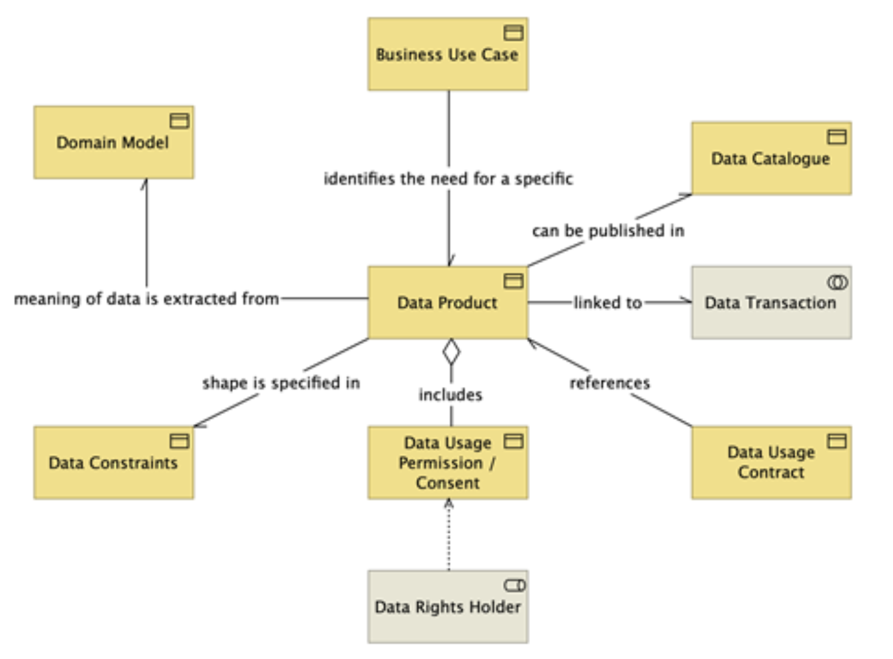

In de context van de European Health Data Space (EHDS) en de Data Governance Act (DGA) is het concept van beveiligde verwerkingsomgevingen (BVOs) essentieel voor de implementatie van de gezondheidsdata-infrastructuur. Data gebruikers _krijgen_ geen data, maar _toegang tot_ data in een BVO die voldoet aan vastgestelde strenge technische en veiligheidsnormen.[^1] Daarbij is de gedachte dat er meerdere BVOs zullen worden gerealiseerd, dus een netwerk van veilige verwerkingsomgevingen zoals is weergegeven in de blauwe laag in figuur 1.

Om een dergelijk netwerk van BVOs te realiseren is (data) interoperabiliteit essentieel. Het 'zandloper' model is een bewezen concept om interoperabiliteit voor dergelijke netwerk technologieen te realiseren. Dit model (zie figuur 2) gaat uit van het principe van maximimale vrijheid voor toepassingen (boven in de zandloper) èn maximale vrijheid voor de onderliggende basisinfrastructuur aan de onderkant. Ondanks deze vrijheid kan een hoge mate van standaardisatie en harmonisatie worden gerealiseerd in het hart van de zandloper, zodat daarmee interoperabiliteit kan worden gerealiseerd in het netwerk. Schultes (2023)[@schultes2023fair] heeft de principes van het zandloper model gecombineerd met de FAIR principes.

/// caption
**Figuur 2.** Het zandloper model als denkraam voor data interoperabiliteit. Bron: Schultes (2023).[@schultes2023fair]
///

??? abstract "FAIR principes"

    De internationale FAIR-principes zijn richtlijnen voor de manier van beschrijven, opslag en publicatie van data. FAIR is een acroniem voor:

    - **F**indable - vindbaar 
    - **A**ccessible - toegankelijk
    - **I**nteroperable - uitwisselbaar
    - **R**eusable - herbruikbaar

    Alhoewel de principes oorspronkelijk zijn geformuleerd voor wetenschappelijke data, worden ze ook toegepast voor secundair gebruik van data die routematig wordt vastgelegd in bijvoorbeeld het reguliere zorgproces.

## De vijf lagen van het zandloper model

Het zandloper model gaat uit van vijf lagen die de data moeten laten stromen vanaf het eerste moment dat ze worden vastgelegd door de data houder (laag 1) tot en met het uiteindelijke secundair gebruik door de data gebruiker (laag 5).

### Het FAIRificatie proces in de eerste twee lagen

In **laag 1** wordt de data gecreerd. Diegene die verantwoordelijk is voor het vastleggen van de data heeft hierin maximale vrijheid. Het vastleggen van de data kan gebeuren door een onderzoeker, die handmatig data verzameld, codeert en vastlegd als een onderzoeksdataset, maar kan ook worden gedaan in het primaire proces van de zorg waarbij allerlei zorgverleners in verschillende zorginformatiesystemen data vastleggen.

In **laag 2** wordt een begin gemaakt met het standaardiseren van de data. Het is een soort trechter waar met gebruik van allerlei databewerkings tools de data en metadata worden omgezet naar gestructureerde formats die machine-leesbaar zijn en gebruik maken van gestandaardiseerde terminologie en informatieschemas.

### Het data station in het hart van de zandloper

**Laag 3 is het hart van de zandloper** en fungeert als een brug tussen de twee onderste en twee bovenste lagen. In deze laag worden de data en metadata klaargezet voor gebruik en FAIRificatie proces en het verbonden aan het netwerk van beveiligde verwerkingsomgevingen. Deze laag is het meest cruciale om interoperabiliteit te realiseren. Daarvoor wordt een set van minimale, open en technologie-neutrale standaarden gedefinieert. Het idee van een data station sluit aan bij het concept van data producten in de EHDS.

??? abstract "Data product"
    Primair gebruik heeft betrekking op de directe zorgverlening aan een patiënt, terwijl secundair gebruik betrekking heeft op het hergebruik van gegevens voor onder andere onderzoek, beleid en innovatie.
    
    Bepaalde gegevens voor primair gebruik kunnen worden samengebracht in een dataproduct, zoals de patiëntsamenvatting. Deze bevat onder meer de essentiële patiëntgegevens, recepten en verstrekkingen. Een dataproduct wordt hierbij gedefinieerd als een concrete dataset die kan worden gedeeldtussen zorgverleners, systemen en instellingen. Ook voor secundair gebruik kunnen datasets worden samengesteld als dataproduct, bijvoorbeeld in OMOP-formaat.
    
    Elk dataproduct bevat, naast de data zelf, ook metadata. Deze metadata kunnen bijvoorbeeld verwijzen naar de betekenis van de data,
    vastgelegd in een ontologie of domeinmodel. Daarnaast legt een dataproduct vast aan welke regels de data moet voldoen: hoe de structuur is opgebouwd, welke inhoudelijke eisen gelden voor de data, hoe het mag worden gebruikt en welke beleidsregels van toepassing zijn voor toegang.

    

### FAIR orchestratie

In **laag 4** wordt het data station opgenomen in een netwerk om de data te verwerken en te verbruiken. Denk hierbij aan generieke voorzieningen zoals een catalogus en zoekfunctionaliteit (welke data stations hebben welke data?), het integreren wat data uit verschillende data stations en het uitvoeren van allerlei berekeningen op de data.

In **laag 5** wordt aan de data gebruiker maximale vrijheid gegeven om allerlei diensten af te nemen en/of analyses te doen.

[^1]: Wat deze vereisten exact gaan zijn wordt door de Europese Commissie vastgesteld. Voor primair gebruik is dit uiterlijk maart 2027, voor secundair gebruik maart 2029.

