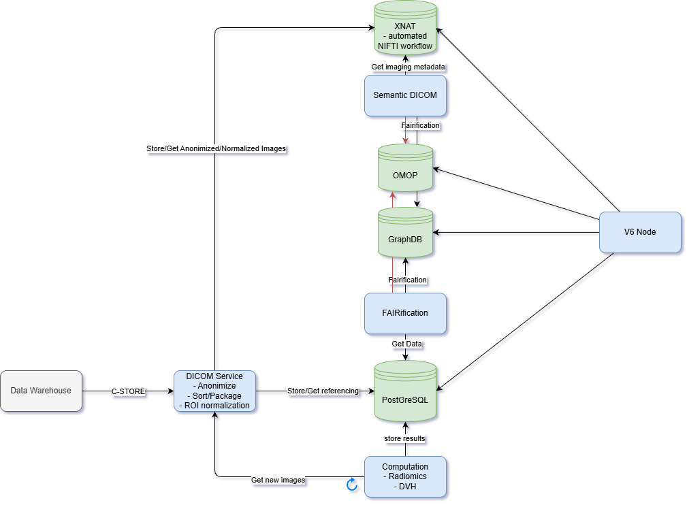

# 7.5. Proposed development agenda for SPEs

The biggest gaps we see are:

- Output control: still an _unsolved problem_ for deep learning models
- Smart contracts as an additional safeguard in federated SPEs.

## Imaging data provisions
To facilitate research and registrations based on medical images, a number of components could be added to the data station. An example implementation is currently being developed by [MDW](https://www.medicaldataworks.nl/) in the context of [DIGIONE](https://digicore-cancer.eu/).

### PACS for research
For direct use of imaging data, DICOM images are stored in a research-oriented Picture Archiving System. During storage, images are converted to storage formats such as NIfTI and NRRD, which are better suited for direct use in federated algorithms.

### DICOM service
Images are anonymised immediately upon receipt, and locally used structure names of segmentations are translated to globally recognised standards. Depending on the required calculations, linked modalities are queried together, such as CT images, delineations and information about the planned dose distribution.

### Computation service
Upon image receipt, automatically derived analyses are performed, such as DVH calculations and radiomics extractions. By using the normalised naming of delineations, it is also possible to base these calculations on composite structures (e.g. the mean dose in both lungs, excluding the primary tumour). The results of these configurable analyses are stored in a relational database and made available for use by the node.

### Interoperability
To guarantee interoperability of the data, both imaging data and derived results are converted to OMOP and graphDB via automatic conversions.
