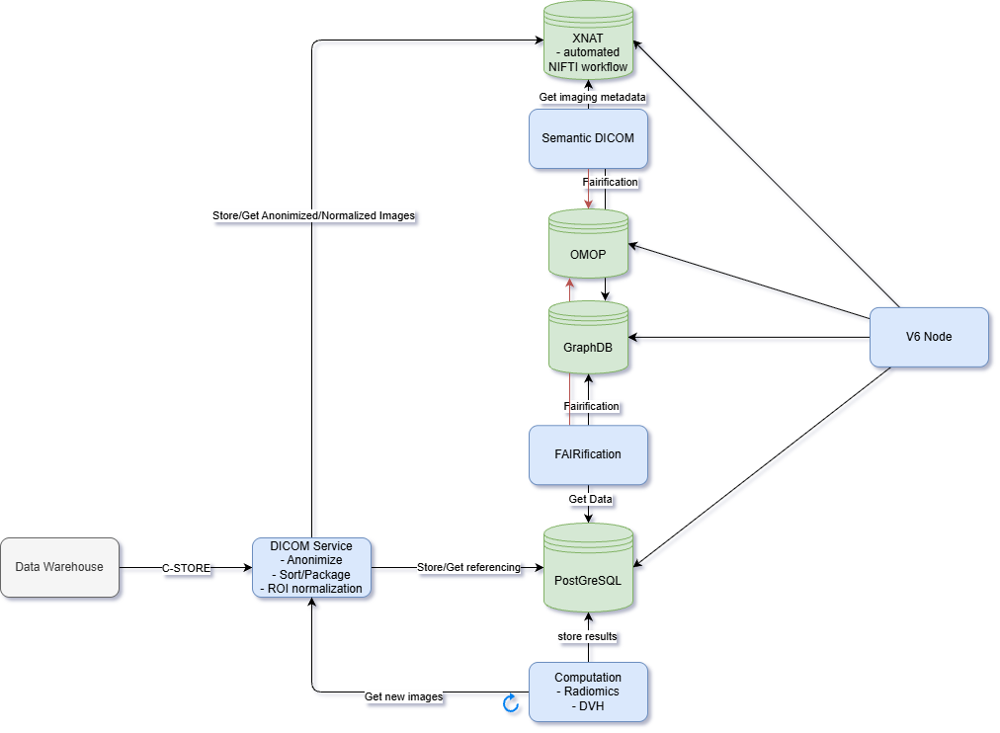

# Voorstel ontwikkelagenda BVOs

De grootste gaps die we zien zijn:

- Output controle: nog _unsolved problem_ voor deep learning modellen
- Smart contracts als extra waarborg in federatieve BVO. Alleen een

## Imaging Data voorzieningen
Voor het faciliteren van onderzoek en registraties op basis van medische beelden zouden een aantal componenten aan het data station kunnen worden toegevoegd. Een voorbeeldimplementatie wordt momenteel ontwikkeld door [MDW](https://www.medicaldataworks.nl/) in de context van [DIGIONE](https://digicore-cancer.eu/). 

### PACS voor onderzoek
Voor rechstreeks gebruik van beelddata worden de DICOM beelden opgeslagen in een onderzoeksgerichte Picture Archiving System. Tijdens opslag worden de beelden geconverteerd naar opslagformaten als NIfTI en NRRD, deze formaten lenen zich meer voor rechtstreeks in de gefedereerde algoritmen.

### DICOM Service
Beelden worden na ontvangst direct geanonimiseerd, en lokaal gebruikte structuurnamen van segmentaties worden vertaald naar globaal bekende standaarden. Afhankelijk van de benodigde berekeningen worden gekoppelde modaliteiten samen opgevraagd, zoals bijvoorbeeld de CT beelden, intekeningen en informatie over geplande dosisdistributie.

### Computatieservice
Bij beeldontvangst worden automatisch afgeleide analyses uitgevoerd, zoals DVH-berekeningen en radiomics-extracties. Door gebruik te maken van de genormaliseerde naamgeving van intekeningen is ook mogelijk deze berekeningen te baseren op samengestelde structuren (bijvoorbeeld de gemiddelde dosis in beide longen, afgezien van de primaire tumor). De resultaten van deze configureerbare analyses worden opgeslagen in een relationele database en beschikbaar gesteld voor gebruik door de node.

### interoperabiliteit
Om interoperabiliteit van de data te garanderen worden zowel beelddata als afgeleide resultaten geconverteerd naar OMOP en graphDB door middel van automatische conversies.

