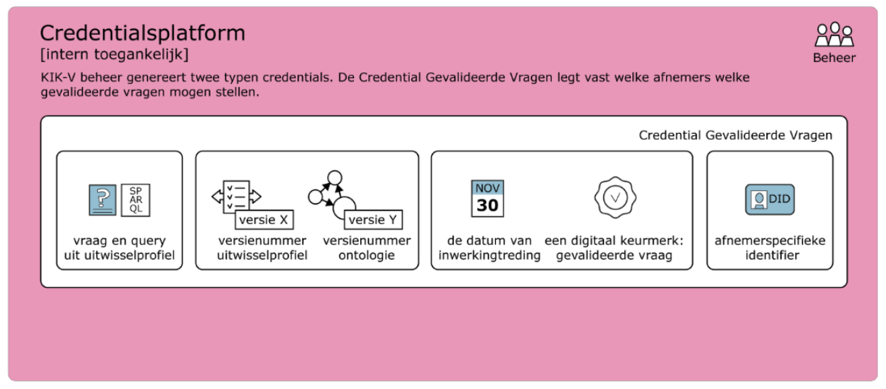

# 6.1.3. KIK-V implementation: application

## 6.1.3.1. The KIK-V data station

The KIK-V data station is a standardised application that realises the syntactic and semantic interoperability of data. A specification has been drawn up so that business service providers can offer a _data-station-as-a-service_. A KIK-V data station must at a minimum meet all of the following functional requirements. Data station vendors are of course also free to add their own additional functionalities.

| Required functionality | Description |
|:----------------------|:-------------|
| Import data | The system can retrieve data via various methods, such as APIs, database connections or files (such as XML, JSON, CSV). |
| Convert to standard format | Data is automatically converted to a standard format (RDF) |
| Manage connections | Connections can be easily added, tested, modified or deleted. |
| Automated and manual import | Both automated and manual data entry are supported. |
| Support for calculations | Manual entry of calculated data is also possible. |
| Multiple versions | The system works with different ontologies and versions of ontologies. |
| Error checking | Data is validated, for example for completeness and accuracy. |
| Link data | Data can be automatically connected to ontologies. |
| Insight into actions | Activities such as importing and checking are stored in a log. |
| Query | Submitting validated queries is done via SPARQL. |
| Open standards and FAIR principles | The system uses internationally recognised standards (RDF, SPARQL, OWL2) and supports accessible and reusable data sharing. |
| Automatic data linking | The system can independently establish relationships between data. |
| Flexible | New source systems and partners can be easily added. |
| Suitable for care institutions | Both large and small care institutions, with varying IT levels, can use the system. |

As of December 2025, there are three suppliers of KIK-V data stations: [bince](https://bince.nl/over-het-product/daas-kik-v-zorginstituut), [nlcom](https://nlcom.nl/diensten/kik-v-daas/) and [SureSync](https://suresync.nl/datastation). A screenshot from Bince gives an impression of how the data station is used in practice.

## 6.1.3.2. KIK-Starter

TO DO: add a short description of KIK-Starter here

## 6.1.3.3. Credentials platform

Not every information-requesting party can or may simply use any exchange profile or query any care provider at will. Via the credentials platform, information-requesting parties receive the correct query credentials, which permit them to ask only the questions set out in the relevant exchange profile. In addition, the credentials platform issues credentials to participating care providers, so that information-requesting parties can be certain they are approaching the correct care provider.

The credentials platform is not a platform that is visible to end users. It does, however, give the KIK-V management organisation the ability to ensure that users of the KIK-Starter only have access to data for which they are authorised based on their role.

Within the credentials platform, rights are granted per information-requesting party. The platform provides direction on which exchange profile (including version number) and indicators information may be requested from a data station. The following can be selected on the platform:

− Subject DID: the ID of the information-requesting party
− Exchange profile: the exchange profile
− Version: the version number of the exchange profile
− Indicators: the indicators that may be calculated within the exchange profile
− Start date: the date from which the rights are granted
