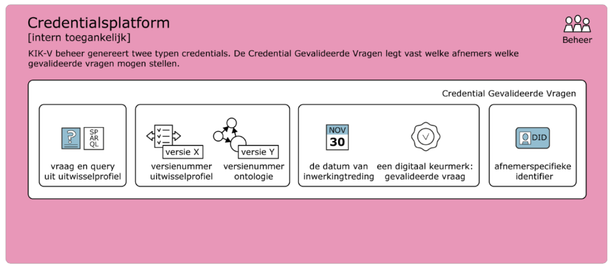

# KIK-V implementatie: applicatie

## Het KIK-V data station

Het KIK-V data station is een gestandaardiseerde applicatie waarmee de syntactische en semantische interoperabiliteit van data wordt gerealiseerd. Hiertoe is een specificatie opgesteld zodat zakelijke dienstverleners een _datastation-as-a-service_ kunnen aanbieden. Een KIK-V data station moet ten minste voldoen aan alle onderstaande functionaliteiten. Uiteraard staat het de data station leveranciers daarnaast vrij om hun eigen functionaliteiten toe te voegen. 

| Vereiste functionaliteit | Omschrijving |
|:-------------------------|:-------------|
| Gegevens importeren | het systeem kan gegevens ophalen via verschillende manieren, zoals API's, databankkoppelingen of bestanden (zoals XML, JSON, CSV). |
| Omzetten naar standaardformaat | data wordt automatisch omgezet naar een standaardformaat (RDF) |
| Beheren van koppelingen | je kunt koppelingen eenvoudig toevoegen, testen, aanpassen of verwijderen. |
| Automatisch en handmatig importeren | zowel geautomatiseerde als handmatige gegevensinvoer wordt ondersteund. |
| Ondersteuning van berekeningen | handmatige invoer van berekende gegevens is ook mogelijk. |
| Meerdere versies | het systeem werkt met verschillende ontologieën en versies van ontologieën. |
| Controleren op fouten | data wordt gevalideerd, bijvoorbeeld op volledigheid en juistheid. |
| Gegevens koppelen | data kan automatisch worden verbonden aan ontologieën. |
| Inzicht in acties | activiteiten zoals importeren en controleren worden opgeslagen in een logboek. |
| Vragen stellen | gevalideerde vragen stellen gebeurt via de SPARQL manier.  |
| Open standaarden en FAIR-principes | het systeem gebruikt internationaal erkende standaarden (RDF, SPARQL, OWL2) en ondersteunt toegankelijk en herbruikbaar delen van data. |
| Automatisch koppelen van data | het systeem kan zelfstandig verbanden leggen tussen gegevens. |
| Flexibel | nieuwe bronsystemen en partners kunnen gemakkelijk worden toegevoegd. |
| Geschikt voor zorginstellingen | zowel grote als kleine zorginstellingen, met verschillende IT-niveaus, kunnen het systeem gebruiken. |

Per december 2025 zijn er drie leveranciers van KIK-V data stations: [bince](https://bince.nl/over-het-product/daas-kik-v-zorginstituut), [nlcom](https://nlcom.nl/diensten/kik-v-daas/) en [SureSync](https://suresync.nl/datastation). Een screenshot van Bince geeft een indruk hoe het data station in de praktijk gebruikt wordt.

## KIK-Starter

TO DO: hier nog een korte beschrijving van KIK-started toevoegen

## Credentialsplatform

Niet iedere informatie-vragende partij kan en mag zomaar gebruik maken van ieder uitwisselprofiel of zomaar elke zorgaanbieder bevragen. Via het credentialsplatform ontvangen informatie-vragende partijen de juiste vraag-credentials, die hen toestaan om alleen de vragen te stellen die binnen het betreffende uitwisselprofiel zijn vastgelegd. Daarnaast geeft het credentialsplatform credentials uit aan deelnemende zorgaanbieders, zodat informatie-vragende partijen zeker weten dat ze de juiste zorgaanbieder benaderen.

Het credentialsplatform is geen platform die zichtbaar is voor eindgebruikers. Het biedt de beheerorganisatie van KIK-V echter de mogelijkheid om ervoor te zorgen dat gebruikers van de KIK-starter alleen toegang hebben tot gegevens waarvoor zij op basis van hun rol gemachtigd zijn.

Binnen het credentialsplatform worden per informatie-vragende partij rechten verleend. Het platform geeft daarbij sturing voor welk uitwisselprofiel (inclusief versienummer) en indicatoren informatie opgevraagd mag worden bij een datastation. Op het platform kan het volgende worden geselecteerd:

− Subject DiD: het ID van de informatie-vragende partij
− Uitwisselprofiel: het uitwisselprofiel
− Versie: het versienummer van het uitwisselprofiel
− Indicatoren: de indicatoren die berekend mogen worden binnen het uitwisselprofiel
− Datum ingang: ingangsdatum vanaf wanneer de rechten verleend worden

