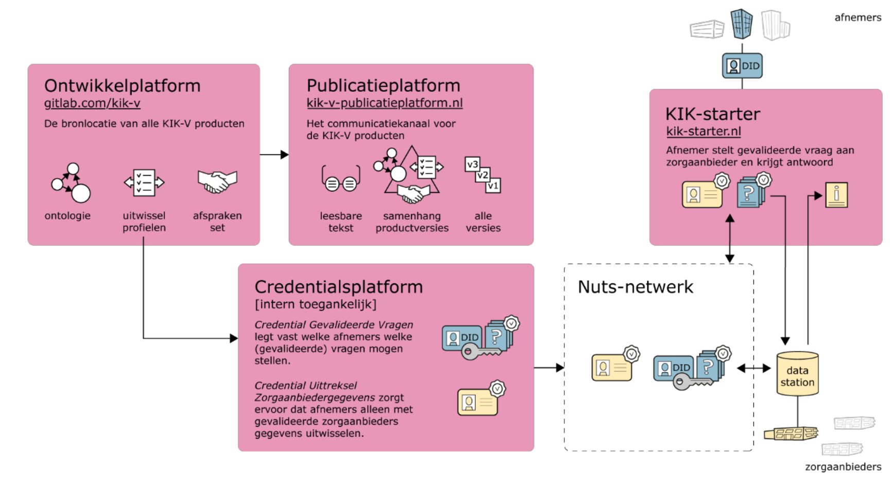

# Implementation: KIK-V

## Why KIK-V and what can we do with it?

In the KIK-V[^1] programme, chain partners in nursing home care work together to streamline information exchange using a set of agreements.

Before KIK-V was used, chain partners such as care offices (zorgkantoren), the NZa, the IGJ and the Care Institute primarily asked care providers to submit data via central databases in order to reduce the number of data requests directed at a single care provider. Unfortunately, these central information sources do not always align with the needs of chain partners, who require more up-to-date data or data at a different level of detail. Sometimes additional data is needed, or requirements change due to external factors. The result: in fact *more* requests directed at the care provider as data holder.

Between chain partners — effectively the data users — there was also little coordination on these requests. The data is, like apples and oranges, not readily comparable. There are differences in definitions and formats, in the timing of requests and in the period covered. This in turn leads to less usable information for data users.

KIK-V has established a decentralised approach to this data exchange. A standard dataset has been defined using an [ontology](). This dataset consists of data that a care provider already records in existing processes such as HR policy, financial management or client support. The dataset resides with the source holder — the care provider itself. Chain partners base their data requests solely on this dataset. Within the KIK-V framework, they coordinate with one another on which requests these are.

It is easy to add new questions if they can be answered using the existing dataset. The care provider compiles the answers from the dataset and shares only those answers with chain partners. Because each question is answered using the same dataset, the quality and comparability of answers improves. And the effort required from the care provider remains limited.

## How KIK-V is implemented

KIK-V implements a form of federated analytics, using the following components:

- Information:
    - The **ontology** is the central data model with which KIK-V works
    - The **exchange profiles** define the various data requests that can be submitted and processed via the platform. These profiles are developed through a structured matching process
- Application:
    - **layer 4 | KIK-Starter** is the application with which data users can execute their data requests.
    - **layer 4 | Credentials platform** fulfils a function comparable to the DAAMS, within which approved exchange profiles are managed and made available to data users.
    - **layer 3 | Data station** contains the data and metadata in RDF format and can be accessed via the secure NUTS network through a SPARQL query API.
- Infrastructure:
    - The **Nuts network** is the foundation supporting the question-and-answer process of data requests.

These elements are described in more detail below.

[^1]: The text and explanation of KIK-V is largely drawn from documentation made available by the Care Institute on [kik-v.nl](https://www.kik-v.nl/).
