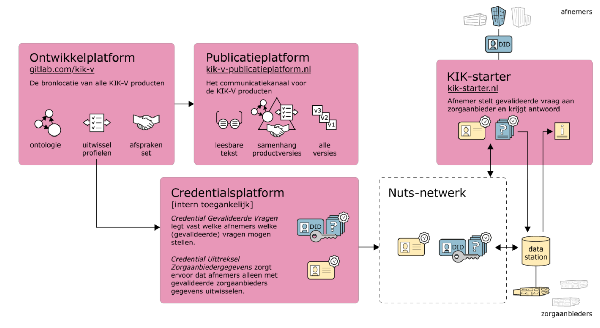

# Implementatie: KIK-V

## Waarom KIK-V en wat kunnen we ermee?

In het programma KIK-V[^1] werken ketenpartijen in de verpleeghuiszorg samen aan het stroomlijnen van de informatie-uitwisseling, aan de hand van een afsprakenset. 

Voordat KIK-V werd gebruikt, vragen ketenpartijen zoals de zorgkantoren, de NZa, de IGJ en het Zorginstituut aan zorgaanbieders vooral om gegevens aan te leveren via centrale databases om zo het aantal uitvragen aan een zorgaanbieder te beperken. Helaas sluiten deze centrale informatiebronnen niet altijd aan bij de behoeften van de ketenpartijen. Die hebben actuelere gegevens nodig of van een ander detailniveau. Soms zijn aanvullende gegevens nodig of veranderen behoeften door externe factoren. Het gevolg is: juist méér uitvragen aan de zorgaanbieder als datahouder.

Tussen ketenpartijen, in feite de datagebruikers, was er ook weinig afstemming over deze uitvragen.  De gegevens zijn, als appels en peren, onderling niet goed vergelijkbaar. Er zijn verschillen in definities en formaten, in uitvraagmomenten en in de periode waarover informatie wordt gevraagd. En dat leidt weer tot minder bruikbare informatie voor datagebruikers.

KIK-V heeft een decentrale manier voor deze gegevensuitwisseling opgesteld. Daarbij is een standaard gegevensset gedefineerd aan de hand van een [ontologie](). Deze set bestaat uit gegevens die een zorgaanbieder al registreert in bestaande processen zoals voor het personeelsbeleid, de financiële bedrijfsvoering of cliëntondersteuning. De gegevensset staat bij de bronhouder, de zorgaanbieder zelf. Ketenpartijen baseren hun uitvragen alleen op deze gegevensset. In KIK-V-verband stemmen ze met elkaar af welke uitvragen dit zijn.

Het is gemakkelijk om nieuwe vragen toe te voegen als deze met de bestaande gegevensset beantwoord kunnen worden. De zorgaanbieder stelt uit de gegevensset de antwoorden samen en deelt alleen deze antwoorden met ketenpartijen. Omdat elke vraag wordt beantwoord met diezelfde gegevensset gaat de kwaliteit en vergelijkbaarheid van de antwoorden omhoog. En de inspanning voor de zorgaanbieder blijft beperkt.

## Hoe is KIK-V implementeerd

KIK-V implementeerd een vorm van federated analytics, waarbij de volgende componenten worden gebruikt:

- Informatie:
    - De **ontologie** is het centrale gegevensmodel waarmee KIK-V werkt
    - De **uitwisselprofielen** definieren de verschilende gegevensverzoeken die via het platform kunnen worden ingediende en verwerkt. Deze profielen worden opgesteld via een gestructureerd matchingsproces
- Applicatie:
    - **laag 4 | KIK-Starter** is de applicatie waarmee datagebruikers hun gegevensverzoeken kunnen uitvoeren.
    - **laag 4 | Credentialsplatform** vervuld een functie vergelijkbaar met de DAAMS, waarbinnen goedgekeurde uitwisselprofielen worden beheerd en beschikbaar gesteld voor datagebruikers.
    - **laag 3 | Data station** bevat de data en metadata in RDF formaat en is via het beveiligde NUTS-netwerk te benaderen middels een SPARQL query API.
- Infrastructuur:
    - Het **Nuts netwerk** is de basis waarmee het vraag- en antwoordspel van gegevensverzoeken wordt ondersteund.

Deze elementen worden hieronder in meer detail beschreven.

[^1]: De tekst en uitleg over KIK-V is grotendeel overgenomen van documentatie die beschikbaar is gesteld door het Zorginstituut op [kik-v.nl](https://www.kik-v.nl/).