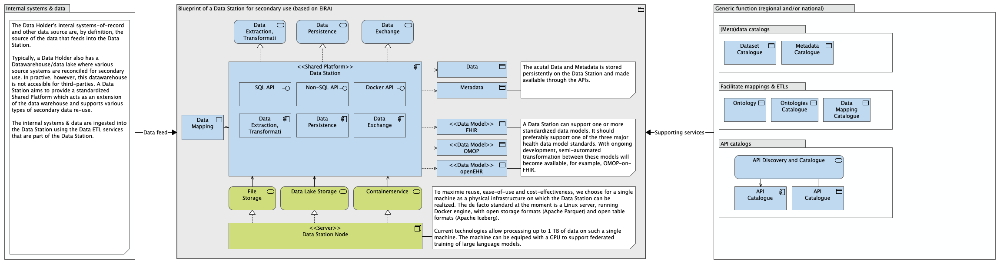

# Application components for decentralised processing

## Application components of PLUGIN

The data station (left) and the federated processing hub (right) form the paired unit of the PLUGIN/vantage6 architecture. The function of each component is described in more detail below.

!!! note "Detailed description of PLUGIN application components"

    === "**vantage6 server**"

        To enable communication between the various nodes, the Vantage6 Server stores information about, among other things, the participating organisations, the available nodes, and the inputs and results of all tasks created in the system. This information is queried by the nodes using a REST API and websockets, so that incoming ports on the data station do not need to be opened.

        Authentication and authorisation based on assignable roles tracks which actions are permitted for users and nodes, among others.

    === "**vantage6 node**"

        The Vantage6 Node executes pending tasks. It retrieves the specified Docker image from the registry and runs it, connecting it to one of the pre-configured data sources. For each task, configuration is used to check whether running the Docker image is permitted.

        To execute the algorithm, the node launches a Docker container on the data station based on the retrieved Docker image. All communication from the algorithm passes through the node to the server.

    === "**Algorithms and registry**"

        For maximum flexibility in the type of task to be executed, Vantage6 uses [Docker images](https://docs.docker.com/get-started/docker-concepts/the-basics/what-is-an-image/). A template image contains required logic such as processing inputs and returning results. This can then be extended with use-case-specific logic, such as a federated query or a federated learning algorithm. The resulting Docker image is stored in a central [Docker registry](https://docs.docker.com/get-started/docker-concepts/the-basics/what-is-a-registry/) (a library for Docker images).

    === "**PLUGIN-Analytics**"
        
        The PLUGIN-Analytics application enables the execution of federated analysis tasks, returning an aggregated answer. This application includes, among other things, an explorer function containing the metadata schema of the data and predefined analysis questions.
        
    === "**PLUGIN-ML**"

        The PLUGIN-ML application enables the data user to develop an AI model in a federated manner. PLUGIN-ML encompasses both the machine learning algorithms executed at PLUGIN data stations and the aggregation algorithms that combine models into a generic model. Via PLUGIN-ML, a data user is able to set up a pipeline using widely used machine learning algorithms.

    === "**PLUGIN-Hub**"     

        The PLUGIN-Hub application securely sends data in bulk from the PLUGIN data station to the central processing hub. The data user must hold a 'permit' or legal basis to be authorised to receive this data.

    === "**PLUGIN-Lake**"   

        The PLUGIN-Lake application is a federated lakehouse implementation within the PLUGIN data stations. PLUGIN-Lake receives, transforms and makes data available to the three applications above. It is possible, among other things, to configure ETL processes, such as transforming data in FHIR format to OMOP.
        
When discussing specific implementations, the term *Aggregator Node* is often used. This refers to the node where aggregation of partial results takes place. Although it is possible to realise this node at a separate location, it is technically no different from other Vantage6 nodes. Every Vantage6 Node is therefore potentially an aggregator node. An exception is the [*Secure Aggregator Node*](https://ai.jmir.org/2025/1/e60847). This solution can be used in specific cases where aggregated data may still be sensitive, to further reduce the risk of a data breach.

## PLUGIN and the European Interoperability Reference Architecture (EIRA)

To meet diverse data needs (such as classical reporting, analysis, data sharing and data science), health institutions often use separate data warehouses, data lakes and other analytical environments. This separation leads to data duplication, additional complexity and data governance challenges. The PLUGIN approach, and more specifically the PLUGIN-Lake component, aims to address these pain points using a lakehouse architecture. A lakehouse architecture can provide a solution by combining the functionality of these different environments. All data is stored in a flexible and scalable platform. There is only one storage layer based on open standards, enabling both unstructured and structured data to be stored, as described in [chapter 5](../../infrastructuur/index.md).

This approach and architecture of PLUGIN is in line with the principles of the **European Interoperability Reference Architecture (EIRA)**. EIRA provides a framework for designing interoperable architectures by identifying reusable *Architectural Building Blocks (ABBs)*. We have translated the PLUGIN architecture into the terminology and concepts of EIRA, with the intent to contribute to further standardisation and the improvement of interoperability. The mapping between the key components of PLUGIN and EIRA ABBs is shown below. This demonstrates that EIRA has in fact included all the essential components for realising a lakehouse architecture, and PLUGIN-Lake, in the reference architecture.

!!! note "PLUGIN in terms of EIRA architectural building blocks"

    === "**Processing hub**"
    
        Functions as an intermediary for communication, manages task metadata and orchestrates interactions. This can be seen as a combination of EIRA ABBs related to *Message Exchange*, *Service Registry* and *Process Control*.

    === "**Data station**"
        
        The component within the jurisdiction of the data holder (e.g. a hospital). It provides the compute capacity for local analysis and ensures that data does not leave its own environment. This corresponds to EIRA ABBs for *Secure Data Processing* and *Service Consumption*.

    === "**Secure Aggregation Server (SAS)**"
    
        A specialised node responsible for securely aggregating local results. This is a specific instantiation of a *Data Processing* and *Security* ABB.

    === "**Algorithm (Docker Image)**"
    
        The "train" that defines the analysis. It is a self-contained, executable component containing the logic, model and API. This aligns with the idea of a *Business Logic Component* or *Application Service* in EIRA.

    === "**Secured communication channels**"
    
        The infrastructure enabling secure data exchange (of aggregated results, not source data). This falls under EIRA ABBs such as *Secure Communication* and *Network Infrastructure*.
