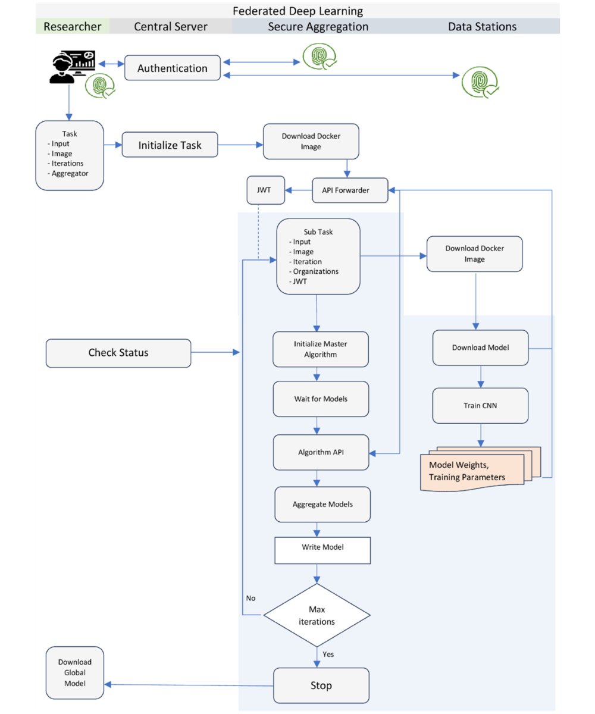

# Applicatie componenten voor decentrale verwerking

## Applicatiecomponenten van PLUGIN

Het datastation (links) en de federated processing hub (rechts) vormen de twee-eenheid van de PLUGIN/vantage6 architectuur. Hieronder wordt de functie van elke component in meer detail beschreven.

!!! note "Gedetailleerde beschrijving applicatiecomponenten vantage6"

    === "**vantage6 server**"

        Om communicatie mogelijk te maken tussen de verschillende nodes, slaat de Vantage6 Server informatie op over onder andere de deelnemende organisaties, de beschikbare nodes, en de invoer en resultaten van alle aangemaakte taken in het systeem. Deze informatie wordt opgevraagd door de nodes met behulp van een REST api en websockets, waardoor het niet nodig is binnenkomende poorten te openen op het data station.

        Door middel van authenticatie en authorisatie op basis van aan te wijzen rollen wordt bijgehouden welke acties toegestaan zijn voor o.a. gebruikers en nodes.

    === "**vantage6 node**"

        De Vantage6 Node voert openstaande taken uit. Hierbij wordt het aangegeven Docker image uit de bibliotheek gehaald en uitgevoerd, en gekoppeld aan een van de vooraf geconfigureerde databronnen. Voor elke taak wordt door middel van configuratie gecontroleerd of het uitvoeren van de Docker image toegestaan is.

        Om het algoritme uit te voeren start de node op basis van het binnengehaalde Docker image een Docker container op het data station. Communicatie vanuit het algoritme verloopt hierbij altijd via de node naar de server.

    === "**Algoritmen en bibliotheek**"

        Voor een maximale flexibiliteit in het soort uit te voeren taak, wordt in Vantage6 gebruik gemaakt van [Docker images](https://docs.docker.com/get-started/docker-concepts/the-basics/what-is-an-image/). Een sjabloon-image bevat vereiste logica zoals het verwerken van inputs en terugsturen van resultaten. Deze kan vervolgens worden uitgebreid met de specifieke logica voor de use-case, zoals bijvoorbeeld een federatieve query of een federated learning algoritme. Het Docker image dat hieruit resulteert wordt opgeslagen in een centrale [Docker registry](https://docs.docker.com/get-started/docker-concepts/the-basics/what-is-a-registry/) (een bibliotheek voor Docker images).

Wanneer gesproken wordt over specifieke implementaties wordt vaak de term *Aggregator Node* gebruikt. Hiermee wordt de node bedoeld waar aggregatie van deelresultaten plaats vindt. Hoewel het mogelijk is deze node op een aparte locatie te realiseren, verschilt deze technisch gezien niet van andere Vantage6 nodes. Elke Vantage6 Node is dus in potentie een aggregator node. Uitzondering hierop is de [*Secure Aggregator Node*](https://ai.jmir.org/2025/1/e60847). Deze oplossing wordt niet gebruikt binnen PLUGIN, maar bij specifieke use-cases om datalek problematiek tegen te gaan.

## PLUGIN

### PLUGIN-Analytics
### PLUGIN-ML
### PLUGIN-Hub
### PLUGIN-Lake

## Federatief leren met PLUGIN/vantage6

De PLUGIN-architectuur is gebaseerd op vantage6. Het gefedereerd leren van een algoritme omvat een reeks gecoördineerde stappen tussen de onderzoeker, de centrale server en de datastations. Dit proces is ontworpen om de analyse uit te voeren zonder dat de brongegevens de lokale omgeving van het datastation verlaten. Hieronder volgt een detailleerde beschrijving wat elk van de applicatiecomponenten hierin doen.

???+ note "**Authenticatie**"

    De onderzoeker start het proces door te authenticeren bij de centrale Vantage6-server.

??? note "**Taak specificatie**"
    
    Na succesvolle authenticatie definieert de onderzoeker een taak. Hierbij wordt opgegeven:
    *   Welk algoritme (Docker-image) gebruikt moet worden.
    *   Specifieke inputparameters voor de analyse.
    *   Het aantal iteraties (indien van toepassing, voor machine learning).
    *   De identiteit van de *Secure Aggregation Server* (SAS), de node die verantwoordelijk is voor het aggregeren van resultaten.

??? note "**Verzending naar nodes**"
    
    De centrale server stuurt de taak door naar de betrokken nodes. De SAS (Secure Aggregation Server, een specifieke node) ontvangt het verzoek als eerste.

??? note "**Start hoofdalgoritme (SAS)**"
    
    De SAS downloadt het Docker-image, start het hoofd-algoritme en orkestreert de subtaken die door de datastations uitgevoerd moeten worden.

??? note "**Start subtaken (datastations)**"
    
    De datastations ontvangen hun subtaak van de centrale server, downloaden hetzelfde Docker-image en starten het lokale deel van het algoritme. De analyse wordt uitgevoerd op de lokale data.

??? note "**Verzending lokale resultaten**"
    
    Na elke trainingscyclus of analysestap stuurt het algoritme op het datastation de lokale resultaten (bijv. modelgewichten of statistische coëfficiënten) naar de SAS. De brongegevens verlaten het datastation niet.

??? note "**Verificatie en aggregatie**"
    
    De SAS verifieert de resultaten, extraheert de metadata en voegt de resultaten van alle datastations samen tot een geaggregeerd tussenmodel. Dit voltooit één iteratie.

??? note "**Vervolg-iteraties**"
    
    Voor vervolgstappen vragen de datastations de geaggregeerde resultaten van de vorige ronde op bij de SAS om hun lokale modellen verder te trainen. Deze cyclus herhaalt zich totdat het model convergeert of het gewenste aantal iteraties is bereikt.

??? note "**Afronding**"
    
    De SAS informeert de onderzoeker dat de taak is voltooid. De onderzoeker kan vervolgens het finale, globale model downloaden van de server. Gedurende het proces heeft niemand, ook de onderzoeker niet, toegang tot de tussenresultaten, wat de veiligheid waarborgt.

## PLUGIN en de European Interoperability Reference Architecture (EIRA)

De architectuur van PLUGIN, gebaseerd op de principes van de Personal Health Train en Vantage6, kan worden beschreven aan de hand van de **European Interoperability Reference Architecture (EIRA)**. EIRA biedt een raamwerk om interoperabele architecturen te ontwerpen door herbruikbare *Architectural Building Blocks (ABBs)* te identificeren.

Hoewel een gedetailleerde mapping naar specifieke EIRA ABB's een technische oefening is (vaak vastgelegd in een Archimate-model), kunnen we de componenten van PLUGIN conceptueel positioneren binnen de EIRA-gedachte. De architectuur is opgebouwd uit logische componenten die elk een specifieke rol vervullen, wat aansluit bij de EIRA-visie. De belangrijkste componenten, beschouwd als ABBs, zijn hieronder weergegeven.

!!! note "PLUGIN in termen van EIRA architectural building blocks"

    === "**Processing hub**"
    
        Fungeert als een intermediair voor communicatie, beheert metadata van taken en orkestreert de interacties. Dit kan worden gezien als een combinatie van EIRA ABBs gerelateerd aan *Message Exchange*, *Service Registry* en *Process Control*.

    === "**Datastation**"
        
        De component binnen de jurisdictie van de datahouder (bv. een ziekenhuis). Het voorziet in de rekenkracht voor de lokale analyse en waarborgt dat data de eigen omgeving niet verlaat. Dit komt overeen met EIRA ABBs voor *Secure Data Processing* en *Service Consumption*.

    === "**Secure Aggregation Server (SAS)**"
    
        Een gespecialiseerde node die verantwoordelijk is voor het veilig aggregeren van de lokale resultaten. Dit is een specifieke invulling van een *Data Processing* en *Security* ABB.

    === "**Algoritme (Docker Image)**"
    
        Het "treintje" dat de analyse definieert. Het is een zelfstandige, uitvoerbare component die de logica, het model en de API bevat. Dit sluit aan bij het idee van een *Business Logic Component* of *Application Service* in EIRA.

    === "**Beveiligde Communicatiekanalen**"
    
        De infrastructuur die veilige data-uitwisseling (van geaggregeerde resultaten, niet brongegevens) mogelijk maakt. Dit valt onder EIRA ABBs zoals *Secure Communication* en *Network Infrastructure*.

Door de architectuur op deze manier in componenten op te delen, wordt een modulaire en interoperabele opzet gerealiseerd die in lijn is met de principes van EIRA voor het bouwen van grensoverschrijdende en sector-overstijgende digitale diensten.

## PLUGIN en de composable data stack

TO DO: uitleggen hoe al deze componenten eigenlijk een-op-een te vertalen zijn naar de moderne lakehouse architectuur.

### Node Beheerder

Vereist voor PLUGIN?
