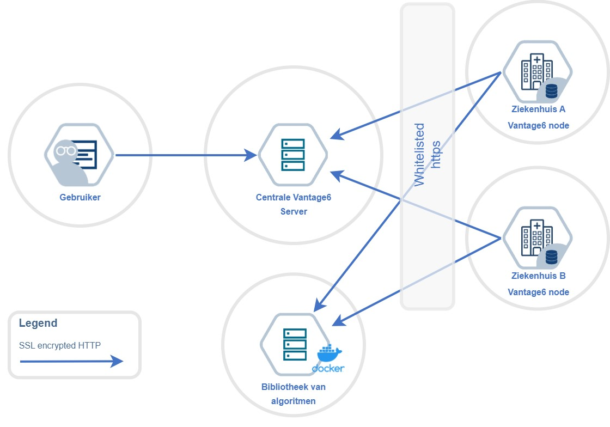

# Architectuur

Om een federatieve infrastructuur mogelijk te maken, zijn er op technisch vlak twee vereisten: 

* Software voor het federatief toegankelijk maken van data
* De data op de verschillende bronnen dient interoperabel te zijn.

PLUGIN maakt gebruik van **[Vantage6](https://vantage6.ai/)** om data te ontsluiten voor federatief gebruik. De data zelf wordt FAIR (en dus interoperabel) gemaakt door middel van **[HL7 FHIR](https://hl7.org/fhir/)**.

## Vantage6

Vantage6 is een open-source infrastructuur voor het uitvoeren van een breed spectrum aan federatieve algoritmen. Bij ieder data station wordt een Vantage6 node geïnstalleerd. Een centraal Vantage6 server component faciliteert communicatie en bewaart slechts de tussentijdse resultaten, welke niet terug te herleiden zijn naar een patiënt. Vanuit een user interface en een client kunnen bevoegde gebruikers nieuwe analyses en algoritmen starten, welke rechtstreeks worden opgehaald uit een vertrouwde bibliotheek.

### Vantage6 Server

Om communicatie mogelijk te maken tussen de verschillende nodes, slaat de Vantage6 Server informatie op over onder andere de deelnemende organisaties, de beschikbare nodes, en de invoer en resultaten van alle aangemaakte taken in het systeem. Deze informatie wordt opgevraagd door de nodes met behulp van een REST api en websockets, waardoor het niet nodig is binnenkomende poorten te openen op het data station.
Door middel van authenticatie en authorisatie op basis van aan te wijzen rollen wordt bijgehouden welke acties toegestaan zijn voor o.a. gebruikers en nodes.

### Algoritmen en Bibliotheek

Voor een maximale flexibiliteit in het soort uit te voeren taak, wordt in Vantage6 gebruik gemaakt van [Docker images](https://docs.docker.com/get-started/docker-concepts/the-basics/what-is-an-image/). Een sjabloon-image bevat vereiste logica zoals het verwerken van inputs en terugsturen van resultaten. Deze kan vervolgens worden uitgebreid met de specifieke logica voor de use-case, zoals bijvoorbeeld een federatieve query of een federated learning algoritme. Het Docker image dat hieruit resulteert wordt opgeslagen in een centrale [Docker registry](https://docs.docker.com/get-started/docker-concepts/the-basics/what-is-a-registry/) (een bibliotheek voor Docker images).

### Vantage6 Node

De Vantage6 Node voert openstaande taken uit. Hierbij wordt het aangegeven Docker image uit de bibliotheek gehaald en uitgevoerd, en gekoppeld aan een van de vooraf geconfigureerde databronnen. Voor elke taak wordt door middel van configuratie gecontroleerd of het uitvoeren van de Docker image toegestaan is.

Om het algoritme uit te voeren start de node op basis van het binnengehaalde Docker image een Docker container op het data station. Communicatie vanuit het algoritme verloopt hierbij altijd via de node naar de server.

## HL7 FHIR

## Benodigdheden

### Juridisch

https://www.medicaldataworks.nl/governance

### Data Station Hardware

PLUGIN verwacht bij voorkeur de volgende hardware-specificaties:

* ≥ 16 cores, x86/x64 CPU
* ≥ 56 GB CPU RAM
* ≥ 360 GB SSD
* virtualization enabled
* GPU (optioneel, maar aanbevolen):
    * CUDA compatible NVIDIA kaart
    * 16 GB GPU RAM

Specificaties zijn echter sterk afhankelijk van de uit te voeren algoritmen.

### Netwerk

* ≥ 100Mbit ethernet
* Poort 443/TCP (https) open voor **uitgaand** verkeer naar de server
* Een Publiek IP-adres voor whitelisting bij de server

### Software

* Besturingssysteem: Ubuntu 22.04+, Windows 10 of hoger, macOS 13.x of hoger
* Docker of Docker Desktop
* Python versie 3.10+

## Data

### Node Beheerder

Vereist voor PLUGIN?
