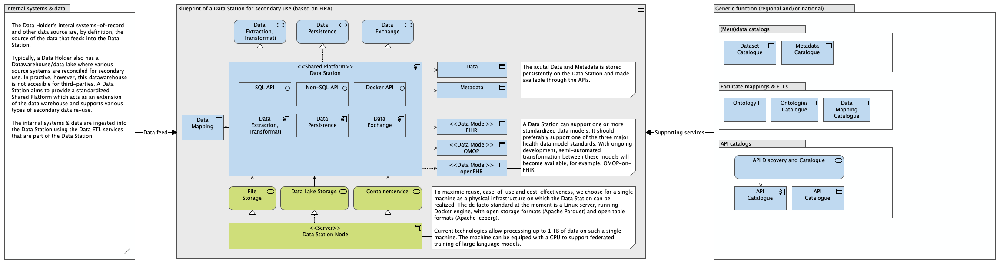

# Applicatie componenten voor decentrale verwerking

## Applicatiecomponenten van PLUGIN

Het datastation (links) en de federated processing hub (rechts) vormen de twee-eenheid van de PLUGIN/vantage6 architectuur. Hieronder wordt de functie van elke component in meer detail beschreven.

!!! note "Gedetailleerde beschrijving applicatiecomponenten PLUGIN"

    === "**vantage6 server**"

        Om communicatie mogelijk te maken tussen de verschillende nodes, slaat de Vantage6 Server informatie op over onder andere de deelnemende organisaties, de beschikbare nodes, en de invoer en resultaten van alle aangemaakte taken in het systeem. Deze informatie wordt opgevraagd door de nodes met behulp van een REST api en websockets, waardoor het niet nodig is binnenkomende poorten te openen op het datastation.

        Door middel van authenticatie en authorisatie op basis van aan te wijzen rollen wordt bijgehouden welke acties toegestaan zijn voor o.a. gebruikers en nodes.

    === "**vantage6 node**"

        De Vantage6 Node voert openstaande taken uit. Hierbij wordt het aangegeven Docker image uit de bibliotheek gehaald en uitgevoerd, en gekoppeld aan een van de vooraf geconfigureerde databronnen. Voor elke taak wordt door middel van configuratie gecontroleerd of het uitvoeren van de Docker image toegestaan is.

        Om het algoritme uit te voeren start de node op basis van het binnengehaalde Docker image een Docker container op het datastation. Communicatie vanuit het algoritme verloopt hierbij altijd via de node naar de server.

    === "**Algoritmen en bibliotheek**"

        Voor een maximale flexibiliteit in het soort uit te voeren taak, wordt in Vantage6 gebruik gemaakt van [Docker images](https://docs.docker.com/get-started/docker-concepts/the-basics/what-is-an-image/). Een sjabloon-image bevat vereiste logica zoals het verwerken van inputs en terugsturen van resultaten. Deze kan vervolgens worden uitgebreid met de specifieke logica voor de use-case, zoals bijvoorbeeld een federatieve query of een federated learning algoritme. Het Docker image dat hieruit resulteert wordt opgeslagen in een centrale [Docker registry](https://docs.docker.com/get-started/docker-concepts/the-basics/what-is-a-registry/) (een bibliotheek voor Docker images).

    === "**PLUGIN-Analytics**"
        
        De PLUGIN-analytics applicatie maakt het mogelijk om gefedereerde analysetaken uit te voeren waarop een geaggregeerd antwoord terug komt. Deze applicatie bestaat onder andere uit een verkennerfunctie met daarin het metadata schema en vooropgestelde analyse vragen. 
        
    === "**PLUGIN-ML**"

        De PLUGIN-ML applicatie stelt de datagebruiker in staat om federatief een AI-model te ontwikkelen. PLUGIN-ML omvat zowel de machine learning algoritmes die uitgevoerd worden bij de PLUGIN-datastations als de aggregatie algoritmes die de modellen samenvoegen tot een generiek model. Via PLUGIN-ML is een datagebruiker in staat om een pipeline op te zetten gebruik makend van veel gebruikte Machine learning algoritmes.

    === "**PLUGIN-Hub**"     

        De PLUGIN-Hub applicatie verstuurd veilig data in bulk vanaf de PLUGIN-datastation naar de centrale processing hub. De datagebruiker dient hierbij een ‘permit’ of grondslag te hebben om deze data te mogen ontvangen. 

    === "**PLUGIN-Lake**"   

        De PLUGIN-Lake applicatie is een federatieve lakehouse implementatie binnen de PLUGIN-datastations. PLUGIN-Lake ontvangt, transformeert en stelt data beschikbaar aan de bovenstaande 3 applicaties. Hierbij is het o.a. mogelijk om ETL-processen in te richten, zoals het transformeren van data in FHIR formaat naar OMOP. 
        
Wanneer gesproken wordt over specifieke implementaties wordt vaak de term *Aggregator Node* gebruikt. Hiermee wordt de node bedoeld waar aggregatie van deelresultaten plaats vindt. Hoewel het mogelijk is deze node op een aparte locatie te realiseren, verschilt deze technisch gezien niet van andere Vantage6 nodes. Elke Vantage6 Node is dus in potentie een aggregator node. Uitzondering hierop is de [*Secure Aggregator Node*](https://ai.jmir.org/2025/1/e60847). Deze oplossing kan gebruikt worden in specifieke gevallen waarin samengestelde data nog steeds gevoelig kan zijn, om het risico op een datalek verder te verkleinen.

## PLUGIN en de European Interoperability Reference Architecture (EIRA)

De architectuur van PLUGIN, gebaseerd op de principes van de Personal Health Train en Vantage6, kan worden beschreven aan de hand van de **European Interoperability Reference Architecture (EIRA)**. EIRA biedt een raamwerk om interoperabele architecturen te ontwerpen door herbruikbare *Architectural Building Blocks (ABBs)* te identificeren.

Hoewel een gedetailleerde mapping naar specifieke EIRA ABB's een technische oefening is (vaak vastgelegd in een Archimate-model), kunnen we de componenten van PLUGIN conceptueel positioneren binnen de EIRA-gedachte. De architectuur is opgebouwd uit logische componenten die elk een specifieke rol vervullen, wat aansluit bij de EIRA-visie. De belangrijkste componenten, beschouwd als ABBs, zijn hieronder weergegeven.

!!! note "PLUGIN in termen van EIRA architectural building blocks"

    === "**Processing hub**"
    
        Fungeert als een intermediair voor communicatie, beheert metadata van taken en orkestreert de interacties. Dit kan worden gezien als een combinatie van EIRA ABBs gerelateerd aan *Message Exchange*, *Service Registry* en *Process Control*.

    === "**Datastation**"
        
        De component binnen de jurisdictie van de datahouder (bv. een ziekenhuis). Het voorziet in de rekenkracht voor de lokale analyse en waarborgt dat data de eigen omgeving niet verlaat. Dit komt overeen met EIRA ABBs voor *Secure Data Processing* en *Service Consumption*.

    === "**Secure Aggregation Server (SAS)**"
    
        Een gespecialiseerde node die verantwoordelijk is voor het veilig aggregeren van de lokale resultaten. Dit is een specifieke invulling van een *Data Processing* en *Security* ABB.

    === "**Algoritme (Docker Image)**"
    
        Het "treintje" dat de analyse definieert. Het is een zelfstandige, uitvoerbare component die de logica, het model en de API bevat. Dit sluit aan bij het idee van een *Business Logic Component* of *Application Service* in EIRA.

    === "**Beveiligde Communicatiekanalen**"
    
        De infrastructuur die veilige data-uitwisseling (van geaggregeerde resultaten, niet brongegevens) mogelijk maakt. Dit valt onder EIRA ABBs zoals *Secure Communication* en *Network Infrastructure*.

Door de architectuur op deze manier in componenten op te delen, wordt een modulaire en interoperabele opzet gerealiseerd die in lijn is met de principes van EIRA voor het bouwen van grensoverschrijdende en sector-overstijgende digitale diensten.

## PLUGIN en de composable data stack

TO DO: uitleggen hoe al deze componenten eigenlijk een-op-een te vertalen zijn naar de moderne lakehouse architectuur.

Om te voldoen aan uiteenlopende databehoeften (zoals klassieke rapportages, analyses, delen van data en data science) wordt door gezondheidsinstellingen veelal gebruik gemaakt van een gescheiden data warehouse, een datalake en andere analytische omgevingen. Deze scheiding leidt tot duplicatie van data, extra complexiteit en vermoeilijking van data governance.

Een lakehouse architectuur lost deze problematiek op door de functionaliteiten van de verschillende omgevingen samen te voegen. Alle data wordt opgeslagen in een flexibel en schaalbaar platform. Er is slechts één opslaglaag op basis van open standaarden, waarbij zowel ongestructureerde als gestructureerde data kan worden opgeslagen. De PLUGIN datastation componenten vormen de basis voor een moderne lakehouse architectuur.

### gestandaardiseerde data modellen (FHIR/OMOP/openEHR)

### APIs (SQL/No-SQL/Docker)

### Storage
