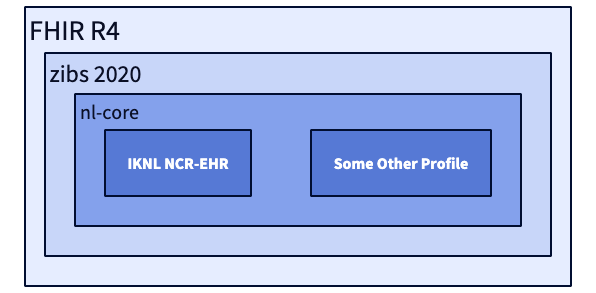

# Use of information models and thesauri in PLUGIN

## Information models for syntactic interoperability

At the time of writing this document, PLUGIN has worked with two different information models, each of which has been piloted or implemented in a separate use case. PLUGIN is soon to start a new use case in which both OMOP CDM and openEHR will be piloted.

!!! note "Information models in PLUGIN"

    === "FHIR"

        From the original design, PLUGIN has prioritised the use of FHIR. The considerations for using this information model are described in an article by Kapitan et al. (2025).[@kapitan2025data] One of the key principles discussed is that of late-binding: because PLUGIN is intended as generic infrastructure, the idea is that conditions and restrictions on incoming data can be applied stepwise. Starting from FHIR R4 as a base, the data is 'funnelled' towards increasingly specific profiles — the zibs2020 profile, nl-core and the profile of the final application, in this case the NCR-EHR profile of the Netherlands Cancer Registry.
        
        

        This approach was successfully piloted in a use case with Radboud UMC, in which data for head and neck cancer was automatically extracted from the Epic FHIR v3 API and translated to the target profile.

        In addition, the PLUGIN consortium worked together with Santeon, HealthSageAI, pacmed, stichtingNICE, UMCG, HL7 Netherlands, Health-RI and openEHR Netherlands on a FHIR Common Data Model. More information about this FHIR Common Data Model can be found in the [PLUGIN FHIR Implementation Guide](https://plugin.healthcare/fhir/).

    === "AI-assisted coding"

        For the "AI-assisted coding" project, a specific set of data is used. The project has developed an AI model that can automatically generate ICD-10 codes for day admissions based on unstructured data (correspondence reports).
        
        Participating hospitals provide a dataset consisting of:
        
        *   Correspondence reports
        *   Diagnoses
        *   Admissions
        *   Sub-trajectories
        *   Care activities

        Within the project, this data is extracted from the source system using standardised extraction scripts, either from Epic or Chipsoft HiX. The [AIOC information model](https://plugin.healthcare/fhir/artifacts.html#logical-models-aioc) is a subset of the [National Basic Registration of Hospital Care](https://www.dhd.nl/producten-diensten/registratie-data/ontdek-de-mogelijkheden-van-de-lbz/hulpmiddelen-lbz) (LBZ), an information model in use since 2014. In principle, the LBZ model can be mapped to FHIR, OMOP or openEHR, but this has not yet been done.

In the further development of PLUGIN, it is envisaged that other information models (OMOP, openEHR) will be supported, using the standardised transformations between the three information models as described in the section on [syntactic interoperability](../../informatie/syntactisch.md).

## DHD thesauri as a basis for semantic interoperability

For semantic interoperability, PLUGIN relies heavily on the expertise and standards of DHD (Dutch Hospital Data), and specifically the [Diagnosis and Procedure Thesaurus](https://www.dhd.nl/producten-diensten/registratie-data/oplossingen-voor-registratievraagstukken). These thesauri are the national standards for recording medical diagnoses and procedures respectively. The thesauri consist of lists of uniform terms that are loaded into the EPR. This allows doctors and other healthcare professionals to record terms at source in the language they use in practice. New versions are released every two months to keep the lists up to date. By using these thesauri, PLUGIN ensures that analyses performed across multiple hospitals are based on data with a consistent and shared meaning. In this way, concepts can be automatically derived to DBC codes, ICD-10 codes, concilium codes (training codes) and the international terminology system SNOMED.

In the further development of PLUGIN, consideration is being given to extending the thesauri with the [SSSOM method](https://mapping-commons.github.io/sssom/). This would allow not only mappings between different code systems to be created, but also an indication of whether a mapping is an `exactMatch`, a `broadMatch` or a `narrowMatch`. This is valuable because, for example, in primary care broader diagnoses such as epilepsy are recorded, while in a hospital or university medical centre the diagnosis is coded in more detail, for example focal epilepsy.
