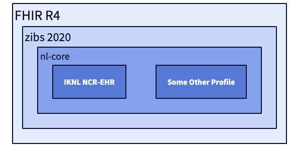

# Gebruik van informatiemodellen en thesauri in PLUGIN

## Informatiemodellen voor syntactische interoperabiliteit

Ten tijde van het schrijven van dit document heeft PLUGIN gewerkt met twee verschillende informatiemodellen die elk in een afzonderlijke usecase zijn beproefd c.q. geimplementeerd. Binnenkort gaat PLUGIN starten met een nieuwe use-case waarin zowel OMOP CDM als openEHR worden beproefd.

!!! note "Informatiemodellen in PLUGIN"

    === "FHIR"

        Vanuit het originele ontwerp heeft PLUGIN het gebruik van FHIR geprioriteerd. De overwegingen om dit informatiemodel te gebruiken is beschreven in een artikel door Kapitan et al. (2025).[@kapitan2025data] Een van de belangrijke principes hierin is dat van late-binding: doordat PLUGIN is bedoeld als generieke infrastructuur, is de gedachte dat het opleggen van condities en restricties in de binnenkomende data stapgewijs kan worden gedaan. Uitgaande van FHIR R4 als basis, wordt de data 'getrechterd' naar steeds specifiekere profielen, zijnde het zibs2020 profiel, nl-core en het profiel van de uiteindelijke toepassing, in dit geval de NCR-EHR profiel van de Nederlandse Kankerregistratie. 
        
        

        Deze aanpak is succesvol beproefd in een usecase met het RadboudUMC, waarbij gegevens voor hoofd-halskanker automatisch uit de Epic FHIR v3 API zijn onttrokken en vertaald naar het target profiel.

        Daarnaast heeft het PLUGIN-consortium samen met Santeon, HealthSageAI, pacmed, stichtingNICE, UMCG, HL7 Netherlands, Health-RI en openEHR Nederland gewerkt aan een FHIR Common Data Model. Meer over dit FHIR Common Data Model is terug te lezen in de [PLUGIN FHIR Implementation Guide](https://plugin.healthcare/fhir/). 

    === "AI-ondersteund coderen"

        Voor het project "AI-ondersteund coderen" wordt een specifieke set gegevens gebruikt. Het project heeft een AI-model ontwikkeld dat op basis van ongestructureerde data (brievenverslagen) automatisch ICD-10 codes kan genereren voor dagopnamen. 
        
        Deelnemende ziekenhuizen leveren hiervoor een dataset aan die bestaat uit:
        
        *   Brievenverslagen
        *   Diagnoses
        *   Opnamen
        *   Subtrajecten
        *   Zorgactiviteiten

        Binnen het project worden deze gegevens middels gestandaardiseerde extractiescript uit het bronsysteem onttrokken, zijnde Epic of Chipsoft HiX. Het [AIOC informatiemodel](https://plugin.healthcare/fhir/artifacts.html#logical-models-aioc) is een subset van de [Landelijke Basisregistratie Ziekenhuiszorg](https://www.dhd.nl/producten-diensten/registratie-data/ontdek-de-mogelijkheden-van-de-lbz/hulpmiddelen-lbz), een informatiemodel wat sinds 2014 in gebruik is. In principe kan het LBZ model gemapped worden naar FHIR, OMOP of openEHR, maar dit is nog niet gedaan.

In de doorontwkkeling van PLUGIN is voorzien dat andere informatiemodellen (OMOP, openEHR) ondersteund gaan worden, met gebruik van de gestandaardiseerde transformaties tussen de drie informatiemodellen zoals is beschreven in de sectie over [syntactische interoperabiliteit](../../informatie/syntactisch.md).

## DHD thesauri als basis voor semantische interoperabiliteit

Voor semantische interoperabiliteit leunt PLUGIN sterk op de expertise en standaarden van DHD (Dutch Hospital Data), en specifiek de [Diagnose- en Verrichtingenthesaurus](https://www.dhd.nl/producten-diensten/registratie-data/oplossingen-voor-registratievraagstukken). Deze thesauri zijn zijn de landelijke standaarden voor de registratie van medische diagnosen respectievelijk verrichtingen. De thesauri bestaan uit lijsten met uniforme termen die worden ingeladen in het epd. Hierdoor kunnen artsen en andere zorgprofessionals de termen aan de bron vastleggen in de taal die zij in de praktijk gebruiken. Elke twee maanden verschijnen nieuwe versies, zodat de lijsten altijd actueel zijn. Door deze thesauri te gebruiken, zorgt PLUGIN ervoor dat analyses die over verschillende ziekenhuizen heen worden uitgevoerd, gebaseerd zijn op data met een consistente en gedeelde betekenis. Zo kunnen concepten automatisch worden afgeleid naar DBC-codes, ICD-10-codes, conciliumcodes (opleidingscodes) en het internationale terminologiestelsel SNOMED.

In de doorontwikkeling van PLUGIN wordt gedacht om de thesauri uit te breiden met de [SSSOM-methode](https://mapping-commons.github.io/sssom/). Daarmee kunnen niet alleen mappings tussen verschillende codestelsel gemaakt worden, maar kan ook aangegeven worden of een mapping een `exactMatch`, een `broadMatch` of een `narrowMatch` is. Dit is van waarde omdat bijvoorbeeld in de huisartsen zorg veel bredere diagnosen worden geregistreerd zoals epilepsie, terwijl in een ziekenhuis of UMC in meer detail de diagnose wordt gecodeerd, bijvoorbeeld focale epilepsie.
