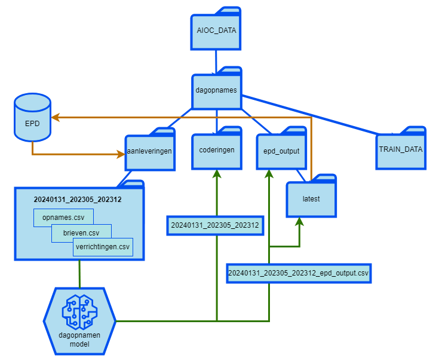

# Infrastructuur

Onderscheid wordt gemaakt tussen *trainingsziekenhuizen* en *inferentieziekenhuizen*. Bij inferentieziekenhuizen wordt wel gebruik gemaakt van het AI-model, maar hier vindt geen training plaats. Deze ziekenhuizen leveren dus geen data waarmee het model wordt ontwikkeld. In dit geval zijn er lichtere systeemeisen voor het datastation.

Het datastation voor PLUGIN is te realiseren als een standaard Linux server. Dit mag ook een VM zijn. Hierop wordt een Vantage6 Node geinstalleerd, een aantal gebruikersaccounts aangemaakt en een standaard folderstructuur ingesteld. Zowel de Node zelf als de daarop uitgevoerde algoritmen zoals de PLUGIN-ML pipeline worden gedraaid binnen Docker.

## Benodigdheden

### Data Station Hardware

PLUGIN verwacht bij voorkeur de volgende hardware-specificaties:

* ≥ 16 cores, x86/x64 CPU
* ≥ 56 GB CPU RAM
* ≥ 360 GB SSD
* virtualization enabled
* GPU (voor trainingsziekenhuizen):
    * CUDA compatible NVIDIA kaart
    * 16 GB GPU RAM

Specificaties zijn echter sterk afhankelijk van de uit te voeren algoritmen.

### Netwerk

* ≥ 100Mbit ethernet
* Poort 443/TCP (https) open voor **uitgaand** verkeer naar de server
* Een Publiek IP-adres voor whitelisting bij de server

### Software

* Besturingssysteem: Ubuntu 22.04+, Windows 10 of hoger, macOS 13.x of hoger
* Docker of Docker Desktop
* Python versie 3.10+

## AIOC Folderstructuur

Een eenduidige folderstructuur wordt aangehouden op de geïnstalleerde server voor de werking van het model. In de configuratie wordt per ziekenhuis aangegeven waar het model naar de data moet zoeken. Hiervoor wordt een standaard folderstructuur aangehouden.

De bestanden aangeleverd door het ziekenhuis komen binnen in een map aanleveringen per aanlevering. De resultaten van het model kunnen vanuit de map epd_output opgehaald worden en ingelezen worden in het EPD.

* **aanleveringen** - In deze map levert het ziekenhuis de aanleverfolders aan
* **coderingen** - De AIOC applicatie maakt hier een werkmap aan waar onder andere een kopie van de aangeleverde data, checkpoint bestanden en resultaten komen te staan. Dit is vooral een werkmap voor de data scientists.
* **epd_output** - Hier worden de uiteindelijke resultaten/output bestanden klaargezet. Deze bestanden kunnen direct in het EPD geïmporteerd worden.
* **latest** - In deze map wordt het laatste outputbestand van de AIOC applicatie geplaatst. Het bestand in deze map kan gebruikt worden om de resultaten te importeren in het EPD.
* **TRAIN_DATA** - In deze map worden de trainingsdata opgeslagen. Deze map is alleen voor trainingsziekenhuizen en bevat data van meerdere jaren met ICD-10 codering om het model te trainen.