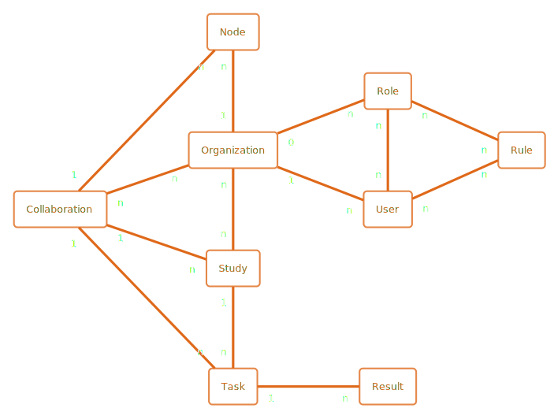
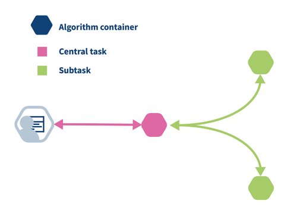
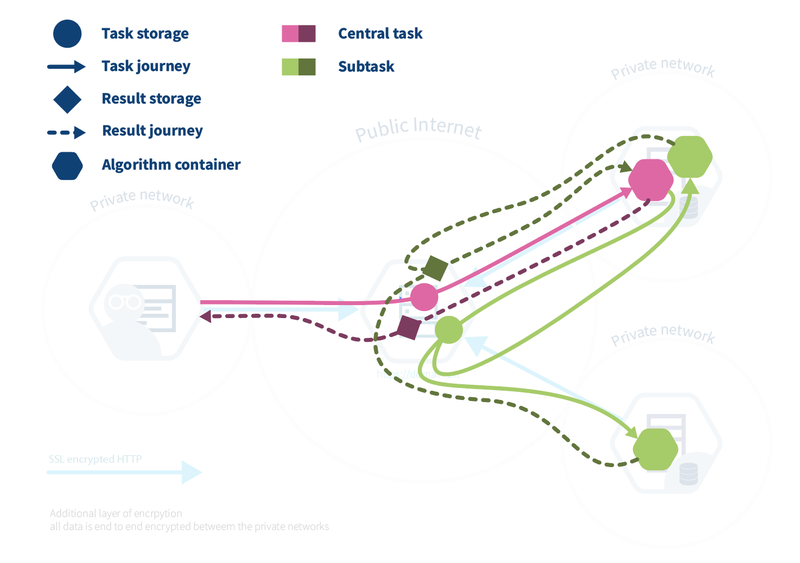
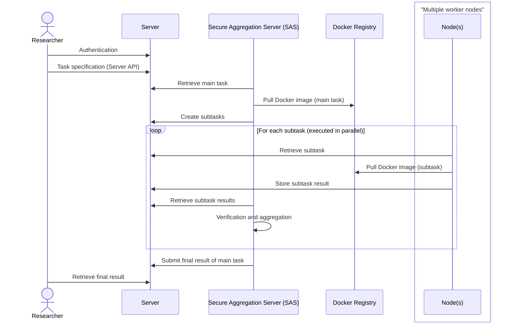

# Process for federated processing with PLUGIN

This page describes how the PLUGIN implementation, which uses vantage6, supports the processes for [federated analysis](../../proces/analyseren.md) and [preparing data](../../proces/klaarzetten.md). PLUGIN/vantage6 is a concrete example of how a Data Station and a Processing Hub can collaborate for secondary data use, as described in the chapter on the [data station](../../applicatie/data-station.md).

In this implementation, the role of the Data Station is fulfilled by a **vantage6 Node**. Coordination between nodes is managed by a **vantage6 Server**. The data user initiates tasks from a Processing Hub, which in this context functions as a client to the vantage6 infrastructure.

## Setting up a collaboration

To start a federated process, a collaboration must first be established. Within vantage6, the following entities are used for this:

*   **User:** A person who is authorised to create and manage tasks on the Processing Hub on behalf of an organisation.
*   **Node:** The technical implementation of a Data Station. This is a service running at the organisation (data holder) that executes tasks (algorithms) on the local data.
*   **Organisation:** A participating entity, such as a hospital or research institute.
*   **Role and Rule:** Define the permissions of a user.
*   **Collaboration:** A collection of organisations (data providers) that work together. This corresponds to the group of data providers for which a data user holds a permit.
*   **Study:** A study is a selection of organisations within a collaboration that participate in a specific analysis.
*   **Task:** A specific assignment, such as training a model or performing an analysis, that is sent to one or more nodes.

The **vantage6 Server** manages these entities and ensures secure communication and correct authorisation, in line with the governance requirements of the data space. Medical Data Works has gained extensive experience in recent years setting up such collaborations and has produced standard [agreements and governance documents](https://www.medicaldataworks.nl/governance) that are also [available open source](https://cris.maastrichtuniversity.nl/en/publications/a-governance-framework-for-federated-learning-projects-in-healthc/).

*   **Consortium Agreement:** Although patient data is sent on an individual basis, this document describes the handling of intellectual property, which parties have permission to initiate new tasks, and who has the right to publish the results.
*   **Data Processing or Joint Controller Agreement:** In the case of federated learning, processing of the data takes place at the data station of the data owner, at the request of the entity distributing the algorithm. For GDPR purposes, a data processing agreement is therefore required. When participating hospitals are also involved in developing the distributed algorithms, a joint controller agreement is needed to indicate that both parties were involved in designing the processing.
*   **Infrastructure User Agreement:** An agreement between each data station and the infrastructure administrator. This describes the roles and responsibilities of the parties with respect to the infrastructure. This contract is independent of the project or collaboration and can therefore be reused for future projects.

## Executing a federated task

Executing a federated task, such as federated learning or a federated analysis, follows a fixed process designed to keep data local.

1.  **Task creation:** A user (e.g. a researcher via the Processing Hub) creates a central task. This task specifies which algorithm is to be executed and on which Data Stations (nodes).
2.  **Distribution:** The vantage6 Server receives the central task and splits it into subtasks for each participating node.
3.  **Local execution:** Each node executes the task (the algorithm) on the local data. This occurs in an isolated environment (a Docker container), as described in the use case [Process algorithm and return result](../../applicatie/data-station.md#416-process-algorithm-and-return-result). The raw data does not leave the node.
4.  **Returning results:** The node sends the result (e.g. a locally trained model or an aggregated answer) back to the central location coordinating the task.
5.  **Aggregation:** The results from all nodes are aggregated to arrive at a final result. This can be an iterative process, in which aggregated results are used for a next round of subtasks.

## Principle of task distribution

A core principle of federated processing is the separation between a centrally coordinating part and decentralised, federated parts of an algorithm.

Suppose we want to calculate the average over data distributed across two locations: `a = [1,2,3]` and `b = [4,5]`. The calculation is `(sum(a) + sum(b)) / (len(a) + len(b))`.

*   **Federated part:** Each location locally calculates `sum()` and `len()`. These are the subtasks executed on the `Data Stations` (nodes).
*   **Central part:** The coordinating algorithm collects the results (`sum` and `len` from each location) and performs the final division to obtain the global average.

Importantly, the central coordination does not necessarily take place on the vantage6 server. To keep the server lightweight, the central (aggregating) task itself is also executed as a container on one of the nodes. The vantage6 server functions purely as a relay and authorisation body. This pattern is illustrated schematically below.

!!! note "Explanation of task distribution"

    The simplest task distribution in vantage6 is as follows. The data user (left) creates a task for the central part of the algorithm (pink hexagon). The central part creates subtasks for the federated parts (green hexagons). Once the subtasks are completed, the central part collects the results and calculates the final result, which is then available to the data user.            
    
    

    In practice, the task distribution works slightly differently. The data user creates a task for the central part of the algorithm. This is registered on the server and leads to the creation of a central algorithm container on one of the vantage6 nodes. The central algorithm then creates subtasks for the federated parts of the algorithm, which are again registered on the server. All vantage6 nodes for which the subtask is intended begin their work by executing the federated part of the algorithm. The vantage6 nodes send the results back to the vantage6 server, from where they are picked up by the central algorithm. The central algorithm then calculates the final result and sends it to the processing hub, where the data user can retrieve it.

    

    It is easy to confuse the central vantage6 server with the central part of the algorithm: the vantage6 server is the central part of the infrastructure, but not the place where the central part of the algorithm is executed (Fig. 2). The central part is actually executed on one of the vantage6 nodes, as this provides more flexibility: an algorithm may, for example, require substantial compute resources to perform the aggregation, and it is better to do this on a vantage6 node that has these resources, rather than having to upgrade the server every time a new algorithm requires more resources.

## Federated learning with PLUGIN/vantage6

The PLUGIN architecture is based on vantage6. Federated learning of an algorithm involves a series of coordinated steps between the researcher, the central server and the data stations. This process is designed to perform the analysis without the source data leaving the local environment of the data station. Below is a detailed description of what each of the application components does in this process.

???+ note "**Authentication**"

    The researcher starts the process by authenticating with the central Vantage6 server.

??? note "**Task specification**"
    
    After successful authentication, the researcher defines a task. This specifies:
    *   Which algorithm (Docker image) is to be used.
    *   Specific input parameters for the analysis.
    *   The number of iterations (if applicable, for machine learning).
    *   The identity of the *Secure Aggregation Server* (SAS), the node responsible for aggregating results.

??? note "**Dispatch to nodes**"
    
    The central server forwards the task to the nodes involved. The SAS (Secure Aggregation Server, a specific node) receives the request first.

??? note "**Start main algorithm (SAS)**"
    
    The SAS downloads the Docker image, starts the main algorithm and orchestrates the subtasks to be executed by the data stations.

??? note "**Start subtasks (data stations)**"
    
    The data stations receive their subtask from the central server, download the same Docker image and start the local part of the algorithm. The analysis is performed on the local data.

??? note "**Sending local results**"
    
    After each training cycle or analysis step, the algorithm on the data station sends the local results (e.g. model weights or statistical coefficients) to the SAS. The source data does not leave the data station.

??? note "**Verification and aggregation**"
    
    The SAS verifies the results, extracts metadata from the results and aggregates the results from all data stations into an aggregated intermediate model. This completes one iteration.

??? note "**Subsequent iterations**"
    
    For subsequent steps, the data stations retrieve the aggregated results from the previous round from the SAS to further train their local models. This cycle repeats until the model converges or the desired number of iterations has been reached.

??? note "**Completion**"
    
    The SAS informs the researcher that the task has been completed. The researcher can then download the final, global model from the server. Throughout the process, no one — including the researcher — has access to intermediate results, which guarantees security.
    
## Using PLUGIN for federated analysis and data pooling

PLUGIN/vantage6 was originally set up to support federated learning. However, the same infrastructure and processes can be applied to various forms of secondary data use.

=== "Federated learning"

    The original use case for which vantage6 and PLUGIN were developed. The goal is to train separate machine learning models on each data station, which are then combined into a single model. Combining into a model essentially involves averaging across all models.

=== "Federated analysis"

    In federated analysis, the goal is not to train a model but to perform a statistical analysis. The "algorithm" here is an aggregation query (e.g. `COUNT` or `AVG`).

    *   Each PLUGIN data station executes the query locally.
    *   The aggregated (non-identifiable) results are sent to the central task.
    *   The central task combines the results for an overarching answer, with additional statistical disclosure control checks performed on the final result.

    This directly aligns with the use case [Answer data request](../../applicatie/data-station.md#417-answer-data-request).

=== "Data pooling (forwarding data)"

    The infrastructure can also be used to collect data at a central location, such as a Processing Hub. This is called "Data Pooling". Here, the "algorithm" is a selection query.

    *   Each PLUGIN data station executes a selection query to select a specific dataset or cohort.
    *   Instead of an aggregated result, the node forwards the selected raw data 'as-is' to the Processing Hub.

    This process aligns with the scenario for central data availability as described in the use case [Make data available for secondary use](../../applicatie/data-station.md#415-make-data-available-for-secondary-use). Privacy and security here depend on the security of the receiving Processing Hub.
