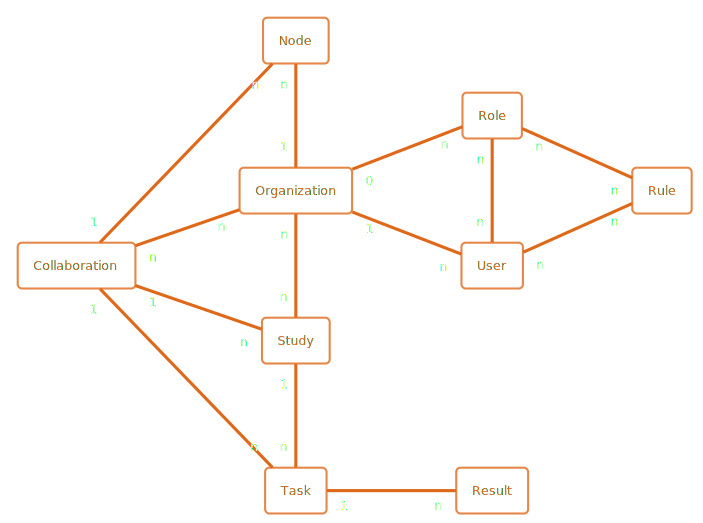
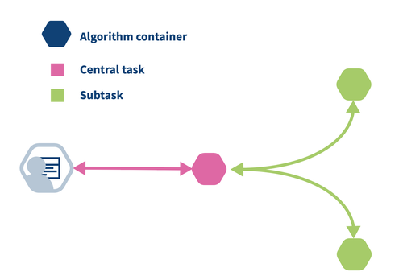
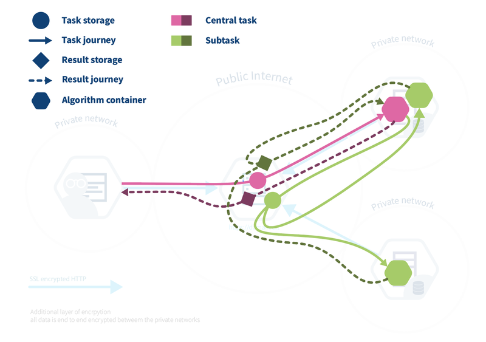

# Proces voor federatieve verwerking met PLUGIN

Deze pagina beschrijft hoe de PLUGIN-implementatie, die gebruikmaakt van vantage6, de processen voor [federatieve analyse](../../proces/analyseren.md) en het [klaarzetten van data](../../proces/klaarzetten.md) ondersteunt. PLUGIN/vantage6 is een concreet voorbeeld van hoe een Datastation en een Processing Hub kunnen samenwerken voor secundair datagebruik, zoals beschreven in het hoofdstuk over het [datastation](../../applicatie/laag-3/data-station.md).

In deze implementatie wordt de rol van het Datastation vervuld door een **vantage6 Node**. De coördinatie tussen de nodes wordt beheerd door een **vantage6 Server**. De datagebruiker initieert de taken vanaf een Processing Hub, die in deze context functioneert als een client naar de vantage6-infrastructuur.

## Opzetten van een samenwerkingsverband

Om een federatief proces te starten, moet eerst een samenwerkingsverband worden opgezet. Binnen vantage6 worden hiervoor de volgende entiteiten gebruikt:

*   **Samenwerking (Collaboration):** Een verzameling van organisaties (dataleveranciers) die met elkaar samenwerken. Dit komt overeen met de groep dataleveranciers waarvoor een datagebruiker een vergunning heeft.
*   **Organisatie (Organization):** Een deelnemende entiteit, zoals een ziekenhuis of onderzoeksinstituut.
*   **Node:** De technische implementatie van een Datastation. Dit is een service die bij de organisatie draait en taken (algoritmes) uitvoert op de lokale data.
*   **Gebruiker (User):** Een persoon die namens een organisatie of de Processing Hub taken mag aanmaken en beheren.
*   **Taak (Task):** Een specifieke opdracht, zoals het trainen van een model of het uitvoeren van een analyse, die naar een of meerdere nodes wordt gestuurd.
*   **Rol (Role) en Regel (Rule):** Definiëren de permissies van een gebruiker.

De **vantage6 Server** beheert deze entiteiten en zorgt voor veilige communicatie en correcte autorisatie, in lijn met de governance-eisen van de dataspace. Medical Dataworks heeft afgelopen jaren veel ervaring opgedaan met het opzetten van dergelijke samenwerkingsverbanden en heeft hiertoe standaard [overeenkomsten en governance documenten](https://www.medicaldataworks.nl/governance) opgesteld en open source beschikbaar gesteld.

## Uitvoeren van een federatieve taak

Het uitvoeren van een federatieve taak, zoals federatief leren of een federatieve analyse, volgt een vast proces dat is ontworpen om data lokaal te houden.

1.  **Taakcreatie:** Een gebruiker (bijv. een onderzoeker via de Processing Hub) maakt een centrale taak aan. Deze taak specificeert welk algoritme moet worden uitgevoerd en op welke Datastations (nodes).
2.  **Distributie:** De vantage6 Server ontvangt de centrale taak en deelt deze op in subtaken voor elke deelnemende node.
3.  **Lokale Uitvoering:** Elke node voert de taak (het algoritme) uit op de lokale data. Dit gebeurt in een geïsoleerde omgeving (een Docker-container), zoals beschreven in de usecase [Verwerk algoritme en geef resultaat terug](../../applicatie/laag-3/data-station.md#414-verwerk-algoritme-en-geef-resultaat-terug). De ruwe data verlaat de node niet.
4.  **Resultaten retourneren:** De node stuurt het resultaat (bv. een lokaal getraind model of een geaggregeerd antwoord) terug naar de centrale locatie die de taak coördineert.
5.  **Aggregatie:** De resultaten van alle nodes worden geaggregeerd om tot een eindresultaat te komen. Dit kan een iteratief proces zijn, waarbij de geaggregeerde resultaten worden gebruikt voor een volgende ronde van subtaken.

## Principe van taakverdeling

Een kernprincipe van federatieve verwerking is de scheiding tussen een centraal coördinerend deel en decentrale, federatieve delen van een algoritme.

Stel, we willen het gemiddelde berekenen over data die verdeeld is over twee locaties: `a = [1,2,3]` en `b = [4,5]`. De berekening is `(sum(a) + sum(b)) / (len(a) + len(b))`.

*   **Federatief deel:** Elke locatie berekent lokaal `sum()` en `len()`. Dit zijn de subtaken die op de `Datastations` (nodes) worden uitgevoerd.
*   **Centraal deel:** Het coördinerende algoritme verzamelt de resultaten (`sum` en `len` van elke locatie) en voert de uiteindelijke deling uit om het globale gemiddelde te krijgen.

Belangrijk is dat de centrale coördinatie niet per se op de vantage6 server plaatsvindt. Om de server licht te houden, wordt de centrale (aggregerende) taak zelf ook als een container op een van de nodes uitgevoerd. De vantage6 server fungeert puur als doorgeefluik en autorisatie-orgaan. Dit patroon is hieronder schematisch weergegeven.

!!! note "Toelichting taakverdeling"

    De meest simpele taakverdeling in vantage6 is als volgt. De gebruiker (links) creëert een taak voor het centrale deel van het algoritme (roze zeshoek). Het centrale deel creëert sub-taken voor de gefedereerde delen (groene zeshoeken). Wanneer de sub-taken zijn         voltooid, verzamelt het centrale deel de resultaten en berekent het het uiteindelijke resultaat, dat vervolgens beschikbaar is voor de gebruiker.            
    
    

    In de praktijk werkt de taakverdeling net iets anders. De gebruiker creëert een taak voor het centrale deel van het algoritme. Dit wordt geregistreerd op de server en leidt tot de creatie van een centrale algoritmecontainer op een van de knooppunten.  Het centrale algoritme creëert vervolgens sub-taken voor de gefedereerde delen van het algoritme, die opnieuw worden geregistreerd op de server. Alle knooppunten waarvoor de sub-taak bedoeld is, beginnen hun werk door het gefedereerde deel van het algoritme uit te voeren. De knooppunten sturen de resultaten terug naar de server, vanwaar ze worden opgepikt door het centrale algoritme. Het centrale algoritme berekent vervolgens het uiteindelijke resultaat en stuurt dit naar de server, waar de gebruiker het kan ophalen.

    

    Het is gemakkelijk om de centrale server te verwarren met het centrale deel van het algoritme: de server is het centrale deel van de infrastructuur, maar niet de plaats waar het centrale deel van het algoritme wordt uitgevoerd (Fig. 2). Het centrale deel wordt feitelijk uitgevoerd op een van de knooppunten, omdat dit meer flexibiliteit biedt: een algoritme kan bijvoorbeeld zware rekenbronnen nodig hebben om de aggregatie uit te voeren, en het is beter om dit te doen op een knooppunt dat over deze bronnen beschikt, in plaats van de server te moeten upgraden telkens wanneer een nieuw algoritme meer bronnen nodig heeft.   

## Gebruik van PLUGIN voor federatieve analyse en data pooling

PLUGIN/vantage6 is van oorsprong opgezet voor het ondersteunen van federatief leren. Echter, dezelfde infrastructuur en processen kunnen worden toegepast voor verschillende vormen van secundair datagebruik.

=== "Gefedereerde analyse"

    Bij gefedereerde analyse is het doel niet het trainen van een model, maar het uitvoeren van een statistische analyse. Het "algoritme" is hierbij een aggregatiequery (bv. `COUNT` of `AVG`).

    *   Elk Datastation voert de query lokaal uit.
    *   De geaggregeerde (niet-identificeerbare) resultaten worden naar de centrale taak gestuurd.
    *   De centrale taak combineert de resultaten voor een overkoepelend antwoord.

    Dit sluit direct aan bij de usecase [Geef antwoord op dataverzoek](../../applicatie/laag-3/data-station.md#415-geef-antwoord-op-dataverzoek).

=== "Data pooling (doorleveren van data)"

    De infrastructuur kan ook worden gebruikt om data te verzamelen op een centrale locatie, zoals een Processing Hub. Dit wordt "Data Pooling" genoemd. Hierbij is het "algoritme" een selectiequery.

    *   Elk Datastation voert een selectiequery uit om een specifieke dataset of cohort te selecteren.
    *   In plaats van een geaggregeerd resultaat, stuurt de node de geselecteerde ruwe data 'as-is' door naar de Processing Hub.

    Dit proces sluit aan bij het scenario voor centrale beschikbaarstelling zoals beschreven in de usecase [Maak data beschikbaar voor secundair gebruik](../../applicatie/laag-3/data-station.md#413-maak-data-beschikbaar-voor-secundair-gebruik). Privacy en veiligheid hangen hierbij af van de beveiliging van de ontvangende Processing Hub.