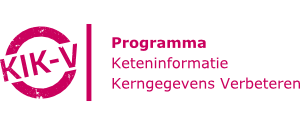
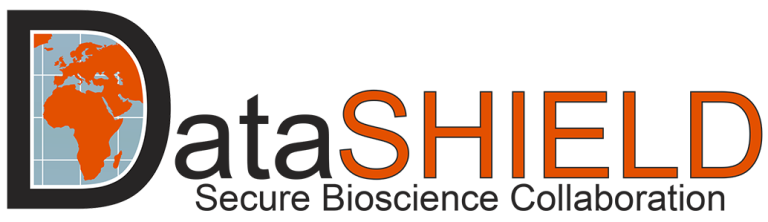

# Implementations

-  

    ---

    With KIK-V, accountability data on quality and operations are shared between providers and recipients via a federated network of data stations.

    ---

    [:octicons-arrow-right-24: Read more about KIK-V](./KIK-V/index.md)

-   

    ---

    PLUGIN is a hybrid infrastructure built on vantage6 through which hospital data is made available via data stations for various forms of secondary use.

    ---

    [:octicons-arrow-right-24: Read more about PLUGIN](./PLUGIN/index.md)
<!-- 
-   

    ---

    DataSHIELD is an infrastructure and a set of R packages that enables the remote analysis of sensitive research data without disclosure.

    ---

    [:octicons-arrow-right-24: View](./DataSHIELD/index.md) -->

