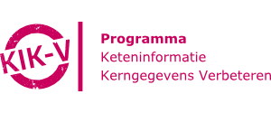

# Implementaties

-  

    ---

    Met KIK-V worden verantwoordingsgegevens over kwaliteit en bedrijfsvoering tussen aanbieders en afnemers gedeeld via een federatief netwerk van datastations.

    ---

    [:octicons-arrow-right-24: Lees meer over KIK-V](./KIK-V/index.md)

-   

    ---

    PLUGIN is een hybride infrastructuur gebouwd op vantage6 waarmee ziekenhuisdata via datastations beschikbaar zijn voor verschillende vormen van secundair gebruik.

    ---

    [:octicons-arrow-right-24: Lees meer over PLUGIN](./PLUGIN/index.md)
<!-- 
-   

    ---

    DataSHIELD is een infrastructuur en een reeks R-pakketten die de analyse van gevoelige onderzoeksgegevens op afstand en zonder openbaarmaking mogelijk maakt.

    ---

    [:octicons-arrow-right-24: Bekijk](./DataSHIELD/index.md) -->

