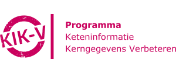

# Implementaties

-   

    ---

    De PLUGIN-basisinfrastructuur is een federatief netwerk gebouwd op vantage6 dat tot doel heeft om ziekenhuizen in staat te stellen medische gegevens veilig en decentraal beschikbaar te stellen voor uiteenlopende toepassingen.

    ---

    [:octicons-arrow-right-24: Bekijk](./PLUGIN/index.md)

-  

    ---

    Met KIK-V worden verantwoordingsgegevens over kwaliteit en bedrijfsvoering tussen aanbieders en afnemers gedeeld via een federatief netwerk van datastations.

    ---

    [:octicons-arrow-right-24: Bekijk](./KIK-V/index.md)

-   

    ---

    DataSHIELD is een infrastructuur en een reeks R-pakketten die de analyse van gevoelige onderzoeksgegevens op afstand en zonder openbaarmaking mogelijk maakt.

    ---

    [:octicons-arrow-right-24: Bekijk](./DataSHIELD/index.md)

