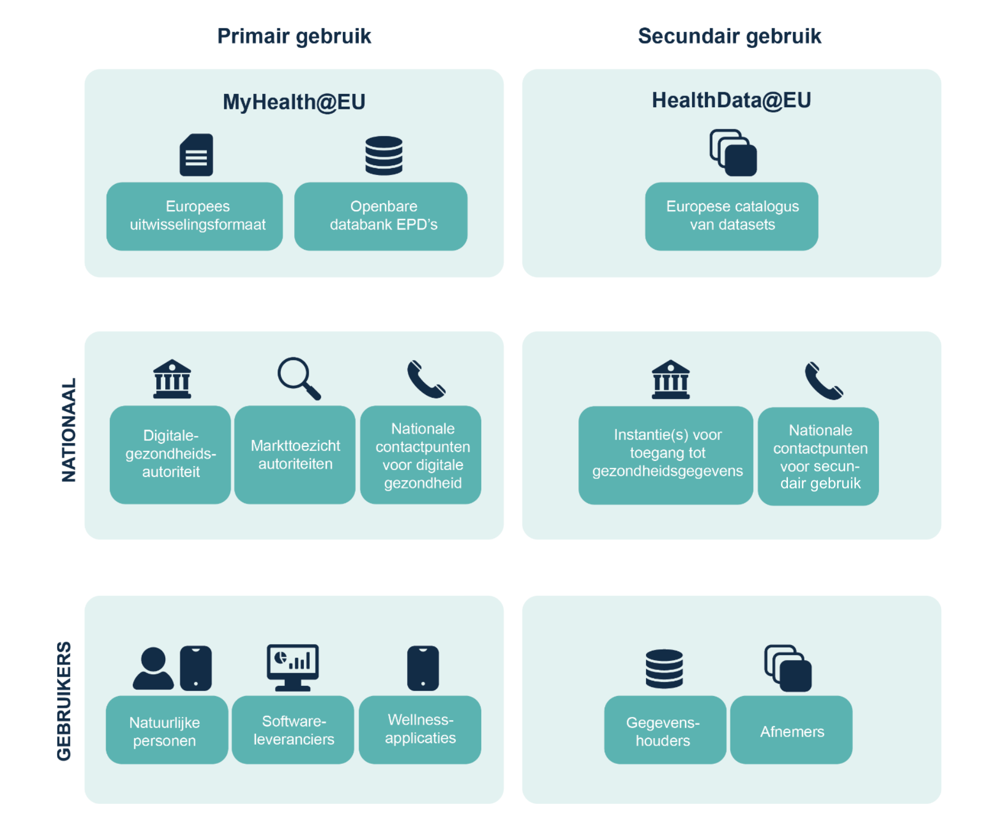
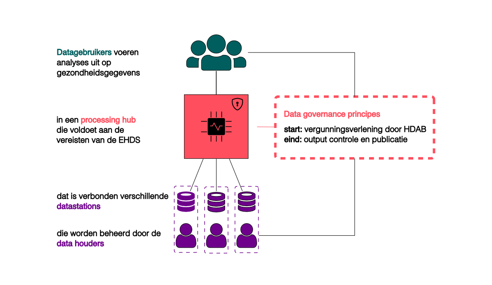

# 1. Introduction

## The need for a national infrastructure for secondary use of health data

The provision of care often takes place within a network of healthcare providers from different sectors. Digitalisation, data exchange and data availability play a crucial role in this. To make this possible, the Netherlands is working on the realisation of a Nationally Covering Network (NCN). The NCN is an overarching term and encompasses:

- an NCN of **infrastructures**, connecting healthcare providers with one another for exchanging and making available health data;
- an accompanying **trust framework** with technical, organisational and legal agreements necessary to ensure that citizens and healthcare professionals can trust the data and its safe and responsible use;
- **generic functions** with agreements, standards and provisions such as identification, authentication, authorisation and addressing.

The NCN will support both primary and secondary use of data, with different types of users, bodies and standards.

This document focuses on the elaboration of an infrastructure for secondary use. It assumes two roles: data holders and data users. On the data holder side, the **data station** is the essential system with which data holders can make data available for reuse in an effective and efficient manner. On the data user side, the **processing hub** is the central component for realising a secure processing environment in which data users can work. The combination of a data station and the processing hub forms the essence of the proposed architecture. This architecture is hybrid: it supports different forms of analysis, both centralised and decentralised. It is open: a data station can be connected to multiple processing hubs; within one collaboration (network) of data stations, different studies can be carried out. All of this stems from the ambition to harmonise and standardise as much as possible. These concepts will be explained in detail throughout this document.

///caption
**Figure 1.** Primary and secondary use within the NCN. Original figure from Impact Analysis EHDS Zorginstituut (2022), adapted.
///

///caption
**Figure 2.** Simplified representation of secondary use of data in the context of the NCN.
///

???+ abstract "The key concepts around secondary use"
    The key concepts around secondary use are defined in new European legislation, notably the EHDS (Chapter IV, Articles 50–81) and the Data Governance Act (DGA).

    === "**Secure Processing Environment (SPE)**"
        A secure environment in which health data can be processed for purposes such as scientific research. This can be a central SPE, such as the [CBS Microdata environment](https://www.cbs.nl/nl-nl/onze-diensten/maatwerk-en-microdata/microdata-zelf-onderzoek-doen), a federated SPE or a hybrid combination thereof. The focus of this specification is that data stations can serve as a cornerstone for a network of SPEs.
    
    === "**Health data user**" 
        A person or organisation that has been granted access to electronic health data for secondary use. For example, a researcher, a policy officer or a developer of commercial products. In EHDS terminology: the health data user (_Health Data User_).

    === "**Data recipient**"
        A person or organisation that bears processing responsibility for the use of data by the health data user. A data recipient is a participant in the data space for secondary use.

    === "**Data holder**"
        A data holder is a person or organisation (public or private) that manages health data. Many organisations fall under this category. It is not limited to hospitals, but includes, for example, anyone who develops products or services intended for the healthcare sector, developers of wellness apps, or scientific researchers working in the healthcare sector.

    === "**Data supplier**"
        A data holder that is not exempt under Article 50 of the EHDS is a data supplier and thereby a participant in the data space for secondary use.

    === "**Secondary use**"
        The use of electronic health data for purposes other than those for which they were collected. Using health data that was recorded for the treatment of a patient for scientific research is an example of secondary use.

## Scope of this specification document

This specification document describes an architecture for a national health data infrastructure for secondary use. It is based on the concept of data stations as a cornerstone for achieving syntactic and semantic interoperability, in combination with a processing hub as the system through which data users gain access to the data and can perform computations. This specification has been prepared at the request of Health-RI, as part of its core task to enable secondary use of health data. Various experts and practitioners have been involved from the outset in writing and developing this document. It is intended that the specification will be submitted for consultation to the field in early 2026 via a process yet to be determined.

Questions, comments and feedback on this document are very welcome. Please use the comment field at the bottom of each page.

???+ info "EHDS implementation timeline"
    The work on the NCN is part of the implementation of the European Health Data Space (EHDS), which entered into force on 26 March 2025. The key milestones on the road to full implementation are:

    - **March 2027**: adoption of national implementing legislation with detailed rules and practical elaboration of the regulation, including the designation of the national Health Data Access Body (HDAB) as the body for overseeing and enabling secondary use.
    - **March 2029**: the regulation will apply to the first priority categories of health data (patient records, electronic prescriptions and dispensing) in all EU countries for primary use. The HDAB is operational and secondary use is possible for most data categories.
    - **March 2031**: the second group of priority health data categories (medical images, laboratory results and discharge reports) is available for primary use. The rules for secondary use will also apply to the remaining data categories (e.g. genomic data).
    - **March 2035**: third countries and international organisations can join HealthData@EU for secondary use.

    This document aims to contribute to these milestones by providing a clear architecture and guidelines for the secondary use of health data.
    
## Attribution

This specification has been prepared at the request of Health-RI by:

- [Daniel Kapitan](https://linkedin.com/in/dkapitan)
- [René Hietkamp](https://www.linkedin.com/in/renehietkamp/)

The following persons have also contributed to the first version:

- [René Houwen](https://www.linkedin.com/in/renehouwen/) (on behalf of Zorginstituut Nederland): description of the KIK-V implementation
- [Maarten Kollenstart](https://www.linkedin.com/in/maarten-kollenstart-a08429146/) (TNO): review of the overall data spaces architecture, detailed elaboration of the DCAT standard, _verifiable credentials_
- [Madou Derksen](https://www.linkedin.com/in/madou-derksen/) (Dutch Hospital Data): description of the PLUGIN/vantage6 implementation
- [Yannick Vinkesteijn](https://www.linkedin.com/in/yvinkesteijn/) (Dutch Hospital Data): description of the PLUGIN/vantage6 implementation, in particular the data station and infrastructure
- [Tim Hendriks](https://www.clinicaldatascience.nl/Staff/tim-hendriks) (Medical Data Works): federated learning, description of the PLUGIN/vantage6 implementation

**:material-creative-commons: This work is licensed under a [Creative Commons Attribution 4.0 International License](https://creativecommons.org/licenses/by/4.0/).**
