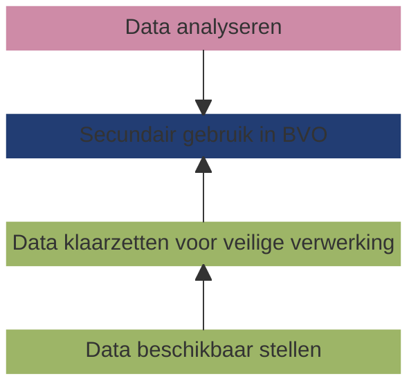

# Een specificatie van een federatieve gezondheidsdata-infrastructuur voor onderzoek, beleid en innovatie

## Context

Dit document beschrijft een functionele specificatie van een gezondheidsdata-infrastructuur voor onderzoek, beleid en innovatie - ook wel secundair gebruik genoemd. Daarnaast worden bestaande implementaties van beschreven en vergeleken. Doel van dit document is om voor _best practices_, bewezen oplossingsrichtingen e.d. makkelijk toegankelijk te maken, om hiermee de implementatie van de European Health Data Space (EHDS) en de daarvoor benogdigde infrastructuur te ondersteunen.

De gezondheidsdata-infrastructuur voor secundair gebruik bestaat uit verschillende elementen, zoals hieronder is weergegeven.

!!! info "Definities"
    De belangrijkste concepten van deze gezondheidsinfrastructuur zijn gedefinieerd in de nieuwe Europease wetgeving, met name de European Health Data Space (EHDS) en de Data Governance Act (DGA).

    === "**Data gebruiker**" 
        Een persoon of organisatie die toegang heeft gekregen tot elektronische gezondheidsgegevens voor secundair gebruik. Bijvoorbeeld een onderzoeker, een beleidsmederwerker of een ontwikkelaar van commerciële producten.

    === "**Data houder**"
        Een data houder is een persoon of organisatie (publiek of privaat) die gezondheidsdata beheert. Veel organisaties vallen hieronder. Het gaat niet alleen om ziekenhuizen, maar bijvoorbeeld ook iedereen die producten of diensten ontwikkelt die bestemd zijn voor de zorgsector of gezondheidszorg, of ontwikkelaars van wellnessapps, of wetenschappelijk onderzoekers die zich bezighouden met de zorgsector of gezondheidszorg.

    === "**Secundair gebruik van gezondheidsgegevens**"
        Het gebruik van elektronische gezondheidsgegevens voor andere doeleinden dan die waarvoor ze verzameld zijn. Het gebruiken van gezondheidsgegevens, die zijn vastgelegd voor de behandeling van een patiënt, voor wetenschappelijk onderzoek, is een voorbeeld van secundair gebruik.

    === "**Beveiligde verwerkingsomgeving (BVO)**"
        Een beveiligde omgeving waarin gezondheidsgegevens verwerkt kunnen worden voor bijvoorbeeld wetenschappelijk onderzoek. Dit kan een centrale BVO zijn, zoals bijvoorbeeld de [CBS Microdata omgeving](https://www.cbs.nl/nl-nl/onze-diensten/maatwerk-en-microdata/microdata-zelf-onderzoek-doen), of een gefedereerde data-infrastructuur zijn, wat de scope is dit document.

## Scope en doel van dit document

!!! abstract "Scope van dit document"
    Een data gebruiker voert een data analyse uit in een gefedereerde beveiligde verwerkingsomgeving, dat is verbonden aan een netwerk van _data stations_ zijnde de systemen waarom de data houder de data beschikbaar heeft gesteld en klaargezet voor gebruik. Dit document geeft een functionele specificatie en voorbeeld implementaties van een data station, zijnde het deel van de gezondheidsdatainfrastructuur dat binnen het domein (verwantwoordelijkheid) van de data houder is gerealiseerd.

## Leeswijzer

...

