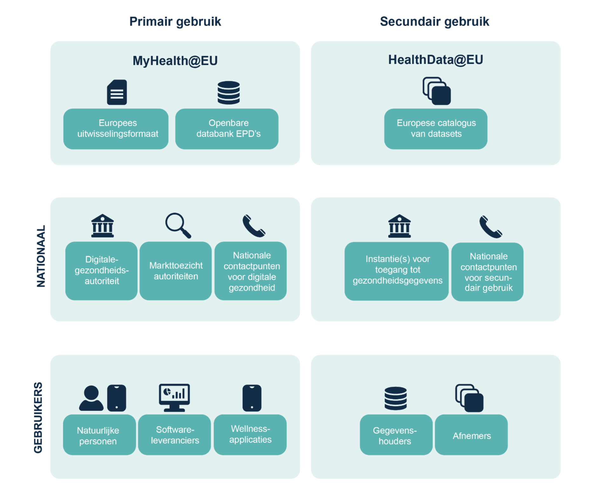
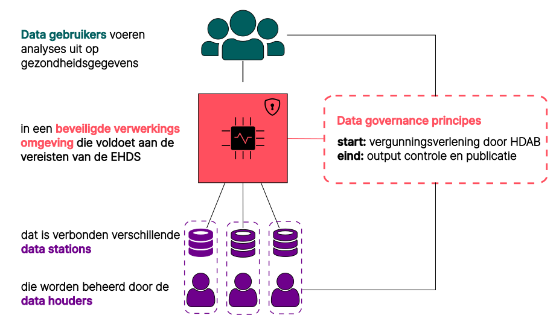

# 1. Inleiding

## De noodzaak voor een landelijk dekkend netwerk in de zorg

Het verlenen van zorg vindt vaak plaats in een netwerk van zorgaanbieders uit verschillende sectoren. Digitalisering, gegevensuitwisseling en databeschikbaarheid vervullen hierin een cruciale rol. Om dit mogelijk te maken, wordt in Nederland gewerkt aan de realisatie van een Landelijke Dekkend Netwerk (LDN). Het LDN is een overkoepelende term en omvat:

- een LDN van **infrastructuren**, dat zorgaanbieders met elkaar verbindt voor het uitwisselen en beschikbaar stellen van gezondheidsgegevens;
- een bijbehorend **vertrouwensstelsel** met technische, organisatorische en juridische afspraken die nodig zijn om te zorgen dat burgers en zorgverleners kunnen vertrouwen op de data en op het veilige en verantwoorde gebruik ervan;
- **generieke functies** met afspraken, standaarden en voorzieningen zoals voor identificatie, authenticatie en autorisatie en adressering.

Het LDN zal primair gebruik en secundair gebruik van data ondersteunen, met verschillende soorten gebruikers, instanties en standaarden. Dit document richt zich op de uitwerking het LDN specifiek voor secundair gebruik, zoals hieronder schematisch is weergegeven.

///caption
**Figuur 1.** Primair en secundair gebruik binnen het LDN. Bron: Impactanalyse EHDS Zorginstituut (2022).
///

///caption
**Figuur 2.** Vereenvoudigde weergave van secundair gebruik van data in de context van het LDN.
///

## Op weg naar de EHDS
Het werk aan het LDN is onderdeel van de implementatie van de European Health Data Space (EHDS), die op 26 maart 2025 in werking is getreden. De belangrijkste mijlpalen op weg naar de volledige uitvoering zijn:

- **maart 2027**: vaststelling landelijke uitvoeringswetten met gedetailleerde regels en praktische uitwerking van de verordening, inclusief de benoeming van de nationale Health Data Access Body (HDAB) als orgaan voor toezicht op en mogelijk maken van secundair gebruik.
- **maart 2029**: de verordening zal van toepassing zijn voor de eerste prioritaire categorieën van gezondheidsgegevens (patientendossiers, elektronische recepten en aflevering) in alle EU landen voor primair gebruik. De HDAB is operationeel en secundair gebruik is mogelijk voor de meeste gegevenscategorieën.
- **maart 2031**: de tweede groep prioritaire categorieën gezondheidsgegevens (medische beelden, laboratoriumuitslagen en ontslagverslagen) is beschikbaar voor primair gebruik. De regels voor secundair gebruik worden ook van toepassing voor de overige gegevenscategorieën (bv. genomische gegevens).
- **maart 2035**: derde landen en internationale organisaties kunnen zich aansluiten bij HealthData@EU voor het secundaire gebruik.

???+ abstract "De belangrijkste concepten rondom secundair gebruik"
    De belangrijkste concepten rondom secundair gebruik zijn gedefinieerd in de nieuwe Europese wetgeving, met name de EHDS (hoofdstuk IV, artikel 50 t/m 81) en de Data Governance Act (DGA).

    === "**Beveiligde verwerkingsomgeving (BVO)**"
        Een beveiligde omgeving waarin gezondheidsgegevens verwerkt kunnen worden voor bijvoorbeeld wetenschappelijk onderzoek. Dit kan een centrale BVO zijn, zoals bijvoorbeeld de [CBS Microdata omgeving](https://www.cbs.nl/nl-nl/onze-diensten/maatwerk-en-microdata/microdata-zelf-onderzoek-doen), een gefedereerde BVO of een hybride combinatie daarvan. Dit focus van deze specificatie is dat datastations als hoeksteen kunnen fungeren voor een netwerk van BVOs.
    
    === "**Datagebruiker**" 
        Een persoon of organisatie die toegang heeft gekregen tot elektronische gezondheidsgegevens voor secundair gebruik. Bijvoorbeeld een onderzoeker, een beleidsmederwerker of een ontwikkelaar van commerciële producten. In EHDS-terminologie: de gebruiker van gezondheidsegegevens (_Health Data User_).

    === "**Data-afnemer**"
        Een persoon of organisatie die verwerkingsverantwoordelijkheid heeft over het gebruik van de data door de datagebruiker. Een data-afnemer is deelnemer aan de dataspace voor secundair gebruik.

    === "**Datahouder**"
        Een datahouder is een persoon of organisatie (publiek of privaat) die gezondheidsdata beheert. Veel organisaties vallen hieronder. Het gaat niet alleen om ziekenhuizen, maar bijvoorbeeld ook iedereen die producten of diensten ontwikkelt die bestemd zijn voor de zorgsector of gezondheidszorg, of ontwikkelaars van wellnessapps, of wetenschappelijk onderzoekers die zich bezighouden met de zorgsector of gezondheidszorg.

    === "**Dataleverancier**"
        Een datahouder die niet is uitgezonderd op grond van artikel 50 van de EHDS is dataleverancier en daarmee deelnemer aan de dataspace voor secundair gebruik.

    === "**Secundair gebruik**"
        Het gebruik van elektronische gezondheidsgegevens voor andere doeleinden dan die waarvoor ze verzameld zijn. Het gebruiken van gezondheidsgegevens, die zijn vastgelegd voor de behandeling van een patiënt, voor wetenschappelijk onderzoek, is een voorbeeld van secundair gebruik.

## Scope van dit specificatie document

Dit specificatie document beschrijft een architectuur voor een landelijke gezondheidsdata-infrastructuur voor secundair gebruik. Het gaat uit van het concept van datastations als hoeksteen om syntactische en semantische interoperabiliteit te realiseren. Deze specificatie is opgesteld in opdracht van Health-RI, als onderdeel van haar kerntaak om secundair van gezondheidsgegevens mogelijk te maken. Verschillende experts en ervaringsdeskundigen zijn vanaf het begin betrokken bij het schrijven en uitwerken van dit document. Het is de bedoeling dat de specificatie begin 2026 ter consultatie wordt voorgelegd aan het werkveld via een nog nader te kiezen proces.

Vragen, reacties en feedback op dit document zijn van harte welkom. Gebruik hiervoor het commentaar veld onder aan elke pagina.

## Attributie

Deze specificatie is opgesteld in opdracht van Health-RI door:

- [Daniel Kapitan](https://linkedin.com/in/dkapitan)
- [René Hietkamp](https://www.linkedin.com/in/renehietkamp/)

Daarnaast hebben de volgende personen een bijdrage geleverd aan de eerste versie:

- [René Houwen](https://www.linkedin.com/in/renehouwen/) (in opdracht van Zorginstituut Nederland): beschrijving KIK-V implementatie
- [Maarten Kollenstart](https://www.linkedin.com/in/maarten-kollenstart-a08429146/) (TNO): review algehele architectuur van data spaces, detaillering gebruik DCAT standaard,  _verifiable credentials_
- [Madou Derksen](https://www.linkedin.com/in/madou-derksen/) (Dutch Hospital Data): beschrijving PLUGIN/vantage6 implementatie
- [Yannick Vinkesteijn](https://www.linkedin.com/in/yvinkesteijn/) (Dutch Hospital Data): beschrijving PLUGIN/vantage6 implementatie, met name datastation en infrastructuur
- [Tim Hendriks](https://www.clinicaldatascience.nl/Staff/tim-hendriks) (Medical Data Works): federated learning, beschrijving PLUGIN/vantage6 implementatie

**:material-creative-commons: Dit werk is gelicenseerd onder een [Creative Commons Naamsvermelding 4.0 Internationaal licentie](https://creativecommons.org/licenses/by/4.0/).**

