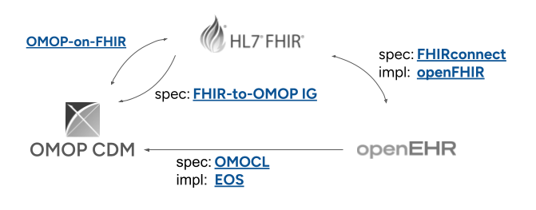
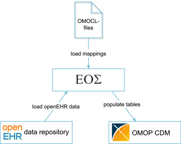

# 3.1. Syntactic interoperability

## 3.1.1. Convergence of openEHR, FHIR and OMOP

Healthcare uses many different information models, but in recent years the sector has been converging on openEHR, OMOP and FHIR as the leading information models.[@tsafnat2024converge] To achieve syntactic interoperability between these three standards, it is necessary to draw up specifications and/or mappings that define how elements from one information model should be translated into another. Ideally, these formal mapping specifications are independent of the specific software implementation used to actually realise the mappings, as shown in the diagram above.

## 3.1.2. Formal specifications for syntactic mappings

At the time of writing this document, the following (first versions of) formal mapping specifications are available.

=== "**FHIRconnect**"

    The [FHIRconnect Specification](https://sevkohler.github.io/FHIRconnect-spec/build/site/FHIRconnect/v1.0.0/index.html). This approach uses a Domain Specific Language (DSL) to define mappings. It abstracts the transformation logic into "Mapping Templates" that are independent of the underlying programming language.

=== "**HL7 FHIR-OMOP IG**"

    The [HL7 FHIR-OMOP Implementation Guide](https://build.fhir.org/ig/HL7/fhir-omop-ig/) provides the formal rules for cross-paradigm mapping, reconciling the transactional nature of FHIR with the longitudinal nature of OMOP.

=== "**OMOCL**"

    { align=right}

    The [OMOP Conversion Language](https://www.sciencedirect.com/science/article/pii/S1532046423001582) is a domain-specific language in which mappings from openEHR archetypes to the OMOP CDM have been created. It is the result of a research project and was submitted to the openEHR community for consultation in July 2025 with the aim of adopting it as a formal specification. EOS is the reference implementation of OMOCL.

## 3.1.3. Implementations of syntactic mappings

Implementations are the execution engines that interpret the formal specifications to transform or move data. A distinction is made between two different implementation patterns.

1. A facade pattern implements a real-time mapping layer on top of an existing database.
2. An ETL pattern implements data transformation pipelines that periodically (typically daily) translate data from one format to another. This pattern comes from data warehousing.

=== "**openFHIR**"

    [openFHIR](https://open-fhir.com/#access) is a commercial implementation of the FHIRconnect specification. It uses a facade pattern to bidirectionally store FHIR data in openEHR and read FHIR data from openEHR.

=== "**OMOPonFHIR**"
    
    The [OMOPonFHIR](https://github.com/omoponfhir) project provides software components (servers, adapters) that realise the bidirectional FHIR interface on top of the OMOP CDM. This solution follows a facade pattern: when a client requests a FHIR `Observation` via a REST API, the facade layer intercepts the request, executes a query on the underlying OMOP `MEASUREMENT` table in real time, and transforms the result into a FHIR JSON resource using the formal specification. Via this facade pattern, FHIR messages can also be stored in the OMOP database. OMOPonFHIR is based on OMOP CDM 5.4 and FHIR v4 and is implemented in Java. It was developed before the HL7 FHIR-OMOP IG was available and has therefore defined its own mappings.

=== "**EOS**"

    The [Eos Framework](https://github.com/SevKohler/Eos) is the reference implementation of the OMOCL mapping specification. It follows an ETL pattern and is implemented in Java.

## 3.1.4. Implications for data stations

In accordance with TEHDAS2, SPEs must support syntactic interoperability, including transformations between the most common information models as described above (see FCR-1 and FCR-2 in the [TEHDAS2 requirements](../appendix/tehdas2-requirements.md)). In cases where datasets or even entire databases are available in one of the three information models, syntactic transformations can be carried out effectively. It is expected that the specifications and reference implementations mentioned above will reach a level of maturity in the coming years that allows them to be incorporated as a component within an SPE.

It is worth noting that openEHR, FHIR and OMOP often use the same taxonomies, thesauri and/or ontologies for so-called _codeable concepts_. For example, SNOMED is supported by all three information models for coding procedures, diagnoses, etc. If SNOMED is used within openEHR, for instance, then a transformation to FHIR and/or OMOP can be performed without loss of meaning, because the SNOMED coding is taken over in its entirety. In practice, the greatest challenge will lie in semantic transformations. Suppose a data holder uses the G-Standard for medication, which is the most widely used taxonomy for medication in the Netherlands. And suppose the data holder can provide the data in FHIR format and it needs to be made available in OMOP format on the data station. Using the FHIRconnect specification, the _syntactic_ transformation would be relatively straightforward to implement. The _semantic_ mapping from the G-Standard to IDMP, for example, as the European standard for medication, would be considerably more laborious.

The same applies to the exposure of source systems with a non-standard information model, as is the case with many healthcare information systems. In practice, it is often relatively easy to map the _legacy_ information model to openEHR, FHIR or OMOP. The number of service providers offering products and services for this purpose is also growing steadily. But here too, the challenge lies in the semantic mappings. If, for example, medication prescriptions in the source system are stored as free text, it can be very laborious to convert that text into the required coding system. The details of semantic transformations are discussed in the next section. For now, we close with a list of examples.

| Source system | Target system | Notes |
|:------------|:------------|:------------|
| Epic FHIR v3 | OMOP CDM 5.4 | - Translate FHIR v3 to v4 using existing specifications - Use FHIRconnect specification and implement in programming language of choice - Low complexity provided that coding systems in FHIR v3 are already used correctly in the source system |
| openEHR | OMOP CDM 5.4 | - RSO Zuid-Limburg has already made the transformation of _legacy_ systems to openEHR within its region for primary use of data - With OMOCL and EOS, data stations for secondary use can be implemented from openEHR using an ETL pattern |
| OMOP CDM 5.4 | FHIR | - Suppose a national quality registry uses OMOP and wants to create a citizen app that allows people to look up information about themselves - With OMOPonFHIR, a FHIR facade can be realised to offer an API for the app |

