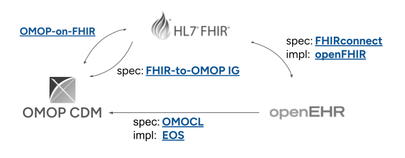

# 3.1. Syntactische interoperabiliteit

## 3.1.1. Convergentie van openEHR, FHIR en OMOP

In de zorg worden veel verschillende informatie modellen gebruikt, maar in de afgelopen jaar is de sector aan het convergeren naar openEHR, OMOP en FHIR als de belangrijkste informatiemodellen.[@tsafnat2024converge] Om syntactische interoperabiliteit tussen deze drie standaarden te realiseren, is het noodzakelijk om specificaties c.q. mappings op te stellen hoe elementen uit het ene informatiemodel vertaald moeten worden naar het andere. Idealiter staan deze formele mappingsspecificaties los van de specifieke implementatie van software om de mappings daadwerkelijk te realiseren, zoals in bovenstaand diagram is weergegeven.

## 3.1.2. Formele specificaties voor syntactische mappings

Ten tijde van het schrijven van dit document zijn de volgende (eerste versies van) formele mappingsspecificaties beschikbaar.

=== "**FHIRconnect**"

    De [FHIRconnect Specificatie](https://sevkohler.github.io/FHIRconnect-spec/build/site/FHIRconnect/v1.0.0/index.html). Deze aanpak gebruikt een Domain Specific Language (DSL) om mappings te definiëren. Het abstraheert de transformatielogica naar "Mapping Templates" die onafhankelijk zijn van de onderliggende programmeertaal.

=== "**HL7 FHIR-OMOP IG**"

    De [HL7 FHIR-OMOP Implementation Guide](https://build.fhir.org/ig/HL7/fhir-omop-ig/) biedt de formele regels voor cross-paradigma mapping, waarbij het transactionele karakter van FHIR en het longitudinale karakter van OMOP worden verzoend.

=== "OMOCL"

    De [OMOP Conversione Language](https://www.sciencedirect.com/science/article/pii/S1532046423001582) is een domein-specifieke taal waarin mapping van openEHR archetypes zijn gemaakt naar het OMOP CDM. Het is het resultaat van ee onderzoeksproject en is in juli 2025 ter consultatie  voorgelegd aan de openEHR community met als doel om het als formele specificatie te adopteren. EOS is de referentie implementatie van OMOCL. 

## 3.1.3. Implementaties van syntactische mappings

Implementaties zijn de uitvoeringsmotoren (engines) die de formele specificaties interpreteren om gegevens te transformeren of te verplaatsen. Daarbij wordt onderscheidt gemaakt tussen twee verschillende implementatie patronen.

1. Een facade-patroon implementeert een real-time mapping laag bovenop een bestaande database.
2. Een ETL-patroon implementeert data transformatie 'straten' die periodiek (typisch dagelijks) de data van het ene formaat naar het andere vertalen. Dit patroon komt uit datawarehousing.

=== "**openFHIR**"

    [openFHIR](https://open-fhir.com/#access) is een commerciele implementatie van de FHIRconnect specificatie. Het gebruikt een facade-patroon om bi-directioneel FHIR data in openEHR op te slaan, en FHIR data uit openEHR te lezen. 

=== "**EOS**"

    Het [Eos Framework](https://github.com/SevKohler/Eos) is de referentieimplementatie van de OMOCL mappingspecificatie. Het volgt een ETL patroon en is geimplementeerd in Java.

=== "**OMOPonFHIR**"
    
    Het [OMOPonFHIR](https://github.com/omoponfhir) project levert de softwarecomponenten (servers, adapters) die de bidirectionele FHIR interface realiseren bovenop het OMP CDM. Deze oplossing volgt een facade-patroon: wanneer een client een FHIR `Observation` opvraagt via een REST API, onderschept de facade-laag het verzoek, voert een query uit op de onderliggende OMOP `MEASUREMENT`-tabel in real-time, en transformeert het resultaat naar een FHIR JSON-resource middels de formele specificatie. Middels dit facase patroon kunnen FHIR berichten ook worden opgeslagen in de OMOP database. OMOPonFHIR gaat uit van OMOP CDM 5.4 en FHIR v4 en is geimplementeerd in Java. Het is ontwikkeld voordat de HL7 FHIR-OMOP IG beschikbaar was en heeft daarom de mappings zelf gedefinieerd.

