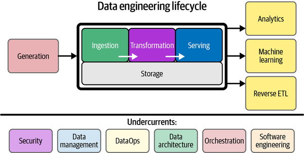
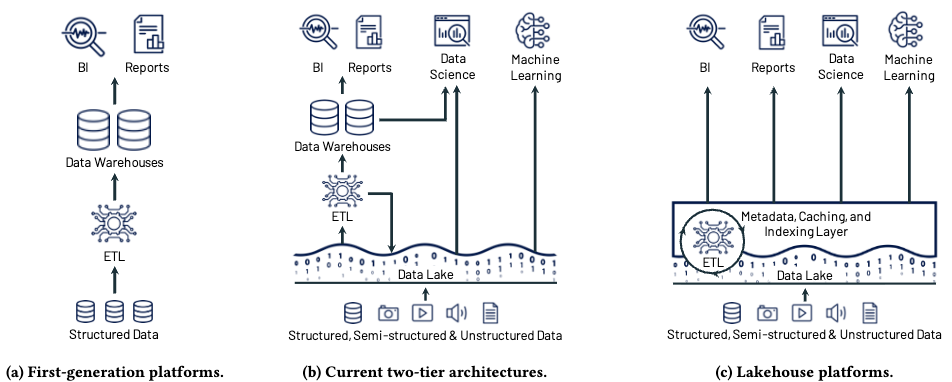

# 5.1. Evolution of data infrastructures

## Data warehouse, data lake and lakehouse

A data infrastructure, often also called a data platform, is an implementation of the data engineering lifecycle consisting of storage as its foundation, with processing layers for ingestion, transformation and serving built on top. These are supported by auxiliary processes such as governance, security and orchestration.

To be able to evaluate implementations of data platforms, we first introduce a number of infrastructure concepts.

!!! abstract "Infrastructure concepts"

    * **OLTP** (*Online Transaction Processing*): real-time transaction processing for operational systems.    
    * **OLAP** (*Online Analytical Processing*): complex analysis on large datasets for decision-making.
    * **ACID compliance** Four properties (*Atomicity*, *Consistency*, *Isolation*, *Durability*) that guarantee data integrity.
    * **ETL** (*Extract-Transform-Load*): data is transformed before it is stored.
    * **ELT** (*Extract-Load-Transform*): raw data is first stored, then transformed.
    * **Data lineage** The complete transformation history of data from origin to destination.
    * **Data catalog** A central inventory of data assets with metadata for discoverability.
    * **Schema-on-read vs Schema-on-write** Structuring data at storage time (write) vs at usage time (read).

Since the advent of relational databases, roughly three generations of data infrastructures can be distinguished: data warehouses, data lakes and the lakehouse architecture.

=== "Data warehouses"

    A data warehouse is a closed system in which orchestration, compute and storage are integrated into a monolithic architecture. Warehouses use **schema-on-write** with **ETL processes**: data is pre-structured and validated according to fixed definitions. This approach provides full referential integrity and ACID compliance, but limits flexibility for unstructured data types and new use cases.

=== "Data lakes"

    Data lakes emerged as a response to the limitations of warehouses for large volumes of heterogeneous data. They use **schema-on-read** with **ELT processes**: raw data is stored without prior structuring. This enabled a separation between storage (often cheap object storage) and compute (via diverse engines). The architecture thus consists of loosely coupled components that offer flexibility and scalability, but lack native ACID compliance or standardised metadata management due to the absence of central orchestration and standardised layers with data metadata.

=== "Lakehouses"

    Lakehouses combine the flexibility of data lakes with governance aspects of warehouses by adding a standardised metadata layer on top of object storage (Harby et al., 2024). This hybrid architecture retains schema-on-read but implements ACID transactions at the metadata level via open table formats such as Delta Lake and Apache Iceberg. Lakehouses support both ETL and ELT patterns which, together with automated data lineage, enable flexible and reliable data pipelines. Like data lakes, storage and compute are separated, yet the lakehouse retains the ability for reliable data governance through a unified metadata layer and an overarching orchestration layer.

## Comparison for data station requirements

The table below provides an overview of the key characteristics of these three types of data infrastructure. For the data station specification, we explicitly choose the lakehouse architecture. The following section goes into more detail on the technical specifications of data stations, built on the principles of the lakehouse architecture and leveraging the best-practice standards of the so-called _composable data stack_.

| Aspect | Data warehouse | Data lake | Lakehouse |
|--------|----------------|-----------|------------|
| **OLTP/OLAP paradigm** | Primarily OLAP; batch analytics | Flexible via decentralised compute engines | Hybrid: reliable OLTP + OLAP via ACID layer |
| **Syntactic interoperability** | Proprietary formats + vendor APIs | Open formats, no standardised APIs | Open table formats + standardised API layer |
| **Semantic interoperability** | Schema-on-write: fixed definition frameworks | Schema-on-read: no semantic consistency | Schema evolution + metadata governance layer |
| **Referential integrity** | Automatically enforced | No validation | Must be manually implemented in workflows |
| **ACID compliance** | Fully ACID-compliant | Not ACID-compliant | ACID transactions at metadata level |
| **Data lineage & provenance** | ETL pipeline logging | Manual lineage reconstruction | Automated end-to-end lineage |
| **Metadata governance** | Internal catalogues, vendor-specific | Ad-hoc metadata management | Unified metadata layer + schema enforcement |
| **Schema flexibility** | Breaking changes on modification | Full flexibility; no validation | Non-breaking schema versioning |
| **Multimodal data support** | Relational structures only | Unstructured storage without context | Unified metadata across all data types |
| **Scalability** | Vertical (expensive) | Horizontal (cost-effective) | Hybrid: horizontal with metadata overhead |
| **Federated governance** | Centralised data stewardship | Distributed; depends on own implementation | Decentralised governance frameworks |
| **Vendor dependency** | Vendor/platform lock-in | Fully open | Open table formats + pluggable architecture |
| **Data quality enforcement** | Pre-load validation (ETL) | Post-hoc validation (ELT) | Configurable quality gates (ETL + ELT) |
