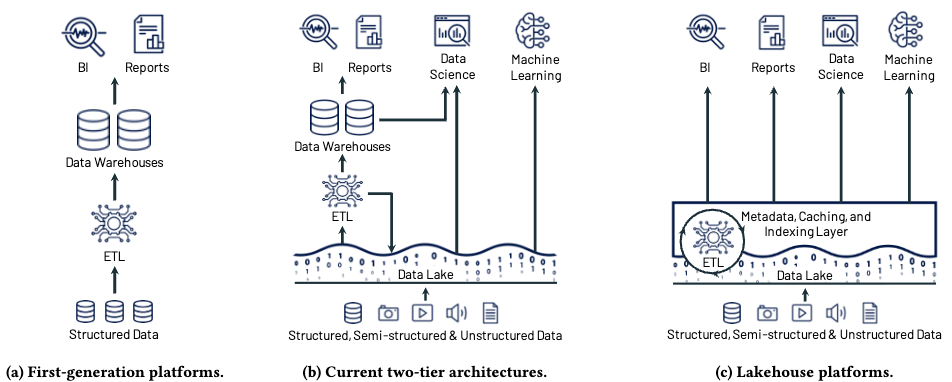

# 5.1. Evolutie van data infrastructuren

## Datawarehouse, data lake en lakehouse

Een data infrastructuur, vaak ook een data platform genoemd, is een implementatie van een data engineering lifecycle die bestaat uit opslag (_storage_) als fundament, met daarbovenop processing lagen voor ingestie, transformatie en ontsluiting. Deze worden ondersteund door ondersteunende processen zoals governance, security en orchestratie.

Om implementaties van data platforms te kunnen evalueren, introduceren we eerst een aantal infrastructuur concepten.

!!! abstract "Infrastructuur concepten"

    * **OLTP** (*Online Transaction Processing*): real-time transactieverwerking voor operationele systemen.    
    * **OLAP** (*Online Analytical Processing*): complexe analyses op grote datasets voor besluitvorming.
    * **ACID compliance** Vier eigenschappen (*Atomicity*, *Consistency*, *Isolation*, *Durability*) die data-integriteit waarborgen.
    * **ETL** (*Extract-Transform-Load*): data wordt getransformeerd voordat het wordt opgeslagen.
    * **ELT** (*Extract-Load-Transform*): ruwe data wordt eerst opgeslagen, daarna getransformeerd.
    * **Data lineage** Volledige transformatiegeschiedenis van data van oorsprong tot bestemming.
    * **Data catalog** Centrale inventaris van data-assets met metadata voor vindbaarheid.
    * **Schema-on-read vs Schema-on-write** Data structureren bij opslag (write) vs bij gebruik (read).

Sinds de komst van relationele databases zijn grofweg drie generaties van data infrastructuren te onderscheiden: datawarehouses, data lakes en de lakehouse architectuur.

=== "Data warehouses"

    Een data warehouse is een gesloten systeem waarbij orchestratie, compute en storage geïntegreerd zijn in een monolithische architectuur. Warehouses hanteren **schema-on-write** met **ETL-processen**: data wordt vooraf gestructureerd en gevalideerd volgens vaste definities. Deze benadering biedt volledige referentiële integriteit en ACID-compliance, maar beperkt flexibiliteit voor ongestructureerde datatypen en nieuwe use cases.

=== "Data lakes"

    Data lakes ontstonden als reactie op de beperkingen van warehouses voor grote volumes heterogene data. Ze hanteren **schema-on-read** met **ELT-processen**: ruwe data wordt opgeslagen zonder voorafgaande structurering. Dit maakte een scheiding mogelijk tussen opslag (vaak goedkope object storage) en compute (via diverse engines). Hierdoor bestaat de architectuur uit loosely coupled componenten die flexibiliteit en schaalbaarheid bieden, maar geen native ACID-compliance of gestandaardiseerd metadata management door het ontbreken van centrale orchestratie en gestandardiseerde metadata lagen.

=== "Lakehouses"

    Lakehouses combineren de flexibiliteit van data lakes met governance aspecten van warehouses door een gestandaardiseerde metadata laag toe te voegen bovenop object storage (Harby et al., 2024). Deze hybride architectuur behoudt schema-on-read maar implementeert ACID transactions op metadata niveau via open table formats zoals Delta Lake en Apache Iceberg. Lake houses ondersteunen zowel ETL als ELT patronen die samen met geautomatiseerde data lineage zorgen voor flexibele en betrouwbare data pipelines. Net als data lakes is opslag en compute gescheiden, maar behoudt het de mogelijkheid voor betrouwbare data governance door een uniforme metadata laag en een overkoepelende orchestratie laag.

## Vergelijking voor datastation requirements

Onderstaand tabel geeft een overzicht van de belangrijkste kenmerken tussen deze drie verschillende vormen van data infrastructuren. Voor de datastation specificatie kiezen we expliciet voor de lakehouse architectuur. In de volgende sectie wordt in meer detail ingegaan op technische specificaties van datastations, gebouwd met de principes van de lakehouse architectuur en gebruik makend van de _best practice_ standaarden van de zogendaame _composable data stack_.

| Aspect | Data warehouse | Data lake | Lakehouse |
|--------|----------------|-----------|------------|
| **OLTP/OLAP paradigma** | Primair OLAP; batch analytics | Flexibel via decentrale compute engines | Hybrid: betrouwbare OLTP + OLAP via ACID layer |
| **Syntactische interoperabiliteit** | Proprietary formaten + vendor APIs | Open formaten, geen gestandaardiseerde APIs | Open table formats + gestandaardiseerde API layer |
| **Semantische interoperabiliteit** | Schema-on-write: vaste definitiekaders | Schema-on-read: geen semantische consistentie | Schema-evolutie + metadata governance laag |
| **Referentiële integriteit** | Automatisch afgedwongen | Geen validatie | Handmatig implementeren in workflows |
| **ACID compliance** | Volledig ACID-compliant | Niet ACID-compliant | ACID transactions op metadata niveau |
| **Data lineage & provenance** | ETL pipeline logging | Handmatige lineage reconstructie | Geautomatiseerde end-to-end lineage |
| **Metadata governance** | Interne catalogi, vendor-specifiek | Ad-hoc metadata beheer | Unified metadata layer + schema enforcement |
| **Schema flexibiliteit** | Breaking changes bij wijzigingen | Volledige flexibiliteit; geen validatie | Non-breaking schema versioning |
| **Multimodale data ondersteuning** | Alleen relationele structuren | Ongestructureerde opslag zonder context | Unified metadata over alle data types |
| **Schaalbaarheid** | Verticaal (duur)| Horizontaal (kosteneffectief) | Hybride: horizontaal met metadata overhead |
| **Federatieve governance** | Centralized data stewardship | Distributed; naar eigen implementatie | Decentralized governance frameworks |
| **Vendor afhankelijkheid** | Vendor/platform lock-in | Volledig open | Open table formats + pluggable architectuur |
| **Data kwaliteitsafdwinging** | Pre-load validatie (ETL) | Post-hoc validatie (ELT) | Configureerbare quality gates (ETL + ELT) |
