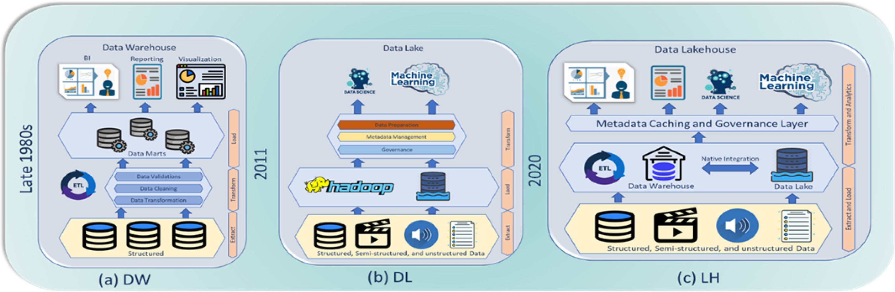

# 5. Perspectief: infrastructuur

## 1. Federatieve uitdagingen voor data-infrastructuur

**Heterogene data en systemen**

In een federatief netwerk leeft de data niet op een centrale plek maar over meerdere data stations. Elk data station heeft een eigen data ecosysteem met niet alleen eigen extractie methodes om data te ontsluiten naar het datastation, maar ook een verschil in context van de data zelf. Met de ontwikkelingen in zowel data generatie technieken is zowel de vraag als aanbod in volume en complexiteit hard gestegen. Het data landschap is geevolueerd van netjes gestructureerde data naar een heterogene mix van verschillende data types en mate van structuur. Waarbij data eerder expliciet werd verplaatst of aangeboden zien we nu een continue stroom aan informatie die binnenkomt.

In een federatief netwerk is het data station de poort van de data binnen een organisatie naar het federatieve netwerk. Een data station heeft hierin dus de essentiele rol om de organisatie eigen data te kunnen convergeren naar een standaard voor hergebruik.
Om deze diversiteit tussen organisaties en in de data zelf te kunnen faciliteren is het van groot belang om een infrastructuur te fasciliteren met een balans tussen flexibiliteit en operabiliteit.

**Late binding voor data kwaliteit**

Om de balans tussen flexibiliteit ten operabiliteit te kunnen waarborgen is het belangrijk is het belangrijk om de kwaliteitseisen die gesteld worden aan een dataset te splitsen in de minimale technische kwaliteitseisen en de contextuele kwaliteitseisen. Een infrastructuur moet ten slotte de data voldoende kunnen begrijpen om het te kunnen verwerken maar de contextuele kwaliteit van data is vaak sterk gebruiksafhankelijk.

Een data infrastructuur binnen een data station is alleen verantwoordelijk voor de technische "leesbaarheid" van de data zodat het verzamelen van meta data en het beschikbaar stellen van verdere verwerking niet gehinderd wordt. Dit principe van **late binding**, betekent dat we data niet op voorhand weigeren op inhoudelijke gronden, maar op "leesbaarheid" en technische toegankelijkheid. De inhoudelijke kwaliteitseisen kunnen vervolgens via selectie en ETL-processen gaandeweg worden toegepast, waardoor semantische interoperabiliteit behouden blijft zonder vroegtijdige data-exclusie.

**Metadata zonder data-exposure**

Om centraal ten aller tijde een betrouwbare afspiegeling te kunnen geven van de beschikbare data binnen een data station, is het fasciliteren van een betrouwbare meta data catalog van cruciaal belang. Het is daarom essentieel om het monitoren als een integraal en automatisch proces mee te nemen zodat er geen discrepanties kunnen onstaan tussen de data zelf en de beschikbare meta data. Deze meta data kan vervolgens aan centrale processen beschikbaar worden gesteld, zodat gebruikers alle informatie voor gebruik hebben zonder dat de data zelf beschikbaar gesteld hoeft te worden.

Nu we inzichtelijk hebben gemaakt welke uitdagingen en belangrijker welke eisen er gesteld mogen worden aan een federatieve data infrastructuur, zullen we eerst verschillende data platform architecturen introduceren en evalueren om zo tot een passende federatieve infrastructuur te kunnen komen.

## 2. Evolutie van data infrastructuren

Een data platform is een implementatie van een data engineering lifecycle die bestaat uit een storage laag als fundament, met daarbovenop processing lagen voor ingestie, transformatie en ontsluiting. Deze worden ondersteund door ondersteunende processen zoals governance, security en orchestratie.

Om implementaties van data platforms te kunnen evalueren, introduceren we eerst een aantal infrastructuur concepten.

!!! abstract "Infrastructuur concepten"
    **OLTP** (*Online Transaction Processing*): real-time transactieverwerking voor operationele systemen.
    
    **OLAP** (*Online Analytical Processing*): complexe analyses op grote datasets voor besluitvorming.

    **ACID compliance** Vier eigenschappen (*Atomicity*, *Consistency*, *Isolation*, *Durability*) die data-integriteit waarborgen.
    
    **ETL** (*Extract-Transform-Load*): data wordt getransformeerd voordat het wordt opgeslagen.
    
    **ELT** (*Extract-Load-Transform*): ruwe data wordt eerst opgeslagen, daarna getransformeerd.
    
    **Data lineage** Volledige transformatiegeschiedenis van data van oorsprong tot bestemming.
    
    **Data catalog** Centrale inventaris van data-assets met metadata voor vindbaarheid.
    
    **Schema-on-read vs Schema-on-write** Data structureren bij opslag (write) vs bij gebruik (read).

### Data warehouses

Een data warehouse is een gesloten systeem waarbij orchestratie, compute en storage geïntegreerd zijn in een monolithische architectuur. Warehouses hanteren **schema-on-write** met **ETL-processen**: data wordt vooraf gestructureerd en gevalideerd volgens vaste definities. Deze benadering biedt volledige referentiële integriteit en ACID-compliance, maar beperkt flexibiliteit voor ongestructureerde datatypen en nieuwe use cases.

### Data Lakes

Data lakes ontstonden als reactie op de beperkingen van warehouses voor grote volumes heterogene data. Ze hanteren **schema-on-read** met **ELT-processen**: ruwe data wordt opgeslagen zonder voorafgaande structurering. Dit maakte een scheiding mogelijk tussen opslag (vaak goedkope object storage) en compute (via diverse engines). 
Hierdoor bestaat de architectuur uit loosely coupled componenten die flexibiliteit en schaalbaarheid bieden, maar geen native ACID-compliance of gestandaardiseerd metadata management door het ontbreken van centrale orchestratie en gestandardiseerde metadata lagen.

### Lake houses

Lake houses combineren de flexibiliteit van data lakes met governance aspecten van warehouses door een gestandaardiseerde metadata laag toe te voegen bovenop object storage (Harby et al., 2024). Deze hybride architectuur behoudt schema-on-read maar implementeert ACID transactions op metadata niveau via open table formats zoals Delta Lake en Apache Iceberg. Lake houses ondersteunen zowel ETL als ELT patronen die samen met geautomatiseerde data lineage zorgen voor flexibele en betrouwbare data pipelines. Net als data lakes is opslag en compute gescheiden, maar behoudt het de mogelijkheid voor betrouwbare data governance door een uniforme metadata laag en een overkoepelende orchestratie laag.

### Vergelijking voor datastation requirements

| Aspect | Data Warehouse | Data Lake | Lake House |
|--------|----------------|-----------|------------|
| **OLTP/OLAP paradigma** | Primair OLAP; batch analytics | Flexibel via decentrale compute engines | Hybrid: betrouwbare OLTP + OLAP via ACID layer |
| **Syntactische interoperabiliteit** | Proprietary formaten + vendor APIs | Open formaten, geen gestandaardiseerde APIs | Open table formats + gestandaardiseerde API layer |
| **Semantische interoperabiliteit** | Schema-on-write: vaste definitiekaders | Schema-on-read: geen semantische consistentie | Schema-evolutie + metadata governance laag |
| **Referentiële integriteit** | Automatisch afgedwongen | Geen validatie | Handmatig implementeren in workflows |
| **ACID compliance** | Volledig ACID-compliant | Niet ACID-compliant | ACID transactions op metadata niveau |
| **Data lineage & provenance** | ETL pipeline logging | Handmatige lineage reconstructie | Geautomatiseerde end-to-end lineage |
| **Metadata governance** | Interne catalogi, vendor-specifiek | Ad-hoc metadata beheer | Unified metadata layer + schema enforcement |
| **Schema flexibiliteit** | Breaking changes bij wijzigingen | Volledige flexibiliteit; geen validatie | Non-breaking schema versioning |
| **Multimodale data ondersteuning** | Alleen relationele structuren | Ongestructureerde opslag zonder context | Unified metadata over alle data types |
| **Schaalbaarheid** | Verticaal (duur)| Horizontaal (kosteneffectief) | Hybride: horizontaal met metadata overhead |
| **Federatieve governance** | Centralized data stewardship | Distributed; naar eigen implementatie | Decentralized governance frameworks |
| **Vendor afhankelijkheid** | Vendor/platform lock-in | Volledig open | Open table formats + pluggable architectuur |
| **Data kwaliteitsafdwinging** | Pre-load validatie (ETL) | Post-hoc validatie (ELT) | Configureerbare quality gates (ETL + ELT) |

### Federatieve platforms vereisen een composable lake house architectuur

Zoals eerder vastgesteld heeft het data station als taak om data houder specifieke data te convergeren naar betrouwbare en ontsluitbare informatie. Elk data station opereert in een unieke organisatorische context met eigen systemen, compliance eisen en technische capaciteiten.

Via een lake house architectuur behoudt een data station de flexibiliteit om diverse data zowel beschikbaar te maken als te verwerken, maar wordt via metadata management en open standaarden een generieke minimale standaard afgedwongen. De gestandaardiseerde metadata laag zorgt voor de benodigde centrale coördinatie zonder lokale autonomie in te perken. Deze metadata laag functioneert als de gemeenschappelijke taal als basis voor federatieve samenwerking en interoperabiliteit.

## 3. Composable data station implementatie
