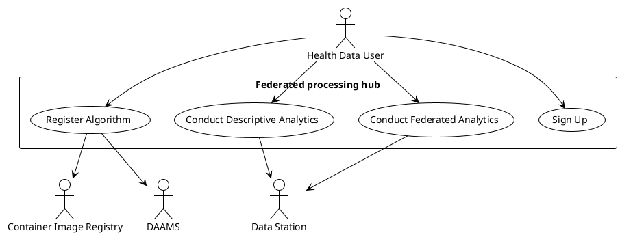

# Data analyseren (_use of data_)

Het portaal geeft een datagebruiker de mogelijkheid om een algoritme te registreren en te distribueren voor het uitvoeren van een gefedereerde analyse. De ontwikkeling van het algoritme vindt buiten het portaal plaats, waarbij de datagebruiker de gelegenheid heeft om testruns uit te voeren om het algoritme te verifiëren.

Uitgangspunt is een gefedereerde manier van databeschikbaarheid. Dit in tegenstelling tot de beschrijving gegeven in [M6.1 Guideline for health data holders on making personal and non-personal electronic health data available for reuse](https://tehdas.eu/wp-content/uploads/2025/09/draft-guideline-for-health-data-holders-on-making-personal-and-non-personal-electronic-health-data-available-for-reuse.pdf). Het portaal geeft hiermee invulling aan de EHDS overweging 80 dat gezien de gevoeligheid van gezondheidsgegevens waar mogelijk beginselen als “privacy door ontwerp” en “privacy door standaardinstellingen” en het concept “breng de vragen naar de gegevens in plaats van die gegevens te verplaatsen” in acht moeten worden genomen.

### Sign Up

**Goal**: Health Data User meldt zich aan en registreert zich

**Primary Actor**: Health Data User (natuurlijk persoon of rechtspersoon)

### Register Algorithm

**Goal**: Health Data User registreert een algoritme voor analyse op gezondheidsgegevens

**Primary Actor**: Health Data User (natuurlijk persoon of rechtspersoon)

**Preconditions**: 

- De primaire actor is een geregistreerde gebruiker

**Main Success Scenario:**

- Health Data User start project voor gefedereerde analyse.
- Health Data User uploadt het algoritme en de bijbehorende configuratie, waaronder de configuratie voor het bouwen van een image.
- Health Data User presenteert de vergunning voor toegang tot gezondheidsgegevens.
- Het systeem verzendt algoritme en configuratie naar DAAMS met een verzoek tot verificatie. De vergunning wordt met het verzoek meegezonden.
- Het systeem wacht totdat DAAMS met een antwoord komt op het verzoek. Er is akkoord op het algoritme.
- Het systeem notificeert de Health Data User dat er akkoord is gegeven op het algoritme.
- Het systeem bouwt op basis van de configuratie een container image voor het algoritme
- Het systeem registreert het image in een gekwalificeerde Container Image Registry

**Extension Points:**

**Post-conditions**

- Image van de container met het algoritme is geregistreerd

### Conduct Federated Analytics

**Goal**: Health Data User ontvangt de resultaten van een federatieve data-analyse

**Primary Actor**: Health Data User (natuurlijk persoon of rechtspersoon)

### Conduct Descriptive Analytics

**Goal**: Health Data User ontvangt de resultaten van een verzoek om data

**Primary Actor**: Health Data User (natuurlijk persoon of rechtspersoon)