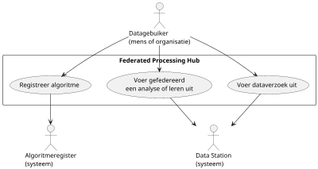
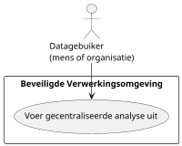

# Data analyseren (_use of data_)

Het proces start wanneer een datagebruiker een analyse wil uitvoeren op gegevens die door dataleveranciers beschikbaar zijn gesteld. Voor het uitvoeren van de analyse maakt de datagebruiker gebruik van een federated processing hub, of van een beveiligde verwerkingsomgeving (BVO) van de HDAB dan wel van een betrouwbare datahouder (artikel 72 van de EHDS). Waar in deze tekst wordt verwezen naar de BVO van de HDAB, wordt daarmee tevens de BVO van een betrouwbare datahouder bedoeld.

De BVO van de HDAB wordt uitsluitend gebruikt wanneer de analyse niet gefedereerd kan worden uitgevoerd. Overweging 80 van de EHDS benadrukt daarbij het uitgangspunt: “_breng de vragen naar de gegevens in plaats van de gegevens te verplaatsen_”. Om die reden heeft een federatieve analyse de voorkeur.

Een analyse kan op drie manieren worden uitgevoerd:

1. Gefedereerde analyse: de data blijft bij de datahouder en wordt beschikbaar gesteld voor een gefedereerde analyse.
2. Gefedereerd leren: de data blijft bij de datahouder en wordt beschikbaar gesteld voor het uitvoeren van gefedereerd leren (federated learning).
3. Datapooling (gecombineerde analyse): de data wordt beschikbaar gesteld voor een analyse waarbij gegevens van meerdere datahouders eerst worden samengevoegd.

Naast het uitvoeren van een analyse kan binnen dit proces ook een verzoek om data worden gedaan. Uitgangspunt is dat een dergelijk dataverzoek gedurende de geldigheidstermijn van de goedkeuring meerdere malen kan worden uitgevoerd. In tegenstelling tot een analyse krijgt de datagebruiker bij een dataverzoek geen toegang tot de onderliggende data waarop de antwoorden zijn gebaseerd.

## Overzicht van de usecases

Een Federated Processing Hub dient als centraal portaal. Datagebruikers kunnen via dit portaal analyses of leermodellen starten, de resultaten ontvangen en deze downloaden. De hub maakt het ook mogelijk om dataverzoeken naar de aangesloten datastations van dataleveranciers te sturen. Voordat deze activiteiten kunnen plaatsvinden, moet de HDAB eerst een vergunning of goedkeuring verlenen. De Federated Processing Hub is een systeem van de HDAB of van een betrouwbare datahouder. 

De HDAB stelt een Beveiligde Verwerkingsomgeving (BVO) ter beschikking voor het uitvoeren van analyses die datapooling vereisen. Dit houdt in dat de data van verschillende bronnen fysiek bij elkaar gebracht moet worden om de analyse te kunnen uitvoeren. De BVO is een ander systeem dan de Federated Processing Hub. Waar de Federated Processing Hub functioneert als een portaal voor decentrale analyses (de data blijft bij de leverancier), is de BVO een gecentraliseerde omgeving waar de gepoolde data wordt samengebracht voor verwerking. De manieren waarop gebruikers toegang krijgen tot de BVO worden bepaald en beheerd door de HDAB. 

Het proces voor het verzamelen van de data voor de gecentraliseerde analyse start met een verzoek van de HDAB aan de dataleverancier, waarin duidelijk wordt aangegeven dat het om datapooling gaat. Als reactie op dit verzoek transporteert het datastation de gevraagde data naar de HDAB. De HDAB zorgt er vervolgens voor dat deze data veilig beschikbaar wordt gesteld binnen de BVO voor de analyse.

De usecases uit het diagram zijn in de vervolgparagrafen kort beschreven.

## Registreer algoritme

Een analyse of leerproces wordt uitgevoerd door een algoritme, bijvoorbeeld een script geschreven in Python of een andere programmeertaal. Het algoritme wordt verpakt in een container, zodat het geïsoleerd kan worden uitgevoerd. Met geïsoleerd wordt bedoeld dat de code uitsluitend invloed heeft binnen de container zelf en geen effect heeft op de omgeving daarbuiten. Op deze manier ontstaat op het datastation een beveiligde verwerkingsomgeving waarin meerdere algoritmen, elk in een eigen container, kunnen worden uitgevoerd. Docker is op dit moment een de facto standaard voor comntainers.

De datagebruiker ontwikkelt het algoritme, test het en registreert het vervolgens in een algoritmeregister. De voorwaarden voor registratie moeten nog worden uitgewerkt. Een mogelijke voorwaarde voor registratie is bijvoorbeeld het uitvoeren van een code review.

## Voer gefedereerd een analyse of leren uit

Bij een gefedereerde analyse of gefedereerd leren blijft de data veilig op de locaties waar deze is opgeslagen. In plaats van de data te verplaatsen, wordt het algoritme verspreid naar de datastations waar de gegevens beschikbaar zijn. Elk datastation voert het algoritme uit en stuurt de resultaten vervolgens terug naar de centrale processing hub. Tijdens de geldigheidstermijn van de vergunning kan de datagebruiker deze analyses herhaald uitvoeren, bijvoorbeeld om meerdere testruns te doen. Een testrun is een proefuitvoering waarbij het doel niet het definitieve resultaat is, maar het controleren of de analyse technisch en inhoudelijk correct werkt.

Om toegang te krijgen tot de processing hub moet een datagebruiker zich aanmelden met een hoog betrouwbaarheidsniveau. Dit betekent dat de identiteit van de gebruiker zorgvuldig wordt vastgesteld en gekoppeld moet zijn aan een geldige vergunning voor toegang tot gezondheidsgegevens. De processing hub maakt deel uit van een beveiligde verwerkingsomgeving, zoals beschreven in de EHDS, en zorgt ervoor dat zowel de identiteit van de gebruiker als de bijbehorende vergunning veilig worden meegezonden bij een verzoek om een gefedereerde analyse of leerproces uit te voeren.

Het andere onderdeel van deze beveiligde omgeving is de uitvoering van het algoritme op het datastation. Wanneer een datastation een verzoek ontvangt, controleert het eerst de identiteit van de gebruiker en de vergunning. Vervolgens wordt het algoritme opgehaald uit het algoritmeregister en krijgt het toegang tot de data die in de vergunning is vastgelegd. De uitvoering vindt plaats in een geïsoleerde omgeving, waarbij alle activiteiten nauwgezet worden gemonitord en gelogd om de veiligheid en naleving te waarborgen. Nadat het algoritme is uitgevoerd, worden de resultaten veilig teruggestuurd naar de processing hub.

In de processing hub kan de datagebruiker de resultaten vervolgens downloaden en gebruiken voor verdere analyse. Hiervoor is een vrijgaveproces ingericht, waarin de resultaten eerst worden gecontroleerd op gevoelige informatie, zoals privacygevoelige gegevens of bedrijfsgeheimen. Hiermee wordt voldaan aan de eisen van artikel 73, lid 2, van de EHDS en wordt de privacy en veiligheid van de gegevens geborgd.

## Voer dataverzoek uit

Een dataverzoek begint bij de beoordeling en goedkeuring door de HDAB. Na goedkeuring zet de HDAB het verzoek om in een technische vraag (query) in een gestandaardiseerde taal, die per informatiedomein kan verschillen. Zo kunnen voor vragen over bedrijfsvoering of zorgkwaliteit andere standaarden gelden dan voor medische gegevens. De antwoorden op dataverzoeken worden altijd geleverd in een geanonimiseerd statistisch format, zoals voorgeschreven in artikel 69, lid 1.

Zodra het verzoek is goedgekeurd en vertaald, kan het daadwerkelijk worden uitgevoerd. De datagebruiker start het verzoek, dat vervolgens naar de datastations van de geselecteerde dataleveranciers wordt gestuurd. Daar wordt de technische vraag op de betreffende data uitgevoerd en beantwoord. De resultaten worden teruggestuurd naar de processing hub, waar de datagebruiker ze kan downloaden en verder analyseren of gebruiken.

Toegang tot de processing hub is uitsluitend mogelijk voor datagebruikers die beschikken over een geldige goedkeuring van een dataverzoek. Om deze toegang te krijgen, moet de datagebruiker worden geauthenticeerd op een hoog betrouwbaarheidsniveau. Dit betekent dat de identiteit van de gebruiker zorgvuldig wordt vastgesteld en altijd gekoppeld is aan een geldige goedkeuring van het betreffende dataverzoek, zodat alleen bevoegde personen toegang hebben tot de gegevens.

## Voer gecentraliseerde analyse uit

De algoritmen voor een gecentraliseerde analyse worden uitgevoerd binnen de beveiligde verwerkingsomgeving (BVO) van de HDAB. Binnen deze omgeving stelt de HDAB de data beschikbaar waarvoor een vergunning is verkregen, zodat de datagebruiker deze kan gebruiken. Toegang tot de BVO vereist dat de datagebruiker zich aanmeldt met een hoog betrouwbaarheidsniveau en dat zijn of haar identiteit gekoppeld is aan een geldige vergunning. Op deze manier wordt gewaarborgd dat alleen bevoegde gebruikers toegang hebben tot de data en de analyses binnen de beveiligde omgeving kunnen uitvoeren.

Nadat de analyse is uitgevoerd, kan de datagebruiker de resultaten downloaden. Net als bij een gefedereerde analyse is hiervoor een vrijgaveproces nodig, waarbij de resultaten eerst worden gecontroleerd.