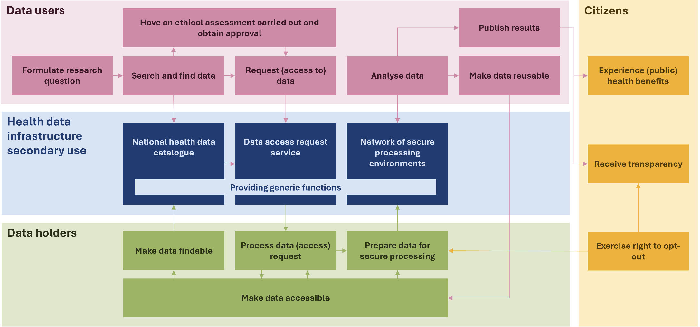

# 2. Perspective: process
## The process of secondary data use as _system of interest_
The _system of interest_ of this specification is the process and the associated information, applications and infrastructure for the secondary use of health data. Such a system consists of various elements, as shown in Figure 1.

///caption
**Figure 1.** Schematic overview of the process of secondary data use. Source: Health-RI.
///

## The secondary use process from the data user's perspective

The key process steps for secondary use have been identified in the draft documentation of TEHDAS2. We have related these to the diagram above and will use them as a guide in the elaboration of the architecture through use cases.

!!! info "Right to opt out of processing for secondary use"

    In accordance with Article 71 of the EHDS, individuals have the right to opt out of the processing of personal electronic health data for secondary use, just as they do for primary use. This means that the content of datasets for primary use may differ from those for secondary use. For example, a person may choose to make their personal record available for primary use, but not for secondary use.

    In the processes described below, the opt-out has not been included. This will need to be described in a separate process, which will likely need to be carried out under the responsibility of the HDAB. The HDAB will then need to communicate the opt-out of an individual to the various data suppliers.

### Data discovery
Before the user can use the data, it must be established whether the required data are available in the necessary format for the secondary use purpose. Datasets available in the EU can be found in a health data catalogue. Once the data have been found, the data user can begin requesting access to the data.

### Data access
Requesting access to data is in fact a request by the data user to process data provided by a data holder, in accordance with specific technical, legal or organisational requirements, without necessarily implying the transfer or downloading of such data. (Data Governance Act (DGA), Article 2(8), (9) and (13)). On the basis of the request, a permit is granted for access to the data or a data request is approved.

### Data preparation
During this phase, data holders supply the required data to the HDAB (Health Data Access Body), which prepares the data for secondary use. Techniques for pseudonymisation, anonymisation, generalisation, suppression and randomisation of personal data are applied. The principle of data minimisation (in accordance with GDPR) must be respected in order to safeguard privacy.

### Use of data
In this phase, the user performs analyses based on the received data for the purpose defined in the request phase. The analysis of data at the individual level must take place within an SPE. The duration of the permit, and thereby the period within which the data may be analysed, is set out in the regulation (Art 68(12)).

### Finalisation
This final phase of the user journey concerns the obligations of the data user with regard to the analysis results arising from the secondary use of data. The data user must publish the results of the secondary use of health data within 18 months of the completion of data processing in a secure processing environment or of receiving the requested health data. The results must be provided in an anonymous format. The data user must notify the HDAB (Health Data Access Body) of the results. Furthermore, the data user must state in the output that the results were obtained using data within the framework of the EHDS (European Health Data Space).

## Elaboration in use cases

The use case method refers to a method for describing the requirements of a _system of interest_. The method begins with identifying the actors and associated use cases. An actor represents a person, system, object or organisation that interacts with the system, such as a "researcher", "data supplier" or "data station". Each use case represents a specific piece of value of the system, expressed as functionality for the actor.

Identifying actors and use cases is not a one-off step. It happens precisely in multiple iterations, with understanding growing step by step. After each iteration, it becomes clearer what value the system must deliver for the stakeholders.

Once the use cases have been identified, they are described further. A use case describes one logically complete goal that an actor wants to achieve, for example "Searching for datasets", "Requesting health data" or "Viewing the status of a request". The name of a use case is always formulated as the functional outcome the actor wants to achieve.

In this document, the use cases are summarised to describe the functionality required for the various steps in the process for secondary data use. For a more detailed description of the functional and technical requirements, we refer to the TEHDAS2 documents[^1].

Use cases are not only a method for describing a system, but also for designing, developing and documenting it. Once the requirements for a use case are clear, it can be realised. The technical design of the use case is called a use case realisation and consists, among other things, of sequence diagrams, state diagrams and information models. The components and other building blocks in this technical design are reused for all use cases of the _system of interest_.

!!! Info "Use cases, communication patterns and transactions"

    A ___business use case___ forms the context and describes what an end user wants to achieve in terms of information provision. Examples of a _business use case_ include prescribing a prescription, a referral to a medical specialist or the transfer of a client from a nursing home to a hospital and vice versa. For secondary use, a _business use case_ could be monitoring the quality of nursing homes or conducting research into a specific condition. The steps in this process description are part of every _business use case_ for secondary use.

    A ___system use case___, often simply called a _use case_, specifies the application process required to realise (part of) the information provision. In the processes, we show the use cases that are necessary for the process.

    Both the _business use case_ and the _use case_ are initiated by an event. In all cases, it is a process in which the event forms the starting point, and the _use case_ represents the goal or value of the process.

    A ___communication pattern___ within the context of data exchange is a fixed, structured way of communicating. A communication pattern is applied within a _system use case_, whereby there is always an actor — the system of a provider or a person — that initiates the communication: the initiator (source: [Data for health](https://www.datavoorgezondheid.nl/documenten/2025/07/14/whitepaper-communicatiepatronen-vws)).
    A communication pattern is divided into multiple _transactions_. The [Nuts Notified Pull](https://wiki.nuts.nl/books/communicatiepatronen/page/notified-pull-gebaseerd-op-fhir-subscriptions) is an example of a communication pattern in which various interactions / transactions are described.

    A ___transaction___ is a sequence of actions in an interaction between two systems that is treated as one indivisible unit of work. In most cases, a _transaction_ can be seen as a request-response pattern via HTTP, whereby one system sends a request and the other system returns a corresponding response, so that the interaction can be treated as one indivisible unit of work.

[^1]: TEHDAS2. (2025). Public consultation of the guidelines and technical specifications to enable seamless use of health data across Europe under the upcoming European Health Data Space (EHDS). https://tehdas.eu/public-consultations/
