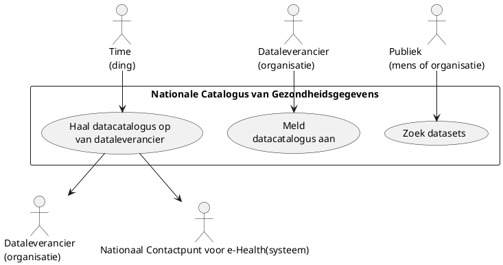

# Data zoeken en vinden (_data discovery_)

Het zoeken en vinden van data is de eerste stap in het hele proces. Een potentiële aanvrager — zoals een onderzoeker of een beleidsdepartement — wil eerst ontdekken welke data over een bepaald onderwerp beschikbaar zijn en onder welke voorwaarden deze kunnen worden gebruikt. Dit zoeken gebeurt via een nationale catalogus van gezondheidsgegevens. Op Europees niveau worden deze nationale catalogi ontsloten via het centrale platform van HealthData@EU (hierna: het centrale platform).

Het publiceren en beheren van een nationale catalogus van gezondheidsinformatie is een taak van de HDAB, zoals vastgelegd in artikel 57 van de EHDS[^1].

In de usecases gebruiken we bewust de term dataleverancier in plaats van datahouder. Hiermee maken we een duidelijk onderscheid tussen de verantwoordelijkheden van een organisatie die data bezit (datahouder) en een partij die data levert (dataleverancier).

Een datahouder kan zelf als dataleverancier optreden, maar kan er ook voor kiezen om een andere partij deze taak te laten uitvoeren, onder de verwerkingsverantwoordelijkheid van de datahouder.

## Overzicht van de usecases

## Meld datacatalogus aan

Een dataleverancier stelt voor de datasets die zij beheert en die onder de categorieën van artikel 51 van de EHDS vallen, een datacatalogus op en publiceert deze. De leverancier zorgt er vervolgens voor dat deze catalogus voor alle deelnemers van de dataspace toegankelijk is via het datastation.

De dataleverancier hoeft de datacatalogus slechts één keer aan te melden. Daarbij geeft zij het adres (URL) op van het datastation waarop de catalogus is gepubliceerd. Deze stap is verplicht overeenkomstig artikel 60 van de EHDS. Minimaal 1x per jaar moet de dataleverancier 

## Haal datacatalogus op van dataleverancier

Het systeem controleert periodiek of de datacatalogus van de dataleverancier is bijgewerkt. Vervolgens wordt de datacatalogus gedownload en geïntegreerd in de publieke Nationale catalogus van gezondheidsgegevens. Alleen de datacatalogus van een dataleverancier die zich heeft aangemeld, wordt gecontroleerd.

Als beheerder van de Nationale catalogus van gezondheidsgegevens zal de HDAB de Nationale catalogus doorsturen naar het centrale platform van HealthData@EU. Dit gebeurt nadat de catalogi van alle aangemelde dataleveranciers zijn verwerkt. Het verzenden van de catalogus verloopt via het Nationale contactpunt.

## Zoek datasets

Een onderzoeker of andere partij kan in de Nationale of Europese catalogus zoeken naar relevante datasets. In de beschrijving van de datasets moet voldoende informatie beschikbaar zijn om te bepalen welke data gebruikt kan worden voor een van de doelen zoals genoemd in artikel 53 van de EHDS. Het formaat van de datacatalogus is beschreven in HealthDCAT-AP Release 5[^2]. 

### Welke data wordt gepubliceerd in de catalogus

Alle categorieën elektronische gezondheidsgegevens overeenkomstig artikel 51 van de EHDS moeten beschikbaar zijn voor secundair gebruik. Voor gegevens uit elektronische gezondheidsdossiers gaan we zoveel mogelijk uit van databeschikbaarheid in het OMOP-formaat. Voor gegevens waarin dat niet mogelijk is, zoals administratieve gegevens op het gebied van gezondheidszorg (artikel 51 lid 1e) en gegevens met betrekking tot gezondheidswerkers (artikel 51 lid 1j), gaan we uit van een RDF-formaat overeenkomstig de FAIR-dataprincipes[^3].

[^1]: European Parliament and Council. (2025). Regulation (EU) 2025/327 of the European Parliament and of the Council of 11 February 2025 on the European Health Data Space and amending Directive 2011/24/EU and Regulation (EU) 2024/2847. Official Journal of the European Union. https://eur-lex.europa.eu/eli/reg/2025/327/

[^2]: Chouaiech, M., Derycke, P., Van Nuffelen, B. et al. (2025, September 22). HealthDCAT-AP Release 5. EC DG-SANTE. https://healthdataeu.pages.code.europa.eu/healthdcat-ap/releases/release-5/ 

[^3]: Wilkinson, M., Dumontier, M., Aalbersberg, I. et al. (2016, Maart 15).The FAIR Guiding Principles for scientific data management and stewardship. Scientific Data. https://rdcu.be/eSNTr