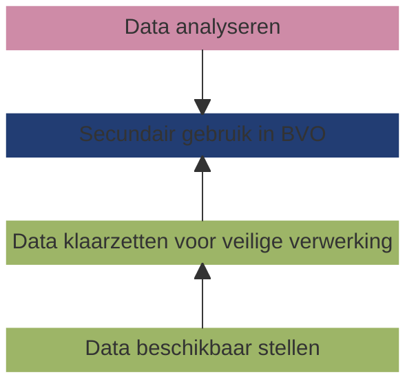

# Scope van de specificatie

## De gezondheidsdata-infrastructuur voor secundair gebruik als _system of interest_
Het _system of interest_ van deze specificatie is de gezondheidsdata-infrastructuur voor secundair gebruik. Een dergelijk systeem bestaat uit verschillende elementen, zoals hieronder is weergegeven.

!!! abstract "Definities"
    De belangrijkste concepten van de gezondheidsinfrastructuur zijn gedefinieerd in de nieuwe Europease wetgeving, met name de European Health Data Space (EHDS) en de Data Governance Act (DGA).

    === "**Beveiligde verwerkingsomgeving (BVO)**"
        Een beveiligde omgeving waarin gezondheidsgegevens verwerkt kunnen worden voor bijvoorbeeld wetenschappelijk onderzoek. Dit kan een centrale BVO zijn, zoals bijvoorbeeld de [CBS Microdata omgeving](https://www.cbs.nl/nl-nl/onze-diensten/maatwerk-en-microdata/microdata-zelf-onderzoek-doen), een gefedereerde BVO of een hybride combinatie daarvan. Dit focus van deze specificatie is dat data stations als hoeksteen kunnen fungeren voor een netwerk van BVOs.
    
    === "**Data gebruiker**" 
        Een persoon of organisatie die toegang heeft gekregen tot elektronische gezondheidsgegevens voor secundair gebruik. Bijvoorbeeld een onderzoeker, een beleidsmederwerker of een ontwikkelaar van commerciële producten.

    === "**Data houder**"
        Een data houder is een persoon of organisatie (publiek of privaat) die gezondheidsdata beheert. Veel organisaties vallen hieronder. Het gaat niet alleen om ziekenhuizen, maar bijvoorbeeld ook iedereen die producten of diensten ontwikkelt die bestemd zijn voor de zorgsector of gezondheidszorg, of ontwikkelaars van wellnessapps, of wetenschappelijk onderzoekers die zich bezighouden met de zorgsector of gezondheidszorg.

    === "**Secundair gebruik**"
        Het gebruik van elektronische gezondheidsgegevens voor andere doeleinden dan die waarvoor ze verzameld zijn. Het gebruiken van gezondheidsgegevens, die zijn vastgelegd voor de behandeling van een patiënt, voor wetenschappelijk onderzoek, is een voorbeeld van secundair gebruik.

## Motivatie: waarom een federatieve BVO en waarom data stations?

- Federatieve data netwerken zijn bewezen veiliger en zijn daarom te preferen boven centrale BVOs wanneer te toepassing dat toestaat
- Er zijn verschillende vormen van federatieve data analyse platformen, die elk hun voor- en nadelen hebben
- Bijna alle gefedereerde BVOs gaan uit van een concept van data stations als koppelvlak om op een veilige manier de BVO te realiseren.
    - Er zijn hier verschillen in, dat willen we harmoniseren
- Data stations geven concreet invulling aan hoe binnen de EHDS wordt gesproken over data producten.

## Scope en doel van dit document

!!! abstract "Scope van dit document"
    Een data gebruiker voert een data analyse uit in een gefedereerde beveiligde verwerkingsomgeving, dat is verbonden aan een netwerk van _data stations_ zijnde de systemen waarom de data houder de data beschikbaar heeft gesteld en klaargezet voor gebruik. Dit document geeft een functionele specificatie en voorbeeld implementaties van een data station, zijnde het deel van de gezondheidsdatainfrastructuur dat binnen het domein (verwantwoordelijkheid) van de data houder is gerealiseerd.

...

