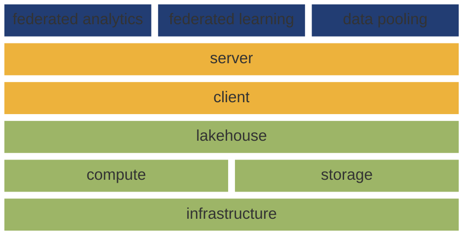
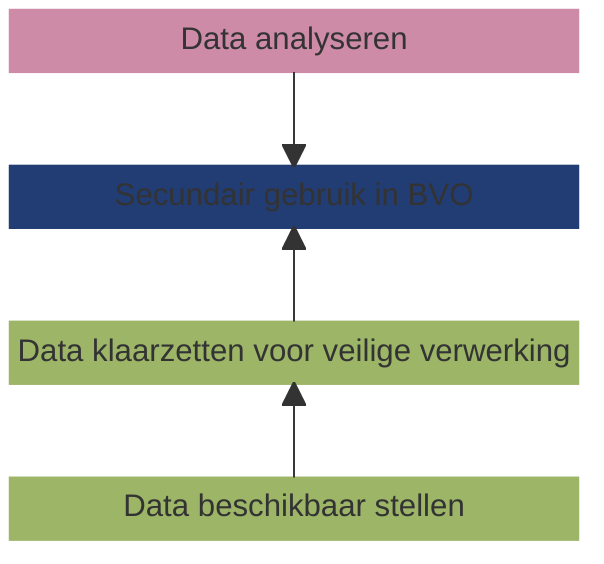

In de context van de European Health Data Space (EHDS) en de Data Governance Act (DGA) is het concept van beveiligde verwerkingsomgevingen (BVOs) essentieel voor de implementatie van de gezondheidsdata-infrastructuur. Data gebruikers _krijgen_ geen data, maar _toegang tot_ data in een BVO die voldoet aan vastgestelde strenge technische en veiligheidsnormen.[^1] Daarbij is de gedachte dat er meerdere BVOs zullen worden gerealiseerd, dus een netwerk van veilige verwerkingsomgevingen zoals is weergegeven in de blauwe laag in figuur 1.

Om een dergelijk netwerk van BVOs te realiseren is (data) interoperabiliteit essentieel. Het 'zandloper' model is een bewezen concept om interoperabiliteit voor dergelijke netwerk technologieen te realiseren. 

## Principes

Een belangrijk kenmerk van een inrichtingsprincipe is dat het niet onderhandelbaar is. Dit onderscheidt principes van requirements, die wel
ter discussie kunnen staan en aangepast kunnen worden. Inrichtingsprincipes spelen een cruciale rol, omdat zij de onderliggende
argumentatie is voor beslissingen over de inrichting en werking van de dataspace.

!!! abstract "Scope van dit document"
    Een data gebruiker voert een data analyse uit in een gefedereerde beveiligde verwerkingsomgeving, dat is verbonden aan een netwerk van _datastations_ zijnde de systemen waarom de data houder de data beschikbaar heeft gesteld en klaargezet voor gebruik. Dit document geeft een functionele specificatie en voorbeeld implementaties van een datastation, zijnde het deel van de gezondheidsdatainfrastructuur dat binnen het domein (verwantwoordelijkheid) van de data houder is gerealiseerd.

