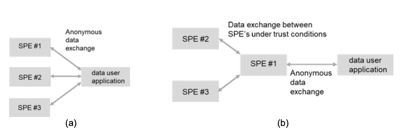

# 1.1. Why this specification document

## 1.1.1. Insufficient attention to federated solutions and the concept of _data visiting_
At the time of writing this document, several important guidelines are being developed regarding the elaboration and implementation of the EHDS for secondary use, notably:

- [Data Spaces Support Center Blueprint](https://blueprint.dssc.eu/): cross-sector guidelines for the design of data spaces.
- [Uitgangspunten LDN](https://open.overheid.nl/documenten/52acfd51-3585-416d-979b-ab6deaba79d9/file): broad principles formulated by VWS, including _privacy-by-design_, a high degree of open-source working and storage of data at the source.
- [TEHDAS2](https://tehdas.eu/public-consultations/): detailed guidelines and technical specifications that are or have been subject to public consultation.[^1]

These developments are providing an increasingly clear picture of what a national health data infrastructure for research, policy and innovation could and should look like. At the same time, we identify a gap with respect to applying principles such as _privacy-by-design_ and _data visiting_. In the preamble to the EHDS, [recital 80](https://eur-lex.europa.eu/legal-content/EN/TXT/HTML/?uri=OJ:L_202500327#rct_80) states that:

> _Given the sensitivity of health data, principles such as "privacy by design" and "privacy by default" and the concept of "bring the questions to the data instead of moving the data" should be applied where possible._

The concept of _data visiting_, also known as _federated computing_, _algorithm-to-the-data_ or _Personal Health Train_ (PHT), is not elaborated anywhere in the EHDS[^2]. TEHDAS2 [_M7.4 Draft technical, functional and security specifications of Secure Processing Environments_](./appendix/tehdas2-spe.md) (chapter 6) does address this to some extent and provides an initial definition of federated computing.

???+ abstract "Definitions of federated computing in TEHDAS2"
    
    === "**Federated computing**"
        Decentralised computation of data in which computations are performed on local, distributed SPEs rather than central processing in a single SPE. Such an approach is recommended in recital 80 for _privacy preserving computation_. Federated computing makes it possible to keep data closer to its original location, sharing only aggregated results or model parameters, thereby enhancing privacy and security.
    
    === "**Federated analysis**" 
        A specific form of federated processing in which statistics are computed locally across multiple distributed SPEs. This method is suitable for, among other things, comparative analyses, multi-centre research and other forms of collaborative statistical analysis. Only aggregated results or summary statistics are exported from the local SPEs, with corresponding safeguards to ensure that no data is extracted from the SPE that could later be traced back to individual persons; re-identification must be prevented.

    === "**Federated learning**"
        A specific form of federated computing in which models are trained and validated on distributed SPEs. Raw data is not shared between SPEs. Instead, only model updates are shared to achieve better data privacy and security. Because it is difficult to assess the anonymity of intermediate results, it is essential that federated learning takes place within a trusted network of SPEs.

    TEHDAS2 distinguishes between two scenarios: federated analysis (a) and federated learning (b), as shown below. It is worth noting that this is a simplified representation. In scenario a), an aggregation server is often also used (even though it is not drawn in the figure).

    

## 1.1.2. A specification for a hybrid SPE
Central SPEs, such as the CBS Microdata environment or the _Trusted Research Environments_ being implemented within the [EOSC-ENTRUST](https://eosc-entrust.eu/) framework, are currently the most common form of SPEs. This document describes the architecture of a **hybrid SPE**[^3] that i) supports different forms of federated computing (federated learning and federated analytics), and also ii) supports data delivery to a central SPE (data pooling). The data stations and the federated processing hub are the essential components of this hybrid SPE. We believe that such a hybrid network can make an important contribution to implementing the EHDS effectively, efficiently and securely, and we see it as a complement to and alternative for central SPEs.

[^1]: These detailed functional and technical specifications of health data spaces and SPEs are still in the consultation phase and have yet to be established by the European Commission. For primary use, this deadline is March 2027 at the latest; for secondary use (the scope of TEHDAS2), March 2029.
[^2]: The word _federated_ appears only twice in the EHDS regulation.
[^3]: In TEHDAS2, this is called a federated SPE. We prefer the terms central, decentralised and hybrid, which are explained in more detail in the introduction of [Application](./applicatie/index.md).
